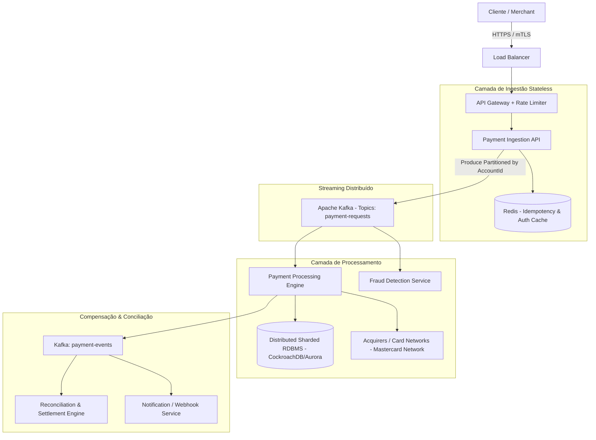

# 💳 Guia de Preparação para Entrevistas SDE-2 (Java Backend) - Mastercard

> **Documento Completo de Estudo e Revisão Técnica**  
> Idioma: Português do Brasil (pt-BR)  
> Foco: Java 17/21+, Spring Boot 3+, Estruturas de Dados & Algoritmos, System Design para Sistemas Financeiros de Alta Escala, Arquitetura de Microsserviços, Bancos de Dados e Transações ACID.

---

## 📑 Sumário

1. [🧩 DSA (Estruturas de Dados e Algoritmos)](#1--dsa-estruturas-de-dados-e-algoritmos)
   - [1️⃣ Maior Subarray com Soma = K (Prefix Sum + HashMap)](#1️⃣-maior-subarray-com-soma--k-longest-subarray-with-sum--k)
   - [2️⃣ Mesclar Intervalos Sobrepostos (Sorting + Merging)](#2️⃣-mesclar-intervalos-sobrepostos-merge-overlapping-intervals)
   - [3️⃣ Implementação de Cache LRU (HashMap + Doubly Linked List)](#3️⃣-implementação-de-cache-lru-design-lru-cache)
2. [☕ Core Java & Conceitos Orientados a Objetos](#2-☕-core-java--conceitos-orientados-a-objetos)
   - [4️⃣ Diferença entre Interface e Classe Abstrata (Java 8+ Métodos Default/Static)](#4️⃣-diferença-entre-interface-e-classe-abstrata-interface-vs-abstract-class)
   - [5️⃣ Java Memory Model (JMM), Heap vs Stack e Garbage Collection](#5️⃣-java-memory-model-jmm-heap-vs-stack-e-garbage-collection)
   - [6️⃣ Diferença entre String, StringBuilder e StringBuffer](#6️⃣-diferença-entre-string-stringbuilder-e-stringbuffer)
   - [7️⃣ Contrato equals() e hashCode() com Exemplo do Mundo Real](#7️⃣-contrato-equals-e-hashcode-com-exemplo-do-mundo-real)
   - [8️⃣ Interfaces Funcionais e Expressões Lambda no Java 8+](#8️⃣-interfaces-funcionais-e-expressões-lambda-functional-interfaces--lambdas)
   - [9️⃣ Diferença entre Runnable, Callable e Future em Multithreading](#9️⃣-diferença-entre-runnable-callable-e-future-em-multithreading)
   - [🔟 Sincronização e Locks no Java (Locks, Synchronized, ReentrantLock)](#🔟-sincronização-e-locks-no-java-synchronization--locks)
3. [🌱 Spring Boot & Microsserviços](#3-🌱-spring-boot--microsserviços)
   - [1️⃣1️⃣ Mecanismo de Autoconfiguração do Spring Boot](#1️⃣1️⃣-mecanismo-de-autoconfiguração-do-spring-boot-autoconfiguration)
   - [1️⃣2️⃣ Diferença entre @Component, @Service, @Repository e @Controller](#1️⃣2️⃣-diferença-entre-component-service-repository-e-controller)
   - [1️⃣3️⃣ Como Proteger REST APIs no Spring (JWT / OAuth2)](#1️⃣3️⃣-como-proteger-rest-apis-no-spring-jwt--oauth2)
   - [1️⃣4️⃣ Spring Boot Actuator e Monitoramento](#1️⃣4️⃣-spring-boot-actuator-e-seu-uso-em-monitoramento)
   - [1️⃣5️⃣ Tratamento de Exceções em REST APIs com @ControllerAdvice](#1️⃣5️⃣-tratamento-de-exceções-em-rest-apis-com-controlleradvice)
   - [1️⃣6️⃣ Ciclo de Vida do Bean no Spring e @PostConstruct / @PreDestroy](#1️⃣6️⃣-ciclo-de-vida-do-bean-no-spring-e-o-papel-de-postconstruct--predestroy)
   - [1️⃣7️⃣ Como a Injeção de Dependências Funciona por Baixo dos Panos](#1️⃣7️⃣-como-a-injeção-de-dependências-do-spring-funciona-por-baixo-dos-panos)
   - [1️⃣8️⃣ Como Lidar com Dependências Circulares no Spring Boot](#1️⃣8️⃣-como-lidar-com-dependências-circulares-no-spring-boot)
4. [🧱 System Design & Arquitetura](#4-🧱-system-design--arquitetura)
   - [1️⃣9️⃣ Design de um Sistema de Processamento de Pagamentos (Milhões TPS)](#1️⃣9️⃣-design-de-um-sistema-de-processamento-de-pagamentos-payment-processing-system)
   - [2️⃣0️⃣ Como Garantir Idempotência em APIs de Pagamento](#2️⃣0️⃣-como-garantir-idempotência-em-apis-idempotency-in-apis)
   - [2️⃣1️⃣ Diferença entre Arquitetura Monolítica e Microsserviços](#2️⃣1️⃣-diferença-entre-arquitetura-monolítica-e-microsserviços)
   - [2️⃣2️⃣ API Gateway e suas Responsabilidades](#2️⃣2️⃣-api-gateway-e-suas-responsabilidades)
   - [2️⃣3️⃣ Tolerância a Falhas, Mecanismos de Retry e Circuit Breakers](#2️⃣3️⃣-tolerância-a-falhas-retry-e-circuit-breakers)
   - [2️⃣4️⃣ Arquitetura Orientada a Eventos com Kafka](#2️⃣4️⃣-arquitetura-orientada-a-eventos-com-kafka-event-driven-architecture)
   - [2️⃣5️⃣ Escala Horizontal vs Vertical: Quando Usar Cada Uma](#2️⃣5️⃣-escala-horizontal-vs-vertical-horizontal-vs-vertical-scaling)
5. [🗃️ Banco de Dados & Transações](#5-🗃️-banco-de-dados--transações)
   - [2️⃣6️⃣ Propriedades ACID em Bancos Relacionais](#2️⃣6️⃣-propriedades-acid-em-bancos-de-dados-relacionais)
   - [2️⃣7️⃣ Índices e Melhoria de Performance de Consultas](#2️⃣7️⃣-índices-e-como-eles-melhoram-a-performance-de-queries)
   - [2️⃣8️⃣ Atualizações Concorrentes: Locking Otimista vs Pessimista](#2️⃣8️⃣-atualizações-concorrentes-locking-otimista-vs-pessimista)
   - [2️⃣9️⃣ Diferença entre Bancos SQL e NoSQL: Quando Escolher](#2️⃣9️⃣-diferença-entre-bancos-sql-e-nosql-quando-escolher-cada-um)
   - [3️⃣0️⃣ Como Detectar e Resolver Deadlocks e Gargalos de Performance](#3️⃣0️⃣-como-detectar-e-resolver-deadlocks-ou-gargalos-de-performance)

---

# 1. 🧩 DSA (Estruturas de Dados e Algoritmos)

---

### 1️⃣ Maior Subarray com Soma = K (Longest Subarray with Sum = K)
> **Problema Original:** *Longest Subarray with Sum = K – Prefix Sum + HashMap ($O(n)$)*

#### 💡 Explicação Teórica & Intuição
O problema pede para encontrar o comprimento máximo de um subarray contíguo cuja soma dos elementos seja exatamente igual a $K$. 
A abordagem de força bruta avaliaria todos os pares $(i, j)$, resultando em complexidade $O(n^2)$.

A solução ótima utiliza o conceito de **Prefix Sum (Soma de Prefixos)** aliado a um **HashMap**:
1. Conforme iteramos pelo array, mantemos uma variável acumuladora `currentSum`.
2. Em cada índice $i$, a soma acumulada de $0$ até $i$ é `currentSum`.
3. Queremos saber se existe algum índice anterior $j$ tal que a soma do subarray de $j+1$ até $i$ seja igual a $K$.
   Matematicamente:
   $$\text{currentSum} - \text{prefixSum}[j] = K \implies \text{prefixSum}[j] = \text{currentSum} - K$$
4. Se `currentSum - K` já foi visto anteriormente e está no nosso `HashMap`, o tamanho do subarray encontrado é $i - \text{map.get}(\text{currentSum} - K)$.
5. Armazenamos no mapa `map.put(currentSum, i)` **apenas na primeira vez** que `currentSum` aparece, para garantir que o índice inicial seja o mais à esquerda possível, maximizando o comprimento.

#### ☕ Código Java Completo ($O(n)$ Tempo | $O(n)$ Espaço)
```java
import java.util.HashMap;
import java.util.Map;

public class LongestSubarrayWithSumK {

    public static int getLongestSubarray(int[] nums, int k) {
        if (nums == null || nums.length == 0) {
            return 0;
        }

        Map<Long, Integer> prefixSumMap = new HashMap<>();
        long currentSum = 0;
        int maxLength = 0;

        for (int i = 0; i < nums.length; i++) {
            currentSum += nums[i];

            // Caso 1: O subarray começa do índice 0 até o índice atual i
            if (currentSum == k) {
                maxLength = i + 1;
            }

            // Caso 2: Verifica se existe um prefixo anterior cuja remoção resulte em soma K
            long complement = currentSum - k;
            if (prefixSumMap.containsKey(complement)) {
                int previousIndex = prefixSumMap.get(complement);
                maxLength = Math.max(maxLength, i - previousIndex);
            }

            // IMPORTANTE: Só adiciona a soma se ela ainda não existir no Map
            // Isso garante que mantemos o menor índice inicial possível para maximizar o tamanho
            if (!prefixSumMap.containsKey(currentSum)) {
                prefixSumMap.put(currentSum, i);
            }
        }

        return maxLength;
    }

    public static void main(String[] args) {
        int[] arr1 = {10, 5, 2, 7, 1, 9};
        System.out.println("Max Length (k=15): " + getLongestSubarray(arr1, 15)); // Retorna 4 ([5, 2, 7, 1])

        int[] arr2 = {-1, 2, 3, -2, 1, 4};
        System.out.println("Max Length (k=5): " + getLongestSubarray(arr2, 5));  // Suporta negativos
    }
}
```

- **Complexidade de Tempo:** $O(n)$ — fazemos uma única passagem pelo array; as operações de `get` e `put` no `HashMap` levam $O(1)$ amortizado.
- **Complexidade de Espaço:** $O(n)$ — no pior caso, todas as somas de prefixos são distintas e armazenadas no mapa.

---

### 2️⃣ Mesclar Intervalos Sobrepostos (Merge Overlapping Intervals)
> **Problema Original:** *Merge Overlapping Intervals – Sorting + Merging ($O(n \log n)$)*

#### 💡 Explicação Teórica & Intuição
Dado um conjunto de intervalos $[[s_1, e_1], [s_2, e_2], \dots]$, o objetivo é mesclar todos os intervalos que se sobrepõem e retornar um array de intervalos disjuntos.

**Estratégia:**
1. **Ordenação:** Ordenamos os intervalos com base no ponto de início ($s_i$). Se os inícios forem iguais, ordenamos pelo fim.
2. **Iteração:** 
   - Inicializamos uma lista resultante com o primeiro intervalo.
   - Para cada intervalo subsequente $[s_{\text{atual}}, e_{\text{atual}}]$:
     - Se $s_{\text{atual}} \le e_{\text{ultimo}}$, há sobreposição. O novo fim do último intervalo se torna $\max(e_{\text{ultimo}}, e_{\text{atual}})$.
     - Se $s_{\text{atual}} > e_{\text{ultimo}}$, não há sobreposição. Adicionamos o intervalo atual como um novo item na lista.

#### ☕ Código Java Completo ($O(n \log n)$ Tempo | $O(n)$ Espaço)
```java
import java.util.ArrayList;
import java.util.Arrays;
import java.util.Comparator;
import java.util.List;

public class MergeIntervals {

    public static int[][] merge(int[][] intervals) {
        if (intervals == null || intervals.length <= 1) {
            return intervals;
        }

        // 1. Ordena os intervalos pelo ponto inicial (start)
        Arrays.sort(intervals, Comparator.comparingInt(a -> a[0]));

        List<int[]> merged = new ArrayList<>();
        int[] currentInterval = intervals[0];
        merged.add(currentInterval);

        for (int i = 1; i < intervals.length; i++) {
            int currentEnd = currentInterval[1];
            int nextStart = intervals[i][0];
            int nextEnd = intervals[i][1];

            if (nextStart <= currentEnd) {
                // Há sobreposição: estende o fim do intervalo atual
                currentInterval[1] = Math.max(currentEnd, nextEnd);
            } else {
                // Não há sobreposição: avança para o próximo intervalo
                currentInterval = intervals[i];
                merged.add(currentInterval);
            }
        }

        return merged.toArray(new int[merged.size()][]);
    }

    public static void main(String[] args) {
        int[][] intervals = {{1, 3}, {2, 6}, {8, 10}, {15, 18}};
        int[][] result = merge(intervals);
        System.out.println("Merged Intervals: " + Arrays.deepToString(result));
        // Saída esperada: [[1, 6], [8, 10], [15, 18]]
    }
}
```

- **Complexidade de Tempo:** $O(n \log n)$ devido à etapa de ordenação. A mesclagem linear subsequente leva $O(n)$.
- **Complexidade de Espaço:** $O(n)$ (ou $O(\log n)$ dependendo do algoritmo de ordenação interno para espaço auxiliar de pilha) para armazenar os intervalos mesclados.

---

### 3️⃣ Implementação de Cache LRU (Design LRU Cache)
> **Problema Original:** *Design LRU Cache – HashMap + Doubly Linked List ($O(1)$ por operação)*

#### 💡 Explicação Teórica & Intuição
Um **LRU (Least Recently Used) Cache** descarta os itens que não foram acessados há mais tempo quando a capacidade máxima é atingida. Ambas as operações `get(key)` e `put(key, value)` precisam rodar em tempo estritamente $O(1)$.

**Por que combinar HashMap e Lista Duplamente Encadeada (Doubly Linked List)?**
- O `HashMap<Key, Node>` oferece busca em $O(1)$ por chave até a referência do nó.
- A **Lista Duplamente Encadeada** permite inserção e remoção de nós em $O(1)$, pois com o ponteiro do nó temos acesso direto a `prev` e `next`.
- Nós **sentinela (dummy)** `head` e `tail` eliminam casos especiais de borda (lista vazia, inserção no início, remoção no fim).
  - Mais recentemente usado (**MRU**): logo após a `head`.
  - Menos recentemente usado (**LRU**): logo antes da `tail`.

```
[head (dummy)] <-> [Node mais recente] <-> ... <-> [Node mais antigo (LRU)] <-> [tail (dummy)]
```

#### ☕ Código Java Completo ($O(1)$ para `get` e `put`)
```java
import java.util.HashMap;
import java.util.Map;

public class LRUCache {

    private static class Node {
        int key;
        int value;
        Node prev;
        Node next;

        Node(int key, int value) {
            this.key = key;
            this.value = value;
        }
    }

    private final int capacity;
    private final Map<Integer, Node> cacheMap;
    private final Node head;
    private final Node tail;

    public LRUCache(int capacity) {
        this.capacity = capacity;
        this.cacheMap = new HashMap<>();

        // Inicializa nós sentinelas
        this.head = new Node(-1, -1);
        this.tail = new Node(-1, -1);
        head.next = tail;
        tail.prev = head;
    }

    public int get(int key) {
        Node node = cacheMap.get(key);
        if (node == null) {
            return -1;
        }
        // Move para a frente (mais recentemente usado)
        moveToHead(node);
        return node.value;
    }

    public void put(int key, int value) {
        Node existingNode = cacheMap.get(key);

        if (existingNode != null) {
            existingNode.value = value;
            moveToHead(existingNode);
            return;
        }

        if (cacheMap.size() >= capacity) {
            // Remove o nó menos recentemente usado (imediatamente antes da tail)
            Node lruNode = tail.prev;
            removeNode(lruNode);
            cacheMap.remove(lruNode.key);
        }

        Node newNode = new Node(key, value);
        addNodeToHead(newNode);
        cacheMap.put(key, newNode);
    }

    private void addNodeToHead(Node node) {
        node.next = head.next;
        node.prev = head;
        head.next.prev = node;
        head.next = node;
    }

    private void removeNode(Node node) {
        node.prev.next = node.next;
        node.next.prev = node.prev;
    }

    private void moveToHead(Node node) {
        removeNode(node);
        addNodeToHead(node);
    }
}
```

- **Complexidade de Tempo:** $O(1)$ para ambos `get` e `put`.
- **Complexidade de Espaço:** $O(\text{capacity})$ para manter o mapa e a lista encadeada.

---

# 2. ☕ Core Java & Conceitos Orientados a Objetos

---

### 4️⃣ Diferença entre Interface e Classe Abstrata (Interface vs Abstract Class)
> **Pergunta Original:** *Difference between interface and abstract class (with Java 8 default/static methods).*

#### 📊 Tabela Comparativa Detalhada

| Aspecto | Interface (Java 8+) | Classe Abstrata (`abstract class`) |
| :--- | :--- | :--- |
| **Herança** | Múltipla (`implements A, B, C`) | Simples (`extends A`) |
| **Estado (Campos/Atributos)** | Apenas `public static final` (constantes) | Pode ter campos de instância mutáveis, privados, protegidos |
| **Construtores** | **Não possui** construtores | **Possui** construtores (chamados via `super()`) |
| **Métodos Concretos** | Suporta métodos `default` e `static` (Java 8+) e `private` (Java 9+) | Qualquer tipo de método (abstrato, concreto, final, estático) |
| **Finalidade de Design** | Define um **contrato / comportamento** ("*o que faz*", ex: `PaymentProcessable`) | Define uma **identidade base compartilhada** ("*o que é*", ex: `BasePaymentTransaction`) |

#### 🔑 Métodos Default & Static (Java 8+)
- **`default` methods:** Permitem adicionar novos métodos a interfaces existentes sem quebrar implementações legadas (evolução de APIs).
- **Diamond Problem em Interfaces:** Se uma classe implementa duas interfaces com o mesmo método `default`, o compilador força a classe a sobrescrever e explicitar qual versão usar:
  ```java
  interface CardPayment {
      default void process() { System.out.println("Processing card"); }
  }
  interface PixPayment {
      default void process() { System.out.println("Processing pix"); }
  }
  class HybridPayment implements CardPayment, PixPayment {
      @Override
      public void process() {
          CardPayment.super.process(); // Desambiguação explícita
      }
  }
  ```

---

### 5️⃣ Java Memory Model (JMM), Heap vs Stack e Garbage Collection
> **Pergunta Original:** *Explain Java Memory Model, Heap vs Stack, and Garbage Collection process.*

```
+-------------------------------------------------------------------------------+
|                                  JVM MEMORY                                   |
|                                                                               |
|  +--------------------------------+   +------------------------------------+  |
|  |             STACK              |   |                HEAP                |  |
|  |  (1 por Thread, isolada)       |   |   (Compartilhado entre Threads)    |  |
|  |                                |   |                                    |  |
|  | - Frames de método             |   | +------------------+-------------+ |  |
|  | - Primitivos locais (int, etc) |   | | Young Generation |     Old     | |  |
|  | - Ponteiros de referência      |   | | (Eden, S0, S1)   | (Tenured)   | |  |
|  +--------------------------------+   | +------------------+-------------+ |  |
|                                       +------------------------------------+  |
|  +-------------------------------------------------------------------------+  |
|  |                       METASPACE (Off-Heap / Native)                     |  |
|  |   - Metadados de Classes, Bytecode, Pool de Constantes                  |  |
|  +-------------------------------------------------------------------------+  |
+-------------------------------------------------------------------------------+
```

#### 1. Stack vs Heap
- **Stack Memory:**
  - Alocada individualmente por Thread (Thread-Safe por isolamento).
  - Guarda stack frames (variáveis primitivas locais e referências a objetos no Heap).
  - Desalocação automática imediata no retorno do método (LIFO).
- **Heap Memory:**
  - Compartilhado por todas as threads da JVM.
  - Onde todos os objetos (`new Object()`) e arrays residem.
  - Gerenciado ativamente pelo Garbage Collector.

#### 2. Processo de Garbage Collection (GC)
Baseado na **Hipótese Geracional Fraca** (*Weak Generational Hypothesis*): a maioria dos objetos morre logo após a criação.

1. **Young Generation (Eden + Survivor Spaces S0 e S1):**
   - Novos objetos são alocados no **Eden**.
   - Quando o Eden enche, ocorre um **Minor GC**: objetos vivos são copiados para $S0$ e recebem uma idade (age counter).
   - No próximo ciclo, objetos vivos de Eden e $S0$ são movidos para $S1$.
2. **Old / Tenured Generation:**
   - Quando um objeto sobrevive a múltiplos ciclos de Minor GC (atingindo o limiar `MaxTenuringThreshold`, default 15), ele é promovido para a **Old Generation**.
   - Quando a Old Generation atinge sua capacidade, ocorre um **Major / Full GC**.
3. **Coletores Modernos:**
   - **G1GC (Garbage-First):** Padrão do Java 9+, particiona a memória em regiões de tamanho igual e coleta prioritariamente as regiões com mais lixo com SLAs de pausa previsíveis.
   - **ZGC / Shenandoah:** Coletores de ultra-baixa latência (pausas sub-milissegundo), executando marcação e realocação de forma concorrente às threads da aplicação.

#### 3. Java Memory Model (JMM) & `happens-before`
- O JMM define como e quando escritas feitas por uma thread tornam-se visíveis para outras threads.
- `volatile`: Garante **visibilidade imediata** entre memórias de cache das CPUs (desativa caching local de registradores) e impede o reordenamento de instruções pelo compilador/CPU (*Memory Barriers*).

---

### 6️⃣ Diferença entre String, StringBuilder e StringBuffer
> **Pergunta Original:** *Difference between String, StringBuilder, and StringBuffer.*

#### 📊 Tabela Comparativa

| Propriedade | `String` | `StringBuilder` | `StringBuffer` |
| :--- | :--- | :--- | :--- |
| **Mutabilidade** | **Imutável** (novo objeto a cada alteração) | **Mutável** (modifica o buffer interno `char[]`/`byte[]`) | **Mutável** (modifica o buffer interno `char[]`/`byte[]`) |
| **Thread-Safety** | **Sim** (imutabilidade é inerentemente thread-safe) | **Não** (não sincronizado) | **Sim** (métodos anotados com `synchronized`) |
| **Performance** | Lenta em concatenações em loop | **Muito rápida** (ideal para single-thread) | Mais lenta que `StringBuilder` pelo overhead de locks |
| **Armazenamento** | String Constant Pool (Heap) | Heap comum | Heap comum |

#### 💡 Boas Práticas
- Use `String` para valores constantes, chaves de Map, DTOs e entidades onde a imutabilidade garante segurança.
- Use `StringBuilder` para manipulação e concatenação dinâmica de strings no escopo de um método (single-thread).
- O `StringBuffer` é considerado legado; na maioria dos cenários concorrentes modernos, prefere-se builders locais ou estruturas atômicas.

---

### 7️⃣ Contrato equals() e hashCode() com Exemplo do Mundo Real
> **Pergunta Original:** *Explain equals() and hashCode() contract with a real-world example.*

#### 📜 O Contrato Fundamental
1. **Consistência de `equals` com `hashCode`:** Se `objA.equals(objB) == true`, então **obrigatoriamente** `objA.hashCode() == objB.hashCode()`.
2. **Colisão permitida:** Se `objA.hashCode() == objB.hashCode()`, `objA.equals(objB)` **não precisa** ser verdadeiro (isso é uma colisão de hash).
3. **Imutabilidade das propriedades de chave:** Os campos usados no cálculo de `equals`/`hashCode` não devem ser modificados após a inserção do objeto em coleções baseadas em hash (`HashMap`, `HashSet`).

#### 🚨 O que acontece se sobrescrever apenas `equals()`?
Se sobrescrevermos `equals()` mas não `hashCode()`, dois objetos com os mesmos valores de negócio cairão em **buckets diferentes** dentro de um `HashMap`. Resultado: `map.get(new TransactionId("TX-123"))` retornará `null`, mesmo que a transação exista no mapa!

#### ☕ Exemplo no Contexto de Pagamentos
```java
import java.util.Objects;

public final class TransactionId {
    private final String networkId; // ex: "MASTERCARD"
    private final String transactionReference;

    public TransactionId(String networkId, String transactionReference) {
        this.networkId = Objects.requireNonNull(networkId);
        this.transactionReference = Objects.requireNonNull(transactionReference);
    }

    @Override
    public boolean equals(Object o) {
        if (this == o) return true;
        if (o == null || getClass() != o.getClass()) return false;
        TransactionId that = (TransactionId) o;
        return Objects.equals(networkId, that.networkId) &&
               Objects.equals(transactionReference, that.transactionReference);
    }

    @Override
    public int hashCode() {
        return Objects.hash(networkId, transactionReference);
    }
}
```

---

### 8️⃣ Interfaces Funcionais e Expressões Lambda no Java 8+
> **Pergunta Original:** *What are functional interfaces and lambdas in Java 8?*

#### 💡 Definição
- **Interface Funcional:** Interface que possui **exatamente um método abstrato (SAM - Single Abstract Method)**. Pode conter métodos `default` ou `static`. É comumente anotada com `@FunctionalInterface`.
- **Lambda:** Sintaxe concisa para instanciar interfaces funcionais sem a verbosidade de classes anônimas.

#### 📦 Pacote `java.util.function` - As 4 Interfaces Principais

| Interface | Assinatura SAM | Propósito | Exemplo |
| :--- | :--- | :--- | :--- |
| **`Predicate<T>`** | `boolean test(T t)` | Filtros e validações | `tx -> tx.getAmount() > 1000` |
| **`Function<T, R>`** | `R apply(T t)` | Mapeamento / Transformação | `Transaction::getCurrency` |
| **`Consumer<T>`** | `void accept(T t)` | Ação com efeito colateral | `tx -> auditLogger.info(tx)` |
| **`Supplier<T>`** | `T get()` | Fábrica / Fornecedor preguiçoso | `() -> UUID.randomUUID().toString()` |

#### ☕ Exemplo Prático com Streams
```java
List<Payment> approved = payments.stream()
    .filter(Payment::isAuthorized)                        // Predicate
    .map(Payment::enrichWithExchangeRate)                 // Function
    .peek(p -> metricsService.recordLatency(p))           // Consumer
    .toList();
```

---

### 9️⃣ Diferença entre Runnable, Callable e Future em Multithreading
> **Pergunta Original:** *Difference between Runnable, Callable, and Future in multithreading.*

#### 📊 Comparação Direta

| Característica | `Runnable` | `Callable<V>` | `Future<V>` |
| :--- | :--- | :--- | :--- |
| **Método Principal** | `void run()` | `V call() throws Exception` | `V get()`, `boolean cancel()`, `boolean isDone()` |
| **Retorno** | Não retorna nada (`void`) | Retorna valor parametrizado `V` | Representa o resultado futuro assíncrono de uma tarefa |
| **Exceções Checadas** | Não pode lançar checked exceptions | Pode lançar `throws Exception` | `get()` lança `ExecutionException`, `InterruptedException` |
| **Origem** | Java 1.0 | Java 5 (`java.util.concurrent`) | Java 5 |

#### ☕ Exemplo de Uso com `CompletableFuture` (Padrão Moderno)
```java
ExecutorService executor = Executors.newFixedThreadPool(10);

// Callable + Future clássico
Future<Double> futureBalance = executor.submit(() -> accountService.fetchBalance("ACC-123"));
Double balance = futureBalance.get(2, TimeUnit.SECONDS); // Bloqueia com timeout

// Abordagem moderna assíncrona não-bloqueante (Java 8+)
CompletableFuture.supplyAsync(() -> fraudCheckService.check("TX-999"), executor)
    .thenApply(isFraud -> isFraud ? RiskScore.HIGH : RiskScore.LOW)
    .thenAccept(risk -> auditService.save(risk))
    .exceptionally(ex -> {
        log.error("Erro na verificação de fraude", ex);
        return null;
    });
```

---

### 🔟 Sincronização e Locks no Java (Synchronization & Locks)
> **Pergunta Original:** *Explain how synchronization and locks work in Java.*

#### 1. `synchronized` (Lock Intrínseco / Monitor)
- Bloqueia o monitor do objeto (`this`), da classe (`Class.class`) ou de um objeto arbitrário de lock.
- **Vantagens:** Simples de usar, liberação automática garantida mesmo se ocorrer uma exceção.
- **Desvantagens:** Bloqueio incondicional (não permite timeout), não permite tentar obter o lock sem bloquear (`tryLock`), não oferece garantia de justiça (*fairness*).

#### 2. `java.util.concurrent.locks.ReentrantLock`
- Fornece controle explícito com métodos como `lock()`, `unlock()`, `tryLock(timeout, unit)` e suporte a ordem justa (*fair lock*).
- Permite múltiplas variáveis de condição com `Condition` (`await()` / `signal()`).

```java
private final ReentrantLock lock = new ReentrantLock(true); // Fair lock

public void transferFunds(Account from, Account to, BigDecimal amount) {
    if (lock.tryLock(500, TimeUnit.MILLISECONDS)) {
        try {
            from.debit(amount);
            to.credit(amount);
        } finally {
            lock.unlock(); // OBRIGATÓRIO no bloco finally
        }
    } else {
        throw new TransactionTimeoutException("Não foi possível obter o lock a tempo");
    }
}
```

#### 3. `ReadWriteLock` & `StampedLock`
- **`ReentrantReadWriteLock`:** Permite múltiplos leitores concorrentes (`readLock`), mas apenas um escritor exclusivo (`writeLock`). Ideal para estruturas com alta taxa de leitura e baixa escrita.
- **`StampedLock` (Java 8+):** Oferece suporte a **Leituras Otimistas** (*Optimistic Reads*), permitindo leituras sem adquirir um lock real a menos que ocorra uma escrita concorrente.

---

# 3. 🌱 Spring Boot & Microsserviços

---

### 1️⃣1️⃣ Mecanismo de Autoconfiguração do Spring Boot (Autoconfiguration)
> **Pergunta Original:** *What is the Spring Boot autoconfiguration mechanism?*

#### ⚙️ Como Funciona por Baixo dos Panos
O objetivo da autoconfiguração (`@EnableAutoConfiguration` incluído no `@SpringBootApplication`) é configurar automaticamente beans de infraestrutura com base nas dependências encontradas no `classpath`, propriedades em `application.yml` e beans já definidos manualmente pelo desenvolvedor.

```
+-----------------------------------------------------------------------------------+
| 1. @SpringBootApplication -> @EnableAutoConfiguration                             |
| 2. Leitura de arquivos de importação:                                             |
|    - Spring Boot 2.x: META-INF/spring.factories                                   |
|    - Spring Boot 3.x: META-INF/spring/org.springframework.boot.autoconfigure.      |
|                       AutoConfiguration.imports                                   |
| 3. Avaliação das condições (@ConditionalOnClass, @ConditionalOnMissingBean, etc.) |
| 4. Registro no ApplicationContext dos beans cujas condições foram satisfeitas     |
+-----------------------------------------------------------------------------------+
```

#### 🛡️ Anotações Condicionais Mais Importantes
- `@ConditionalOnClass(DataSource.class)`: Só ativa a configuração se a classe estiver no classpath.
- `@ConditionalOnMissingBean(PaymentService.class)`: Cria o bean default apenas se a aplicação não registrou seu próprio bean customizado.
- `@ConditionalOnProperty(name = "payment.gateway.enabled", havingValue = "true")`: Ativa com base em propriedade de configuração.

---

### 1️⃣2️⃣ Diferença entre @Component, @Service, @Repository e @Controller
> **Pergunta Original:** *Difference between @Component, @Service, @Repository, and @Controller.*

#### 🎯 Especializações Semânticas do `@Component`

```
                         +-------------------+
                         |    @Component     |  (Genérico)
                         +---------+---------+
                                   |
         +-------------------------+-------------------------+
         |                         |                         |
+--------v--------+       +--------v--------+       +--------v--------+
|    @Service     |       |   @Repository   |       |   @Controller   |
| (Regras Negócio)|       | (Persistência)  |       | (Web / MVC REST)|
+-----------------+       +-----------------+       +-----------------+
```

1. **`@Component`:** Anotação base genérica gerenciada pelo Spring IoC Container.
2. **`@Service`:** Especialização para a camada de serviços de domínio e regras de negócio. Facilita o uso de `@Transactional`.
3. **`@Repository`:** Especialização para a camada de acesso a dados (DAO/Persistência). **Diferencial técnico:** O Spring aplica automaticamente a tradução de exceções nativas de banco (como `SQLException` ou `HibernateException`) para a hierarquia unificada `DataAccessException` do Spring.
4. **`@Controller` / `@RestController`:** Especialização para a camada Web. O `@RestController` combina `@Controller` e `@ResponseBody`, serializando o retorno diretamente em JSON/XML.

---

### 1️⃣3️⃣ Como Proteger REST APIs no Spring (JWT / OAuth2)
> **Pergunta Original:** *How do you secure REST APIs in Spring (JWT/OAuth2)?*

#### 🔐 Arquitetura do Spring Security com JWT / Resource Server

```
[Requisição HTTP com Header Authorization: Bearer <JWT>]
                       │
                       ▼
          [SecurityFilterChain]
                       │
                       ▼
          [JwtAuthenticationFilter] ── Valida Assinatura (RSA/HMAC) & Claims (exp, issuer)
                       │
                       ▼
          [Cria Authentication] ── Popula SecurityContextHolder
                       │
                       ▼
           [@PreAuthorize / Endpoints] ── Checa Roles / Scopes (ex: 'SCOPE_payment:write')
```

#### ☕ Configuração no Spring Boot 3+ (Spring Security 6)
```java
@Configuration
@EnableWebSecurity
@EnableMethodSecurity
public class SecurityConfig {

    @Bean
    public SecurityFilterChain securityFilterChain(HttpSecurity http) throws Exception {
        return http
            .csrf(AbstractHttpConfigurer::disable)
            .sessionManagement(sm -> sm.sessionCreationPolicy(SessionCreationPolicy.STATELESS))
            .authorizeHttpRequests(auth -> auth
                .requestMatchers("/actuator/health", "/api/v1/auth/**").permitAll()
                .requestMatchers(HttpMethod.POST, "/api/v1/payments/**").hasAuthority("SCOPE_payment:write")
                .anyRequest().authenticated()
            )
            .oauth2ResourceServer(oauth2 -> oauth2.jwt(Customizer.withDefaults()))
            .build();
    }
}
```

#### 🛡️ Boas Práticas em FinTechs (Mastercard):
- **mTLS (Mutual TLS):** Autenticação bidirecional com certificados digitais entre microsserviços.
- **Short-Lived Tokens:** JWTs de curta duração (ex: 5 a 15 minutos) com Refresh Tokens armazenados com rotação estrita.
- **Payload Signing (HMAC-SHA256):** Validação de integridade do corpo da mensagem com cabeçalhos `X-Signature`.

---

### 1️⃣4️⃣ Spring Boot Actuator e seu Uso em Monitoramento
> **Pergunta Original:** *Explain Spring Boot Actuator and its use in monitoring.*

#### 📊 Principais Endpoints & Casos de Uso
O Spring Boot Actuator expõe endpoints prontos para produção para telemetria, diagnóstico e observabilidade:
- `/actuator/health`: Avalia o estado da aplicação e dependências (DB, Redis, Kafka). Suporta Probes do Kubernetes:
  - **Liveness Probe** (`/actuator/health/liveness`): Indica se o processo está vivo ou se o container deve ser reiniciado.
  - **Readiness Probe** (`/actuator/health/readiness`): Indica se a aplicação está pronta para receber tráfego de rede.
- `/actuator/prometheus`: Exporta métricas no formato nativo do Prometheus via **Micrometer** (latência de requests HTTP, taxa de erros 5xx, pool de conexões HikariCP, heap memory).
- `/actuator/metrics`: Consulta métricas individuais da JVM e da aplicação.

#### 🛡️ Segurança do Actuator:
Nunca exponha endpoints sensíveis como `/env`, `/beans`, `/heapdump` publicamente. Isole a porta do actuator (`management.server.port=8081`) e restrinja acesso via VPC ou firewall.

---

### 1️⃣5️⃣ Tratamento de Exceções em REST APIs com @ControllerAdvice
> **Pergunta Original:** *How do you implement Exception Handling in REST APIs (using @ControllerAdvice)?*

#### 💡 Padrão RFC 7807 / RFC 9457 (`ProblemDetail`)
No Spring Boot 3+, o tratamento de erros deve padronizar as respostas de falha utilizando `@RestControllerAdvice` e a especificação `ProblemDetail`.

```java
@RestControllerAdvice
public class GlobalExceptionHandler {

    @ExceptionHandler(PaymentNotFoundException.class)
    public ProblemDetail handleNotFound(PaymentNotFoundException ex) {
        ProblemDetail problem = ProblemDetail.forStatusAndDetail(HttpStatus.NOT_FOUND, ex.getMessage());
        problem.setTitle("Payment Not Found");
        problem.setType(URI.create("https://api.mastercard.com/errors/payment-not-found"));
        problem.setProperty("timestamp", Instant.now());
        return problem;
    }

    @ExceptionHandler(MethodArgumentNotValidException.class)
    public ProblemDetail handleValidation(MethodArgumentNotValidException ex) {
        ProblemDetail problem = ProblemDetail.forStatusAndDetail(HttpStatus.BAD_REQUEST, "Validation failure");
        Map<String, String> errors = new HashMap<>();
        ex.getBindingResult().getFieldErrors().forEach(err -> 
            errors.put(err.getField(), err.getDefaultMessage()));
        problem.setProperty("invalidParams", errors);
        return problem;
    }
}
```

---

### 1️⃣6️⃣ Ciclo de Vida do Bean no Spring e o Papel de @PostConstruct / @PreDestroy
> **Pergunta Original:** *Explain the Bean lifecycle in Spring and the role of @PostConstruct/@PreDestroy.*

#### 🔄 Linha do Tempo do Ciclo de Vida

```
1. Instanciação do Bean (via Construtor)
   ↓
2. População de Dependências (@Autowired / Setters)
   ↓
3. Aware Interfaces (BeanNameAware, ApplicationContextAware)
   ↓
4. BeanPostProcessor: postProcessBeforeInitialization()
   ↓
5. Inicialização:
   ├── @PostConstruct
   ├── InitializingBean.afterPropertiesSet()
   └── Custom init-method
   ↓
6. BeanPostProcessor: postProcessAfterInitialization() (Criação de Proxies AOP / Transacionais)
   ↓
7. Bean Pronto para Uso (In Service)
   ↓
8. Destruição:
   ├── @PreDestroy
   ├── DisposableBean.destroy()
   └── Custom destroy-method
```

- **`@PostConstruct`:** Executado **imediatamente após** a injeção de todas as dependências. Usado para aquecimento de cache, inicialização de conexões e validação de configurações.
- **`@PreDestroy`:** Executado **antes** do bean ser destruído no encerramento gracioso (*graceful shutdown*) do `ApplicationContext`. Usado para fechar sockets, liberar locks e descarregar buffers.

---

### 1️⃣7️⃣ Como a Injeção de Dependências do Spring Funciona por Baixo dos Panos?
> **Pergunta Original:** *How does Spring Dependency Injection work under the hood?*

#### 🔍 O Mecanismo Interno
1. **Varredura e Metadados (`BeanDefinition`):**
   Durante a inicialização, o `ClassPathBeanDefinitionScanner` faz o parse de anotações (`@Component`, `@Bean`) e constrói objetos `BeanDefinition`, que descrevem a classe, escopo, dependências e método de inicialização.
2. **IoC Container (`BeanFactory` / `ApplicationContext`):**
   O `DefaultListableBeanFactory` armazena o mapa de `BeanDefinition`.
3. **Resolução de Dependências & Grafo:**
   O container detecta a ordem correta de criação respeitando o grafo de dependências topológico.
4. **Instanciação & Reflexão:**
   A instância é criada via **Java Reflection API** (`Constructor.newInstance()`).
5. **Criação de Proxies Dinâmicos (AOP):**
   Para beans anotados com `@Transactional`, `@Async` ou `@Cacheable`, o Spring envolve a instância real em um **Proxy**:
   - **JDK Dynamic Proxies:** Utilizado quando a classe implementa interfaces.
   - **CGLIB Proxies:** Utilizado para classes concretas sem interface (geração de bytecode de subclasse em runtime).

---

### 1️⃣8️⃣ Como Lidar com Dependências Circulares no Spring Boot?
> **Pergunta Original:** *How do you handle circular dependencies in Spring Boot?*

#### ⚠️ O que é?
Ocorre quando o `ServiceA` depende do `ServiceB` e o `ServiceB` depende do `ServiceA`. No Spring Boot 2.6+, dependências circulares são **bloqueadas por padrão**, gerando `BeanCurrentlyInCreationException`.

#### 🛠️ Soluções Recomendadas (da Melhor para a Pior)

1. **Refatoração Arquitetural (Recomendado):**
   Quebrar a responsabilidade mútua criando um terceiro serviço (`ServiceC`) ou invertendo a dependência.
2. **Arquitetura Baseada em Eventos:**
   Em vez de `ServiceA` chamar `ServiceB` diretamente, `ServiceA` publica um evento (`ApplicationEventPublisher`), que é consumido assincronamente por `ServiceB`.
3. **Injeção com `@Lazy` (Solução de Contorno):**
   Instrui o Spring a injetar um proxy preguiçoso no momento da inicialização, resolvendo a referência real apenas na primeira chamada de método:
   ```java
   @Service
   public class PaymentService {
       private final NotificationService notificationService;
       public PaymentService(@Lazy NotificationService notificationService) {
           this.notificationService = notificationService;
       }
   }
   ```

---

# 4. 🧱 System Design & Arquitetura

---

### 1️⃣9️⃣ Design de um Sistema de Processamento de Pagamentos (Payment Processing System)
> **Pergunta Original:** *Design a Payment Processing System handling millions of transactions per second.*

#### 🏗️ Arquitetura de Referência para Alta Escala



#### 🔑 Pilares Arquiteturais:
1. **Camada de Ingestão Ultra-Rápida:**
   - A API de Ingestão valida o payload, verifica a chave de idempotência no Redis e produz a mensagem para o **Apache Kafka** em menos de 10ms.
2. **Particionamento Consistente no Kafka:**
   - As mensagens são particionadas usando a chave `accountId` ou `merchantId`. Isso garante que transações da mesma conta sejam processadas em **ordem estrita**, eliminando condições de corrida de saldo.
3. **Padrão Saga (Orquestrado):**
   - Coordena as etapas de: (1) Reserva de Saldo, (2) Análise de Risco/Antifraude, (3) Autorização na Rede Mastercard, (4) Confirmação/Cancelamento (*Compensating Transactions*).
4. **Ledger Imutável (Double-Entry Bookkeeping):**
   - Cada movimento financeiro consiste em duas entradas: um Débito e um Crédito. Nenhuma linha é alterada (`UPDATE`), apenas inserções (`INSERT`) são permitidas.

---

### 2️⃣0️⃣ Como Garantir Idempotência em APIs de Pagamento
> **Pergunta Original:** *How do you ensure idempotency in APIs (important for payments)?*

#### 💡 Por que é Crítico?
Em redes de pagamento, quedas de conexão ou timeouts HTTP podem fazer o cliente reenviar a requisição. Sem idempotência, o cliente seria cobrado duas vezes.

#### 🔄 Fluxo de Processamento com Chave de Idempotência

```
1. Cliente envia POST /payments com Header: "Idempotency-Key: <UUID-v4>"
2. Gateway / Service executa no Redis:
   SET payment:idemp:<key> "PROCESSING" NX EX 120
3. Avalia o resultado do SETNX:
   ├── Se retornar NULL (chave já existia):
   │   ├── Se valor == "PROCESSING": Retorna HTTP 409 Conflict ou 202 Accepted (aguarde)
   │   └── Se valor == "COMPLETED": Retorna a resposta serializada salva em cache (sem reprocessar!)
   └── Se retornar OK (primeira vez da chave):
       ├── Executa a transação de pagamento no Banco de Dados (com Lock / Ledger)
       ├── Salva o resultado final no Cache / DB: "COMPLETED" + payload da resposta
       └── Retorna HTTP 201 Created para o cliente
```

---

### 2️⃣1️⃣ Diferença entre Arquitetura Monolítica e Microsserviços
> **Pergunta Original:** *What’s the difference between monolithic and microservices architectures?*

#### 📊 Tabela Comparativa

| Critério | Monólito | Microsserviços |
| :--- | :--- | :--- |
| **Deploy & Entrega** | Deploy único de toda a aplicação | Deploys independentes por serviço e equipe |
| **Escalabilidade** | Escala a aplicação inteira (consome mais recursos) | Escala granular apenas dos serviços com gargalo |
| **Isolamento de Falhas** | Um erro de memória/crash pode derrubar todo o sistema | Falha isolada (mitigada por Fallbacks e Circuit Breakers) |
| **Consistência de Dados** | Transações ACID simples no mesmo banco | Consistência eventual, padrão Saga e locks distribuídos |
| **Complexidade Operacional** | Baixa (pipeline e monitoramento simples) | Alta (Service Mesh, Tracing distribuído, Observabilidade) |

#### 💡 Quando Escolher:
- **Monólito Modular:** Ideal para startups, novos produtos ou domínios em maturação.
- **Microsserviços:** Ideal para organizações de grande porte (Mastercard) com múltiplos times autônomos e requisitos heterogêneos de escala e tecnologia.

---

### 2️⃣2️⃣ API Gateway e suas Responsabilidades
> **Pergunta Original:** *Explain API Gateway and its responsibilities.*

#### 🛡️ Responsabilidades Centrais:
1. **Roteamento Dinâmico & Descoberta de Serviços:** Encaminha requisições aos serviços corretos com base em rotas e balanceamento de carga.
2. **Autenticação & Autorização Centralizada:** Valida tokens JWT/OAuth2 e mTLS na borda antes que o tráfego atinja a rede interna.
3. **Rate Limiting & Throttling:** Protege a infraestrutura contra ataques DDoS e abusos de cota (ex: algoritmo Token Bucket / Leaky Bucket).
4. **Resiliência:** Aplicação de Circuit Breakers e Timeouts na entrada.
5. **Observabilidade & Tracing:** Injeta identificadores de rastreamento distribuído (como `traceparent` no padrão W3C) para correlation IDs no OpenTelemetry.
6. **Transformação e Agregação de Protocolos:** Conversão de REST/JSON externo para gRPC interno.

---

### 2️⃣3️⃣ Tolerância a Falhas, Retry e Circuit Breakers
> **Pergunta Original:** *How do you achieve fault tolerance, retry mechanisms, and circuit breakers?*

#### 🔄 Máquina de Estados do Circuit Breaker (Resilience4j)

```
        ┌──────────────────────────────────────────────┐
        │                                              │
        ▼                                              │
  ┌────────────┐     Taxa de Falha > Limiar     ┌────────────┐
  │   CLOSED   │ ─────────────────────────────> │    OPEN    │
  │ (Normal)   │                                │ (Rejeita)  │
  └────────────┘                                └────────────┘
        ▲                                              │
        │             Após WaitDuration                │
        │             (Teste de Recuperação)           │
        │                                              ▼
        │          Sucesso > Limiar            ┌────────────┐
        └───────────────────────────────────── │ HALF-OPEN  │
                                               │ (Parcial)  │
                                               └────────────┘
```

1. **Circuit Breaker:**
   - **CLOSED:** Operação normal. Se a taxa de falha exceder o limiar (ex: 50%), transiciona para OPEN.
   - **OPEN:** Falha rápida imediata (`CallNotPermittedException`) sem chamar o serviço de destino, protegendo o sistema de sobrecarga.
   - **HALF-OPEN:** Permite um número fixo de requisições de teste para avaliar se o serviço downstream se recuperou.
2. **Retry com Exponential Backoff + Jitter:**
   - Evita o efeito manada (*Thundering Herd Problem*):
   $$\text{Delay} = 2^{\text{attempt}} \times \text{baseDelay} + \text{random\_jitter}$$
3. **Bulkhead Pattern:** Isola pools de threads dedicadas para cada dependência externa, garantindo que a lentidão em um adquirente não esgote as threads de outros fluxos.

---

### 2️⃣4️⃣ Arquitetura Orientada a Eventos com Kafka (Event-Driven Architecture)
> **Pergunta Original:** *Explain event-driven architecture with Kafka or similar.*

#### 🚀 Conceitos Chave do Apache Kafka
- **Topics & Partitions:** O tópico é dividido em partições. A partição é a unidade de escalabilidade e paralelismo do Kafka. A ordenação é garantida **apenas dentro da mesma partição**.
- **Consumer Groups:** Múltiplas instâncias de um serviço dividem as partições de um tópico. O número de consumidores ativos em um grupo é limitado pelo número de partições.

#### 🛡️ Padrão Transactional Outbox (Consistência Dual Write)
Para garantir que a gravação no banco de dados e a publicação no Kafka ocorram de forma atômica sem transações 2PC distribuídas:
1. Dentro da mesma transação do banco de dados relacional, salvamos a entidade de negócio (`payments`) e inserimos o evento na tabela `outbox_events`.
2. Um processo independente (ex: **Debezium CDC** ou polling especializado) lê a tabela `outbox_events` e publica no Kafka com garantia de entrega *At-Least-Once*.

---

### 2️⃣5️⃣ Escala Horizontal vs Vertical: Quando Usar Cada Uma
> **Pergunta Original:** *What is horizontal vs vertical scaling, and when to use each?*

#### 📊 Comparativo

| Característica | Escala Vertical (*Scale-Up*) | Escala Horizontal (*Scale-Out*) |
| :--- | :--- | :--- |
| **Abordagem** | Aumentar poder computacional de 1 máquina (mais vCPUs, RAM) | Adicionar mais instâncias/máquinas em cluster |
| **Complexidade** | Quase nula (não exige mudanças na aplicação) | Alta (exige statelessness, balanceadores de carga, locks distribuídos) |
| **Limite Máximo** | Físico e financeiro (máquinas gigantes têm custo desproporcional) | Virtualmente ilimitado |
| **Disponibilidade** | Ponto único de falha (*SPOF*); requer downtime para upgrades | Alta disponibilidade (se um nó cair, outros assumem sem impacto) |

#### 💡 Recomendações:
- **Aplicações Backend (Spring Boot):** Sempre **Escala Horizontal** com containers stateless no Kubernetes.
- **Bancos de Dados Relacionais:** Inicia-se com Escala Vertical + Réplicas de Leitura; quando atinge limites extremos, adota-se Sharding horizontal ou bancos distribuídos (*NewSQL*).

---

# 5. 🗃️ Banco de Dados & Transações

---

### 2️⃣6️⃣ Propriedades ACID em Bancos de Dados Relacionais
> **Pergunta Original:** *Explain ACID properties in relational databases.*

#### 🏛️ Os 4 Pilares ACID

- **A - Atomicidade (*Atomicity*):**
  - "Tudo ou nada". Todas as instruções dentro da transação são executadas com sucesso ou todas sofrem rollback.
  - Implementado internamente através de **WAL (Write-Ahead Logging)** e *Undo Logs*.
- **C - Consistência (*Consistency*):**
  - A transação move o banco de dados de um estado válido para outro estado válido, respeitando todas as regras de integridade, constraints (`FOREIGN KEY`, `CHECK`, `UNIQUE`) e regras de domínio.
- **I - Isolamento (*Isolation*):**
  - Garante que transações concorrentes não interfiram umas nas outras.
  - **Níveis de Isolamento ANSI SQL:**
    1. *Read Uncommitted:* Permite **Leituras Sujas** (*Dirty Reads*).
    2. *Read Committed:* Evita Dirty Reads; pode sofrer de **Leituras Não Repetíveis** (*Non-Repeatable Reads*).
    3. *Repeatable Read:* Evita Leituras Não Repetíveis através de MVCC (*Multi-Version Concurrency Control*); pode sofrer de **Leituras Fantasma** (*Phantom Reads*).
    4. *Serializable:* Isolamento total com bloqueios estritos ou validação otimista de serialização.
- **D - Durabilidade (*Durability*):**
  - Uma vez que a transação foi confirmada (*commit*), suas alterações persistem mesmo em caso de falha de energia ou crash do servidor.
  - Garantido pelo `fsync` do log de transações (WAL) em disco não volátil.

---

### 2️⃣7️⃣ Índices e como eles Melhoram a Performance de Queries
> **Pergunta Original:** *What are indexes and how do they improve query performance?*

#### 🌲 Estrutura Interna: B+Tree vs Hash Index
- **B+Tree Index (Padrão em RDBMS como PostgreSQL e MySQL InnoDB):**
  - Árvore balanceada onde todas as folhas estão na mesma profundidade e contêm ponteiros sequenciais para os dados.
  - Suporta buscas pontuais ($O(\log N)$) e operações de intervalo (*range queries*, `<, >, BETWEEN, ORDER BY`).
- **Clustered Index vs Non-Clustered Index:**
  - **Clustered (Primário):** A própria organização física dos dados na tabela segue a ordem da Primary Key. Só pode haver 1 por tabela.
  - **Non-Clustered (Secundário):** Estrutura separada com a chave do índice e um ponteiro para a linha física no Clustered Index.

#### ⚠️ Regra do Prefixo Mais à Esquerda (*Leftmost Prefix Rule*):
Para um índice composto `CREATE INDEX idx_user_status ON payments(user_id, status)`:
- `WHERE user_id = 1 AND status = 'APPROVED'` $\rightarrow$ **Usa o índice**.
- `WHERE user_id = 1` $\rightarrow$ **Usa o índice**.
- `WHERE status = 'APPROVED'` $\rightarrow$ **NÃO usa o índice** (Full Table Scan).

---

### 2️⃣8️⃣ Atualizações Concorrentes: Locking Otimista vs Pessimista
> **Pergunta Original:** *How do you handle concurrent updates (e.g., using optimistic/pessimistic locking)?*

#### 📊 Comparação & Casos de Uso

```
[Lock Otimista: Validação na Escrita via Versão]
SELECT balance, version FROM account WHERE id = 1; (version = 5)
... processamento em memória ...
UPDATE account SET balance = balance - 100, version = 6 
WHERE id = 1 AND version = 5;
(Se rows_affected == 0 -> Dispara OptimisticLockException -> Aplicação faz Retry)

[Lock Pessimista: Bloqueio Imediato no Banco]
SELECT * FROM account WHERE id = 1 FOR UPDATE;
(Bloqueia qualquer outra transação de ler/escrever no registro até o COMMIT/ROLLBACK)
```

| Tipo de Lock | Como Funciona | Quando Utilizar |
| :--- | :--- | :--- |
| **Otimista (`@Version`)** | Não bloqueia no banco. Usa coluna numérica de versão e checa se a versão mudou no `UPDATE`. | Alta taxa de leitura, baixa contenção de escrita concorrente. Evita locks longos. |
| **Pessimista (`FOR UPDATE`)** | Bloqueia a linha no banco com lock exclusivo durante toda a transação. | Alta contenção de escrita (ex: débito de conta bancária, compra de ingressos limitados). |

---

### 2️⃣9️⃣ Diferença entre Bancos SQL e NoSQL: Quando Escolher Cada Um
> **Pergunta Original:** *Difference between SQL and NoSQL databases; when to choose each.*

#### 📊 Matriz de Decisão

| Categoria | Tipo / Exemplos | Pontos Fortes | Quando Usar |
| :--- | :--- | :--- | :--- |
| **SQL (Relacional)** | PostgreSQL, MySQL, CockroachDB | ACID estrito, integridade referencial, joins complexos | Core bancário, contabilidade financeira, catálogos estruturados |
| **NoSQL Key-Value** | Redis, AWS DynamoDB | Latência sub-milissegundo, altíssimo throughput | Cache, sessões, idempotência, rate limiters |
| **NoSQL Document** | MongoDB, Couchbase | Schema flexível, agregação rápida em JSON | Perfis de clientes, gerenciamento de conteúdo |
| **NoSQL Columnar** | Apache Cassandra, ScyllaDB | Escrita massiva distribuída sem master | Logs de auditoria de transações, telemetria, séries temporais |
| **NoSQL Graph** | Neo4j, Amazon Neptune | Travessia rápida de relacionamentos complexos | Detecção de fraudes em rede, grafos sociais |

---

### 3️⃣0️⃣ Como Detectar e Resolver Deadlocks ou Gargalos de Performance
> **Pergunta Original:** *How do you detect and resolve deadlocks or performance bottlenecks?*

#### 1. Deadlocks em Bancos de Dados
- **Causa:** Ocorre quando a Transação 1 segura o Lock no Recurso A e aguarda o Recurso B, enquanto a Transação 2 segura o Lock no Recurso B e aguarda o Recurso A.
- **Detecção:** O banco mantém um **Wait-For Graph**. Quando um ciclo é detectado, o banco aborta (*victimizes*) uma das transações com erro de deadlock.
- **Prevenção:**
  - **Ordem Consistente de Aquisição:** Sempre bloquear registros na mesma ordem alfabética/numérica (ex: ordenar IDs antes de bloquear múltiplas contas em uma transferência).
  - Manter transações curtas e sem chamadas de rede externas no meio do bloco transacional.
  - Definir timeouts estritos de lock (`lock_timeout` / `statement_timeout`).

#### 2. Investigação de Gargalos de Performance
- **Banco de Dados:**
  - Identificar queries lentas com **Slow Query Log** e `pg_stat_statements`.
  - Analisar o plano de execução com `EXPLAIN (ANALYZE, BUFFERS)` para encontrar `Seq Scan` (Full Table Scan) e consumo excessivo de I/O de disco.
  - Monitorar saturação do pool de conexões (HikariCP).
- **Aplicação JVM:**
  - **Thread Dump (`jstack`):** Identifica threads em estado `BLOCKED` ou contenção de monitores sincronizados.
  - **CPU Profiling (`async-profiler` / JFR):** Mapeia métodos consumidores de CPU com Flame Graphs.
  - **Heap Dump (`jmap` / Eclipse MAT):** Diagnostica vazamentos de memória (*Memory Leaks*) e objetos retidos.
  - **APM & Tracing:** Uso de OpenTelemetry / Datadog para correlacionar spans de latência de ponta a ponta.

---
*Documento preparado especificamente para o processo seletivo Mastercard SDE-2 (Java Backend).*
