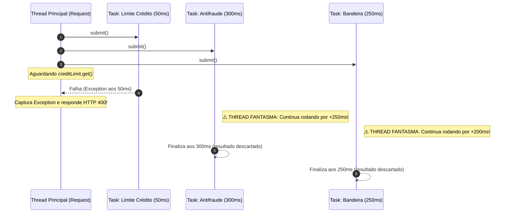
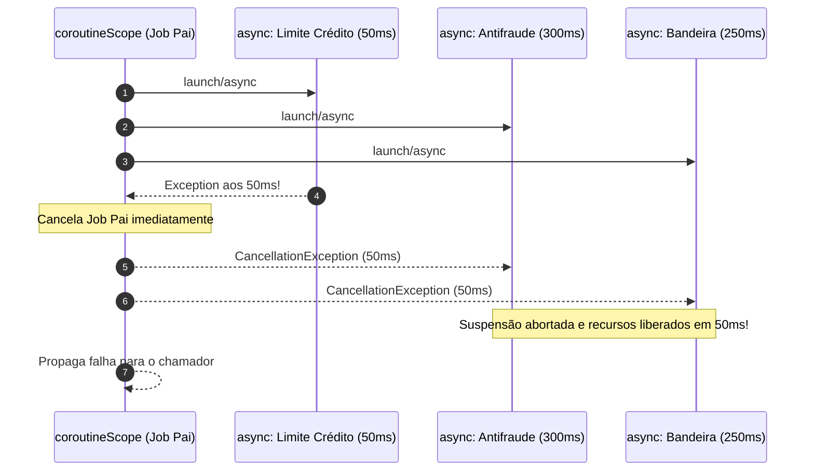

# Concorrência Estruturada na Prática: Eliminando Threads Fantasmas e Desperdício de Recursos em Alta Volumetria (Java vs. Kotlin)

> **Autor:** Engenharia de Backend & Sistemas Distribuídos  
> **Tópicos:** Concorrência Estruturada, Java 21+ (Project Loom), Kotlin Coroutines, Resiliência, Eficiência de Recursos

---

## 1. O Problema: O Custo Oculto das "Threads Fantasmas"

Em sistemas distribuídos de alta volumetria (como gateways de pagamento, core banking e plataformas de alta frequência), a latência de cauda (*tail latency*) e a saturação de recursos são métricas críticas de sobrevivência. 

Tradicionalmente, para processar operações compostas com baixa latência, recorremos à concorrência disparando tarefas paralelas via `ExecutorService`, `Future` ou `CompletableFuture`. No entanto, a concorrência tradicional na JVM é **não-estruturada**: o ciclo de vida da thread que dispara a operação é completamente desacoplado do ciclo de vida das tarefas secundárias criadas por ela.

### O Cenário de Negócio: Autorização de Pagamento Concorrente

Considere um endpoint crítico de autorização de transação que precisa consultar 3 serviços em paralelo antes de aprovar uma compra:

```
                  ┌───> [1] Antifraude (~300ms)
                  │
[Requisição HTTP] ┼───> [2] Limite de Crédito (~50ms) ───> [FALHA: Saldo Insuficiente]
                  │
                  └───> [3] Bandeira do Cartão (~250ms)
```

1. **Serviço de Antifraude:** Executa regras de machine learning e validação de dispositivo (latência esperada: ~300ms).
2. **Serviço de Limite de Crédito:** Consulta saldo disponível no ledger (latência esperada: ~50ms).
3. **Serviço de Bandeira:** Verifica restrições do emissor/bandeira (latência esperada: ~250ms).

Se a consulta de **Limite de Crédito falhar aos 50ms** com saldo insuficiente, a transação inteira já está irrevogavelmente reprovada. Não há qualquer razão lógica para aguardar o resultado do Antifraude ou da Bandeira.

### O Anti-Padrão Tradicional (`ExecutorService` / `Future`)

Vejamos como esse código é comumente implementado com a concorrência clássica do Java:

```java
public PaymentResult processPaymentUnstructured(PaymentRequest request) throws Exception {
    ExecutorService executor = Executors.newCachedThreadPool();

    Future<AntifraudResult> antifraudFuture = executor.submit(
        () -> antifraudService.validate(request)
    );
    Future<CreditLimitResult> creditLimitFuture = executor.submit(
        () -> creditLimitService.check(request)
    );
    Future<CardSchemeResult> cardSchemeFuture = executor.submit(
        () -> cardSchemeService.authorize(request)
    );

    try {
        // Bloqueia aguardando as respostas
        CreditLimitResult creditLimit = creditLimitFuture.get(); // Lança ExecutionException em 50ms!
        AntifraudResult antifraud = antifraudFuture.get();
        CardSchemeResult cardScheme = cardSchemeFuture.get();

        return new PaymentResult(antifraud, creditLimit, cardScheme);
    } catch (ExecutionException e) {
        // A thread principal captura a falha e retorna o erro HTTP 422/400 imediatamente...
        throw new PaymentProcessingException("Falha ao autorizar pagamento", e.getCause());
    }
}
```



### O Desperdício e o Perigo das Threads Fantasmas

Quando `creditLimitFuture.get()` lança exceção aos 50ms:
1. **Trabalho Inútil:** As tarefas de `Antifraud` e `CardScheme` continuam executando em segundo plano até o final (~250ms a mais).
2. **Esgotamento de Pools de Conexão:** Cada uma dessas tarefas "órfãs" mantém alugada uma conexão HTTP do cliente (OkHttp/Apache HttpClient) ou do pool JDBC/R2DBC (HikariCP), além de alocar buffers de socket no kernel do SO.
3. **Efeito Cascata (*Cascading Failure*):** Em um pico de 10.000 RPS, se 10% das transações falharem rapidamente por limite insuficiente, milhares de threads fantasmas continuam enfileirando requisições em serviços downstream já sobrecarregados, derrubando o antifraude e a bandeira sem qualquer benefício.

### O Perigo de Engolir `InterruptedException` em Blocos de Retry

Outro problema grave da concorrência tradicional reside em como bibliotecas e desenvolvedores lidam com interrupções. No Java, o cancelamento cooperativo depende de `Thread.interrupt()`.

Quando uma tarefa é interrompida, métodos bloqueantes lançam `InterruptedException`. O erro comum em rotinas de resiliência e retry é o seguinte:

```java
// ❌ ANTI-PADRÃO CRÍTICO: Engolindo a interrupção no retry
public AntifraudResult validateWithRetry(PaymentRequest req) {
    for (int attempt = 1; attempt <= 3; attempt++) {
        try {
            return callAntifraudApi(req);
        } catch (Exception e) { // Captura genérica (inclui InterruptedException!)
            log.warn("Tentativa {} falhou. Tentando novamente...", attempt);
            try {
                Thread.sleep(100); // Se foi interrompido, vai falhar aqui de novo...
            } catch (InterruptedException ie) {
                // Pior ainda: engole silenciosamente sem rearmar a flag!
            }
        }
    }
    throw new ServiceUnavailableException("Antifraude indisponível");
}
```

Ao capturar `InterruptedException` ou `Exception` genérica sem rearmar a flag com `Thread.currentThread().interrupt()`, a thread limpa o status de interrupção e continua rodando em loop. Mesmo que o chamador original tente cancelar o `Future` via `future.cancel(true)`, a thread filha ignora a ordem e segue desperdiçando CPU e rede.

---

## 2. A Solução do Java: `StructuredTaskScope` (Projeto Loom)

Para resolver esse desacoplamento nocivo, o Java introduziu a **Concorrência Estruturada** (*Structured Concurrency*, JEP 453/462/480/487) como parte do Projeto Loom.

### Princípio do Escopo Léxico

A ideia fundamental da concorrência estruturada é análoga à programação estruturada (estruturas de controle como `if`, `for` e blocos de código `{ }`): **uma tarefa concorrente com múltiplas sub-tarefas só pode ser considerada concluída quando todas as suas sub-tarefas terminarem ou quando o escopo léxico for encerrado**.

No Java, isso é materializado através da interface `AutoCloseable` em conjunto com o bloco `try-with-resources`:

```
┌── try (var scope = StructuredTaskScope.open(...)) ────────────────┐
│   │                                                               │
│   ├──> fork(tarefa 1) ──┐                                         │
│   ├──> fork(tarefa 2) ──┼──> scope.join()                         │
│   └──> fork(tarefa 3) ──┘                                         │
│                                                                   │
│   [Ao atingir close(), nenhuma thread filha permanece viva]       │
└───────────────────────────────────────────────────────────────────┘
```

Se qualquer sub-tarefa falhar, a política de junção (*joiner*) detecta a falha, encerra o escopo e propaga `Thread.interrupt()` imediatamente para todas as sub-tarefas irmãs ainda em execução. O fechamento do bloco `try` no `close()` bloqueia deterministicamente até que todas as threads filhas tenham atendido ao cancelamento e finalizado suas rotinas de limpeza.

### Exemplo Prático com `StructuredTaskScope.Joiner.allSuccessfulOrThrow()`

Utilizando as APIs mais recentes do Loom com o `Joiner.allSuccessfulOrThrow()`:

```java
package com.payment.service;

import java.util.concurrent.StructuredTaskScope;
import java.util.concurrent.StructuredTaskScope.Joiner;
import java.util.concurrent.StructuredTaskScope.Subtask;
import java.util.concurrent.ExecutionException;

public class PaymentServiceLoom {

    private final AntifraudService antifraudService;
    private final CreditLimitService creditLimitService;
    private final CardSchemeService cardSchemeService;

    public PaymentServiceLoom(AntifraudService af, CreditLimitService cl, CardSchemeService cs) {
        this.antifraudService = af;
        this.creditLimitService = cl;
        this.cardSchemeService = cs;
    }

    public PaymentResult processPayment(PaymentRequest request) 
            throws InterruptedException, ExecutionException {

        // 1. Abre o escopo estruturado com a política: Todas devem ter sucesso; na 1ª falha, interrompe as demais.
        try (var scope = StructuredTaskScope.open(Joiner.<Object>allSuccessfulOrThrow())) {

            // 2. Dispara (fork) as 3 tarefas em Virtual Threads dedicadas
            Subtask<AntifraudResult> antifraudTask = scope.fork(
                () -> antifraudService.validate(request)
            );
            Subtask<CreditLimitResult> creditLimitTask = scope.fork(
                () -> creditLimitService.check(request)
            );
            Subtask<CardSchemeResult> cardSchemeTask = scope.fork(
                () -> cardSchemeService.authorize(request)
            );

            // 3. Aguarda o término ou a primeira falha (fail-fast)
            scope.join();

            // 4. Se chegou aqui, todas as 3 sub-tarefas completaram com sucesso.
            // O método .get() é seguro e não bloqueia.
            return new PaymentResult(
                antifraudTask.get(),
                creditLimitTask.get(),
                cardSchemeTask.get()
            );

        } // 5. O scope.close() implícito aqui garante que NENHUMA thread vaze deste bloco.
    }
}
```

### O que acontece por baixo dos panos quando `creditLimitTask` falha aos 50ms?

1. `creditLimitService.check(request)` lança uma `CreditLimitExceededException` aos 50ms.
2. A implementação do `Joiner.allSuccessfulOrThrow()` intercepta a falha e invoca internamente o cancelamento do escopo.
3. O escopo envia `Thread.interrupt()` instantaneamente para as Virtual Threads responsáveis por `antifraudTask` e `cardSchemeTask`.
4. As chamadas I/O de rede dessas tarefas irmãs são abortadas (ex: `SocketTimeoutException` ou `ClosedByInterruptException`), liberando seus sockets e conexões imediatamente.
5. O método `scope.join()` acorda imediatamente e o bloco `try` é finalizado sem desperdiçar mais nenhum milissegundo de CPU ou tráfego de rede.

---

## 3. A Abordagem do Kotlin: Simplicidade e Coroutines

O Kotlin adotou o conceito de Concorrência Estruturada desde a concepção de sua biblioteca `kotlinx.coroutines`. No ecossistema Kotlin, a concorrência estruturada não é uma camada adaptada a um modelo de threads pré-existente: **é a fundação de todo o modelo de execução**.

### Concorrência Estruturada Nativa via `coroutineScope`

No Kotlin, qualquer bloco `coroutineScope { ... }`:
1. Cria um `Job` pai associado ao escopo atual.
2. Qualquer coroutine iniciada com `async` ou `launch` dentro deste bloco torna-se automaticamente um **filho** do `Job` pai.
3. Se qualquer coroutine filha lançar uma exceção não tratada, ela **cancela o pai**, que por sua vez **cancela todos os outros filhos** e propaga a exceção para cima (*hierarchical cancellation*).
4. O cancelamento em coroutines é cooperativo e baseado em suspensão: quando uma coroutine é cancelada, os pontos de suspensão (`delay`, `await`, chamadas Ktor/Retrofit/gRPC suspend) lançam imediatamente uma `CancellationException`, liberando o despachante sem bloquear threads do sistema operacional.

### Exemplo Prático em Kotlin

Vejamos o mesmo cenário de negócio implementado com Kotlin Coroutines:

```kotlin
package com.payment.service

import kotlinx.coroutines.async
import kotlinx.coroutines.coroutineScope

class PaymentServiceKotlin(
    private val antifraudService: AntifraudService,
    private val creditLimitService: CreditLimitService,
    private val cardSchemeService: CardSchemeService
) {

    suspend fun processPayment(request: PaymentRequest): PaymentResult = coroutineScope {
        // Dispara as 3 tarefas assíncronas no escopo estruturado
        val antifraudDeferred = async { antifraudService.validate(request) }
        val creditLimitDeferred = async { creditLimitService.check(request) }
        val cardSchemeDeferred = async { cardSchemeService.authorize(request) }

        // Aguarda todos os resultados
        PaymentResult(
            antifraud = antifraudDeferred.await(),
            creditLimit = creditLimitDeferred.await(),
            cardScheme = cardSchemeDeferred.await()
        )
    }
}
```



### Comportamento em Caso de Falha

Se `creditLimitService.check(request)` lançar uma exceção aos 50ms:
- O `coroutineScope` intercepta a falha e cancela o `Job` pai.
- As chamadas `antifraudDeferred` e `cardSchemeDeferred` recebem sinal de cancelamento imediato.
- Como o ecossistema Kotlin utiliza funções `suspend`, o cancelamento ocorre no próximo ponto de suspensão (ou imediatamente se estiver aguardando I/O não-bloqueante), abortando a requisição HTTP/gRPC downstream.
- O bloco `coroutineScope` encerra deterministicamente, garantindo **zero vazamento de coroutines ou conexões**.

---

## 4. Comparativo Prático: Java (Loom) vs. Kotlin (Coroutines)

Arquiteturalmente, tanto o Java com `StructuredTaskScope` quanto o Kotlin com `coroutineScope` atingem o **mesmo objetivo de engenharia**:
- Garantia de que nenhuma sub-tarefa sobreviva ao ciclo de vida de quem a invocou.
- Cancelamento automático e cooperativo (*fail-fast*) de tarefas irmãs quando uma falha.
- Prevenção de vazamento de sockets, conexões de banco de dados e CPU em computações condenadas.
- Aplicação de timeouts globais que se propagam em cascata pela árvore de execução.

No entanto, a **ergonomia** e o modelo subjacente diferem consideravelmente.

### Matriz Comparativa

| Dimensão | Java 21+ (Project Loom) | Kotlin (Coroutines) |
| :--- | :--- | :--- |
| **Abstração Principal** | `StructuredTaskScope` + `VirtualThread` | `coroutineScope` + `Continuation` (Suspensão) |
| **Garantia de Escopo** | Escopo léxico explícito via `try-with-resources` (`AutoCloseable`) | Bloco de função lambda (`coroutineScope { ... }`) |
| **Mecanismo de Cancelamento** | `Thread.interrupt()` cooperativo da JVM | `CancellationException` em pontos de suspensão |
| **Sintaxe e Ergonomia** | Mais verbosa; requer criação de escopo, `fork()`, `join()` e `get()` manual | Altamente concisa; `async { }` e `await()` integrados à linguagem |
| **Propagação de Contexto** | `ScopedValue` (JEP 446/481) | `CoroutineContext` (ex: MDC, Tracing, CoroutineName) |
| **Gestão de Timeout** | `scope.joinUntil(Instant)` explícito | `withTimeout(duration) { ... }` idiomático |
| **Impacto no Código Legado** | Não exige reescrever assinaturas de métodos (bloqueio síncrono em Virtual Threads) | Exige marcar funções com o modificador `suspend` |

### Análise de Ergonomia: Por que o Kotlin ainda é mais limpo?

1. **Ausência de Cerimônia:**
   No Java, o desenvolvedor precisa instanciar o escopo com o `Joiner` correto, realizar o `fork()` de cada `Callable`, chamar explicitamente `scope.join()` e, em seguida, invocar `.get()` em cada `Subtask`. Se esquecer de chamar `join()`, o compilador/runtime lançará `IllegalStateException` ao tentar ler `.get()`.
   
   No Kotlin, o simples encapsulamento em `coroutineScope` cuida de todo o ciclo de vida: o `await()` já combina a sincronização e a extração do valor retornado com tipagem estrita de forma natural.

2. **Natureza não-bloqueante vs Virtual Threads:**
   - O Java executa código síncrono bloqueante em cima de Virtual Threads gerenciadas pelo runtime. Isso é excelente para compatibilidade com código legado e bibliotecas JDBC antigas.
   - O Kotlin transforma funções `suspend` em máquinas de estado em tempo de compilação. Isso elimina o custo de alocação de pilhas de threads e torna o código extremamente leve e reativo sem o inferno de callbacks (*callback hell*) de frameworks reativos clássicos.

---

## 5. Conclusão: O Impacto Real em Sistemas de Alta Volumetria

A Concorrência Estruturada não é um mero preciosismo estético ou um padrão de design acadêmico: **em arquiteturas distribuídas de alta escala, ela é um requisito fundamental de estabilidade e custo operacional**.

### O Impacto Matemático do Cancelamento Imediato

Considere um cluster de pagamentos processando **10.000 requisições por segundo (RPS)**:
- Suponha uma taxa de rejeição/falha rápida de **5%** (500 requisições/s falhando em 50ms por saldo insuficiente ou regras cadastrais).
- Na concorrência tradicional não-estruturada, as tarefas de Antifraude e Bandeira continuam rodando por mais **250ms**.
- **Cálculo de Conexões/Sockets Presos:**  
  $$\text{Conexões Desperdiçadas} = 500 \text{ req/s} \times 2 \text{ tarefas irmãs} \times 0.250 \text{s} = 250 \text{ conexões concorrentes permanentemente saturadas}$$

Essas 250 conexões retidas indevidamente a cada instante representam:
- 250 slots ocupados no pool de conexões HTTP do gateway.
- 250 requisições adicionais enfileiradas nos servidores de Antifraude por segundo, degradando o tempo de resposta de clientes com transações legítimas.
- Centenas de megabytes de buffers de rede e processamento de GC na JVM.

### Veredito de Arquitetura

- Se você está em **Kotlin**, utilize `coroutineScope` e desfrute de concorrência estruturada nativa, concisa e de altíssima ergonomia.
- Se você está em **Java moderno (21+)**, abandone de vez o uso cru de `ExecutorService` e `CompletableFuture` para orquestração de sub-tarefas síncronas; adote `StructuredTaskScope` aliado a **Virtual Threads**.

Em sistemas distribuídos modernos, **economizar 200ms de conexões presas em tarefas condenadas é a linha divisória entre uma aplicação resiliente e o colapso por exaustão de recursos (*thread/pool starvation*)**.
