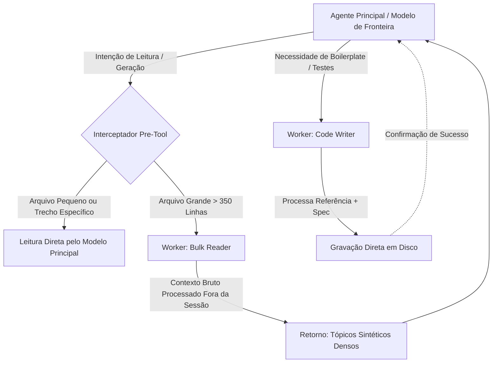

<p align="center">
  
  
  
  
</p>

# ⚡ Otimização e Roteamento de Tokens em Agentes de Código Autônomos

> **Nota Técnica & Guia de Arquitetura**: Como reduzir em até 90% o consumo de tokens de modelos de fronteira através de *Model Routing*, *Pre-Tool Hooks* e delegação especializada de I/O e *boilerplate*.

---

## 📑 Sumário

1. [O Paradoxo do Custo em Agentes de Código](#1-o-paradoxo-do-custo-em-agentes-de-código)
2. [A Estratégia de Roteamento de Modelos (Model Routing)](#2-a-estratégia-de-roteamento-de-modelos-model-routing)
3. [Os Dois Workers Especializados (Declarative Modes)](#3-os-dois-workers-especializados-declarative-modes)
   - [Mode 1: Bulk Reader (Leitor em Massa e Sintetizador)](#mode-1-bulk-reader-leitor-em-massa-e-sintetizador)
   - [Mode 2: Code Writer (Gerador de Boilerplate Direto no Disco)](#mode-2-code-writer-gerador-de-boilerplate-direto-no-disco)
4. [Arquitetura em Três Camadas (Enforcement Determinístico)](#4-arquitetura-em-três-camadas-enforcement-determinístico)
   - [Camada 1: Hooks de Interceptação Pré-Tool (PreToolUse Hooks)](#camada-1-hooks-de-interceptação-pré-tool-pretooluse-hooks)
   - [Camada 2: Scripts Wrappers & Execução Isolada](#camada-2-scripts-wrappers--execução-isolada)
   - [Camada 3: Skills e Redirecionamento Fluido](#camada-3-skills-e-redirecionamento-fluido)
5. [Limitações Críticas: O que NÃO Delegar](#5-limitações-críticas-o-que-não-delegar)
6. [Análise de Latência vs Economia de Tokens](#6-análise-de-latência-vs-economia-de-tokens)
7. [Guia de Implementação Prática](#7-guia-de-implementação-prática)
8. [Matriz Comparativa: Monolítico vs Roteamento em Camadas](#8-matriz-comparativa-monolítico-vs-roteamento-em-camadas)
9. [Arquitetura Modular do Repositório (Standalone Ready)](#9-arquitetura-modular-do-repositório-standalone-ready)
10. [CLI Unificada, Demonstração e Testes](#10-cli-unificada-demonstração-e-testes)

---

## 1. O Paradoxo do Custo em Agentes de Código

Ao utilizar agentes de codificação autônomos no fluxo diário de desenvolvimento de software, é comum assumir que o consumo de tokens decorre de raciocínio lógico profundo e arquitetura de software complexa. 

No entanto, a análise empírica do consumo de contexto de agentes revela um fato contraintuitivo:

> **A maior parte do trabalho de um agente de IA não é raciocínio. É pura operação de I/O (Entrada e Saída) e geração de código repetitivo.**

### A Anatomia do Desperdício de Tokens

Considere as tarefas mais frequentes executadas por um agente em um monorepo ou base de código legada:
- **Leitura exploratória massiva**: Ler 5 a 10 arquivos inteiros de 500 linhas para responder a uma dúvida pontual sobre a assinatura de um método ou dependência de banco de dados.
- **Geração de testes padronizados**: Gerar um arquivo de teste de unidade que replica rigorosamente a mesma estrutura de outros 20 testes já existentes ao lado.
- **Scaffolding e Configurações**: Criar stubs de DTOs, configurações YAML/JSON ou mapeamentos de tipos.

Alimentar milhares de linhas de código bruto repetitivo diretamente na janela de contexto de um **modelo de fronteira** (*frontier model* de alta capacidade e custo elevado) é o equivalente econômico a contratar um arquiteto principal de software sênior para digitar manualmente linhas de digitação de formulários.

```
┌─────────────────────────────────────────────────────────────────────────────┐
│                       FLUXO MONOLÍTICO TRADICIONAL                          │
├─────────────────────────────────────────────────────────────────────────────┤
│                                                                             │
│   Arquivos Brutos (20k tokens) ────────┐                                    │
│   Especificação (500 tokens)   ────────┼──► [ Modelo de Fronteira ]         │
│   Testes de Exemplo (5k tokens)────────┘    (Custo: Alto $$$)               │
│                                                     │                       │
│                                                     ▼                       │
│                                          Resposta / Código Final            │
│                                                                             │
│   ⚠️ Problema: 90% dos tokens foram gastos ingerindo texto bruto sem raciocínio!
└─────────────────────────────────────────────────────────────────────────────┘
```

Se todo o código bruto entra na janela de contexto do modelo principal, ocorrem três problemas graves:
1. **Custo Financeiro Explosivo**: O consumo de tokens por desenvolvedor escala rapidamente, superando com facilidade centenas ou milhares de dólares mensais por pessoa.
2. **Context Exhaustion (Degradação de Atenção)**: Conforme o contexto se enche de centenas de linhas de código irrelevante, o modelo perde atenção a detalhes cruciais (*needle in a haystack problem*).
3. **Desperdício de Janela de Contexto**: A sessão atinge limites de truncamento precocemente, forçando compactações que perdem o histórico da conversa.

---

## 2. A Estratégia de Roteamento de Modelos (Model Routing)

A solução não exige abrir mão de modelos de fronteira para raciocínio analítico, nem adotar exclusivamente modelos fracos. A resposta arquitetural é o **Roteamento Especializado de Tarefas (*Model Routing*)**:

- **Modelo de Fronteira (Orquestrador / Pensador)**: Reservado exclusivamente para planejamento arquitetural, depuração de bugs sutis, decisões de segurança e integração lógica.
- **Modelos Workers (Executores de Grunt Work)**: Modelos menores, ultra-rápidos e de baixo custo (como modelos Flash, SLMs locais ou modelos especializados de leitura) configurados em modo efêmero para engolir centenas de milhares de tokens de I/O e devolver apenas a síntese necessária.



---

## 3. Os Dois Workers Especializados (Declarative Modes)

Para desacoplar as tarefas pesadas de I/O da sessão principal, definimos dois perfis declarativos de *workers*. Cada worker atua de forma descartável (*one-shot* e efêmera), podendo rodar em um modelo leve de baixo custo:

### Mode 1: `bulk-reader` (Leitor em Massa e Sintetizador)

Destinado a situações em que o modelo principal precisaria ler múltiplos arquivos longos apenas para responder a uma pergunta conceitual ou factual sobre o código.

```yaml
name: bulk-reader
description: Leitor em massa para análise de código - delega I/O pesado
model: lightweight-worker-model (ex: gemini-flash / gpt-4o-mini / haiku)
temperature: 0.2
visibility: shared
instructions: |
  Você é um analista de código preciso e conciso.
  Leia os arquivos fornecidos e responda à pergunta do chamador de forma estritamente objetiva.
  Formato de saída:
  - Utilize APENAS tópicos estruturados (bullet points).
  - PROIBIDO: saudações, conclusões, preâmbulos, comentários de cortesia ou prosa genérica.
  - Inicie cada tópico com o nome exato do método, tipo de dado ou número de linha correspondente.
  - Use sub-tópicos aninhados para detalhes técnicos pontuais.
  - Ignore absolutamente tudo o que o chamador não perguntou expressamente.
```

**Por que este prompt é crucial?**
Se o modelo worker devolver introduções educadas ("*Claro! Analisei o arquivo UserService.java e notei que...*"), o modelo de fronteira terá que pagar tokens extras apenas para parsear o texto de preâmbulo. O formato em tópicos crus maximiza a densidade de informação por token.

---

### Mode 2: `code-writer` (Gerador de Boilerplate Direto no Disco)

Destinado à geração de testes unitários, arquivos de configuração, scaffolding ou stubs que seguem convenções rígidas de código já existente no projeto.

```yaml
name: code-writer
description: Gerador de código boilerplate - delega trabalho de alta taxa de tokens de saída
model: lightweight-worker-model (ex: gemini-flash / gpt-4o-mini / haiku)
temperature: 0.2
visibility: shared
instructions: |
  Você gera arquivos de código completos baseando-se estritamente em uma especificação funcional e em arquivos de referência.
  Reproduza exatamente os mesmos padrões arquiteturais, convenções de nomenclatura, bibliotecas e estilo do código de referência.
  Contrato de saída:
  - Retorne EXCLUSIVAMENTE o código-fonte executável.
  - PROIBIDO incluir explicações, comentários conversacionais ou blocos de formatação markdown (sem ```java ou ```python), a menos que explicitamente solicitado.
  - Se a especificação for parcialmente ambígua, adote decisões razoáveis que preservem a coerência com o arquivo de referência.
```

**Por que a instrução "Retorne EXCLUSIVAMENTE o código" é determinante?**
1. Permite que o utilitário de execução capture o *stdout* do modelo worker e grave o arquivo **diretamente no disco**.
2. **O modelo de fronteira NUNCA vê o código gerado em sua janela de contexto**, economizando milhares de tokens de entrada e saída caríssimos.

---

## 4. Arquitetura em Três Camadas (Enforcement Determinístico)

A tentativa ingênua de resolver esse problema consiste em colocar regras consultivas no arquivo de instruções do agente (ex: `AGENTS.md`, `CLAUDE.md` ou prompt de sistema), dizendo: *"Por favor, não leia arquivos grandes diretamente; use o worker"*.

> [!WARNING]
> **A Falácia das Regras Apenas Consultivas**: Modelos de linguagem sob pressão de contexto ou em cadeias longas de passos frequentemente ignoram instruções consultivas e voltam a invocar as ferramentas nativas de leitura direta (`Read`, `cat`, etc.).

Para garantir economia real, a arquitetura deve ser dividida em **três camadas complementares com imposição determinística**:

```
┌─────────────────────────────────────────────────────────────────────────────┐
│                    ARQUITETURA EM TRÊS CAMADAS DE DELEGAÇÃO                 │
├─────────────────────────────────────────────────────────────────────────────┤
│                                                                             │
│   [ Agente Principal ]                                                      │
│           │                                                                 │
│           ▼ (Tenta ler arquivo grande)                                      │
│   ┌─────────────────────────────────────────────────────────────────────┐   │
│   │ CAMADA 1: Pre-Tool Interception Hook                                │   │
│   │  - Mede o tamanho do arquivo alvo em linhas                         │   │
│   │  - Se linhas >= 350: BLOQUEIA a leitura nativa                      │   │
│   │  - Devolve mensagem de erro orientativa: "Use o /bulk-reader"       │   │
│   └─────────────────────────────────────────────────────────────────────┘   │
│           │                                                                 │
│           ▼ (Redirecionado pelo erro do Hook)                               │
│   ┌─────────────────────────────────────────────────────────────────────┐   │
│   │ CAMADA 3: Agent Skills / Tool Definitions                           │   │
│   │  - Guia o agente com a sintaxe precisa de invocação do script       │   │
│   └─────────────────────────────────────────────────────────────────────┘   │
│           │                                                                 │
│           ▼ (Executa via linha de comando)                                  │
│   ┌─────────────────────────────────────────────────────────────────────┐   │
│   │ CAMADA 2: Scripts Wrappers & Execução                               │   │
│   │  - Empacota arquivos em tags XML estruturadas                       │   │
│   │  - Invoca o Worker descartável fora do contexto principal           │   │
│   │  - Grava código direto no disco (Writer) ou cospe síntese (Reader)  │   │
│   └─────────────────────────────────────────────────────────────────────┘   │
│                                                                             │
└─────────────────────────────────────────────────────────────────────────────┘
```

---

### Camada 1: Hooks de Interceptação Pré-Tool (PreToolUse Hooks)

Os hooks disparam **antes** de qualquer ferramenta nativa ser executada no ambiente do agente.

1. **`check-file-size` (Hook em chamadas de leitura nativas)**:
   - Toda vez que a ferramenta de leitura de arquivos é solicitada, o hook inspeciona a quantidade de linhas do arquivo no disco.
   - Se o arquivo exceder o limiar configurado (por exemplo, `350 linhas`), a execução é abortada imediatamente com código de erro, instruindo o agente a recorrer ao leitor em massa.
   - **Exceção inteligente (Targeted Reads)**: Se o agente solicitou um intervalo de linhas restrito (`StartLine` e `EndLine`, ou offset específico), a leitura é autorizada, pois o agente já sabe com precisão o que procura.

2. **`check-bash-read` (Hook para comandos de terminal)**:
   - Intercepta comandos como `cat`, `head -n 1000`, `tail`, `less` ou `more` aplicados sobre arquivos grandes.
   - Permite que comandos com *pipe* passem livremente (ex: `cat arquivo.java | grep "metodoX"`), pois comandos filtrados já realizam corte de volume.

---

### Camada 2: Scripts Wrappers & Execução Isolada

Scripts em linha de comando (Shell / Python) que cuidam de todo o trabalho bruto:
- Delimitam os arquivos dentro de tags XML explícitas (`<file path="...">...</file>`), permitindo que o worker compreenda claramente as fronteiras entre arquivos.
- Despacham a requisição para o runtime do worker de forma descartável (*stateless* e *one-shot*).
- Em caso de geração de código (`code-write`), filtram blocos de formatação acidentais e escrevem diretamente no caminho de destino sem que o arquivo passe pela memória do agente principal.

Exemplo de uso pelo agente:
```bash
# Análise de múltiplos arquivos sem carregar o código no agente principal
bulk-read --question "Quais serviços chamam a API de pagamento?" --paths src/ServiceA.java src/ServiceB.java

# Geração de teste unitário gravado direto no arquivo final
code-write --spec "Criar testes de borda para UserService" --reference tests/OrderTest.java --target tests/UserTest.java
```

---

### Camada 3: Skills e Redirecionamento Fluido

Para que o agente não fique perdido ao ter uma leitura bloqueada pelo hook da Camada 1, a Camada 3 fornece a **definição semântica da habilidade (Skill)** no catálogo de ferramentas do agente.

As especificações de skills prontas para o **Cursor Agent** estão disponíveis na pasta [`agent/`](./agent):
- [`agent/bulk-reader.md`](./agent/bulk-reader.md): instrui o Cursor sobre como invocar o script de leitura compactada e consumir sínteses em bullets.
- [`agent/code-writer.md`](./agent/code-writer.md): instrui o Cursor sobre como despachar a geração de testes e boilerplate diretamente para disco.

Quando o hook bloqueia uma leitura:
> `Bloqueio: O arquivo possui 820 linhas (limite: 350). Utilize a skill /bulk-reader para consultar este conteúdo.`

O agente consulta a documentação da *skill*, que contém a sintaxe exata dos parâmetros, realizando a transição sem intervenção humana.

---

## 5. Limitações Críticas: O que NÃO Delegar

A delegação indiscriminada para modelos menores pode introduzir falhas de software severas. É essencial estabelecer fronteiras invioláveis sobre o que **nunca** deve ser delegado:

```
┌──────────────────────────────────────┬──────────────────────────────────────┐
│       PODE E DEVE SER DELEGADO       │         NÃO PODE SER DELEGADO        │
│          (Workers Baratos)           │       (Apenas Modelo de Fronteira)   │
├──────────────────────────────────────┼──────────────────────────────────────┤
│ 1. Leitura massiva de contexto       │ 1. Edições cirúrgicas e diffs finos  │
│ 2. Varredura de dependências e APIs  │ 2. Depuração de concorrência/threads │
│ 3. Geração de testes padronizados    │ 3. Decisões de segurança crítica     │
│ 4. Scaffolding e stubs de DTOs       │ 4. Decisões de arquitetura e design  │
│ 5. Geração de documentação/specs     │ 5. Refatorações estruturais globais  │
└──────────────────────────────────────┴──────────────────────────────────────┘
```

### 1. Edição Cirúrgica de Código (*Patching*)
Modelos workers e sintetizadores analíticos não produzem números de linha 100% confiáveis para ferramentas de substituição por bloco (*replace chunks*). Para editar linhas específicas de um arquivo, o modelo de fronteira **precisa** fazer a leitura pontual daquele trecho para calcular o diff exato.

### 2. Detecção de Bugs Sutis e Concorrência (*Race Conditions*)
Modelos de menor porte identificam facilmente padrões superficiais (nomes fora do padrão, tipos incompatíveis óbvios), mas frequentemente falham ao analisar:
- Concorrência de memória e visibilidade em ambientes multithread (`volatile`, `synchronized`, atomics).
- Problemas de transacionalidade de banco de dados e isolamento ACID.
- Vulnerabilidades sutis de injeção e ciclo de vida de recursos.

Uma vez fornecido o resumo filtrado pelo worker, o raciocínio final deve permanecer nas mãos do modelo de fronteira.

---

## 6. Análise de Latência vs Economia de Tokens

A delegação introduz um *trade-off* físico inevitável: **tempo de rede**.

Toda invocação de um worker externo envolve uma chamada de rede adicional (*round-trip*), que tipicamente varia de **5 a 20 segundos** dependendo do tamanho do contexto analisado.

```
       Custo em Tokens                       Latência Total
   ┌──────────────────────┐              ┌──────────────────────┐
   │ █ Monolítico (100%)  │              │ █ Monolítico (5s)    │
   │ ░ Delegado   (10%)   │              │ ░ Delegado   (18s)   │
   └──────────────────────┘              └──────────────────────┘
   Economia massiva de tokens            Sobrecarga aceitável para arquivos
   e preservação do contexto             grandes; ineficiente para pequenos
```

### A Regra do Limiar de Linhas (*Threshold Rule*)

- **Para arquivos grandes (> 350 linhas)**: A sobrecarga de 15 segundos compensa enormemente, pois economiza dezenas de milhares de tokens e impede a poluição da janela de contexto.
- **Para arquivos pequenos (< 200 linhas)**: Delegar é contraproducente. A latência de rede adicionada supera os poucos centavos economizados, e o arquivo já caberia sem impacto no contexto principal.

Por esse motivo, o limiar (*threshold*) nos hooks de interceptação é um parâmetro obrigatório de sintonia fina.

---

## 7. Guia de Implementação Prática

Abaixo está a arquitetura de implementação para aplicar esse padrão em qualquer ambiente de agentes baseados em ferramentas de terminal:

### Implementação do Hook Pré-Tool (Pseudocódigo / Shell)

```bash
#!/usr/bin/env bash
# hook-check-file-size.sh - Intercepta leituras antes de serem executadas

TARGET_FILE="$1"
START_LINE="$2"
END_LINE="$3"
THRESHOLD=${AGENT_DELEGATION_THRESHOLD:-350}

# 1. Se a leitura for direcionada (intervalo de linhas específico), permite passar
if [ -n "$START_LINE" ] && [ -n "$END_LINE" ]; then
    DELTA=$((END_LINE - START_LINE))
    if [ "$DELTA" -lt "$THRESHOLD" ]; then
        exit 0 # Permite execução normal
    fi
fi

# 2. Se o arquivo não existir, deixa a ferramenta nativa lidar com o erro
if [ ! -f "$TARGET_FILE" ]; then
    exit 0
fi

# 3. Conta a quantidade de linhas do arquivo
LINE_COUNT=$(wc -l < "$TARGET_FILE" | tr -d ' ')

if [ "$LINE_COUNT" -ge "$THRESHOLD" ]; then
    echo "ERRO DE POLITICA: O arquivo $TARGET_FILE possui $LINE_COUNT linhas (limite direto: $THRESHOLD)." >&2
    echo "A leitura direta deste arquivo foi bloqueada para economizar tokens de contexto." >&2
    echo "Instrução: Utilize o comando 'bulk-read --paths $TARGET_FILE --question \"<sua duvida>\"' ou leia um intervalo menor." >&2
    exit 1 # Bloqueia a ferramenta nativa
fi

exit 0 # Permite execução normal
```

---

### Implementação do Wrapper de Leitura em Massa (`bulk-read`)

```python
#!/usr/bin/env python3
"""
bulk-read.py - Utilitário de delegação de I/O para worker leve
"""
import sys
import argparse
import os

def build_xml_payload(file_paths):
    payload = []
    for path in file_paths:
        if os.path.exists(path):
            with open(path, "r", encoding="utf-8", errors="replace") as f:
                content = f.read()
            payload.append(f'<file path="{path}">\n{content}\n</file>')
    return "\n".join(payload)

def main():
    parser = argparse.ArgumentParser(description="Delega leitura de arquivos a worker leve")
    parser.add_argument("--question", required=True, help="Pergunta analítica sobre os arquivos")
    parser.add_argument("--paths", nargs="+", required=True, help="Lista de arquivos a analisar")
    args = parser.parse_args()

    files_xml = build_xml_payload(args.paths)
    system_prompt = (
        "Você é um sintetizador conciso de código. Responda em bullet points objetivos. "
        "Sem saudações, preâmbulos ou conclusões. Aponte nomes exatos e números de linha."
    )
    user_prompt = f"Pergunta: {args.question}\n\nArquivos para análise:\n{files_xml}"

    # Disparo efêmero via API do modelo worker leve (ex: flash / mini / SLM local)
    # response = invoke_worker_model(system_prompt, user_prompt)
    # print(response.text)

if __name__ == "__main__":
    main()
```

---

### Como Executar os Scripts e a Suíte de Testes

Os scripts funcionais de referência estão disponíveis na pasta [`scripts/`](./scripts):

```bash
# 1. Conceder permissão de execução aos utilitários
chmod +x scripts/*.sh scripts/*.py

# 2. Executar a suíte de testes automatizada (5 testes cobrindo bloqueio, pass-through e geração)
./scripts/test-token-router.sh

# 3. Testar manualmente a interceptação do hook em um arquivo deste diretório
./scripts/hook-check-file-size.sh README.md

# 4. Executar leitura em massa com agrupamento XML
python3 scripts/bulk-read.py --question "Qual a arquitetura em 3 camadas?" --paths README.md

# 5. Gerar código e gravar fisicamente em disco sem tocar a janela de contexto principal
python3 scripts/code-write.py --spec "Criar serviço de auditoria" --reference scripts/bulk-read.py --target /tmp/GeneratedService.py
```

---

## 8. Matriz Comparativa: Monolítico vs Roteamento em Camadas

| Dimensão | Agente Monolítico Convencional | Agente com Roteamento em Camadas |
|:---|:---|:---|
| **Consumo de Tokens** | Alto e linear com o tamanho dos arquivos | **Redução de até 90%** em leituras e *boilerplate* |
| **Custo por Sessão** | Elevado (usa modelo de fronteira para tudo) | **Otimizado** (fração do custo via workers leves) |
| **Preservação de Contexto** | Rápida saturação e perda de histórico | **Janela limpa**, focada apenas nas decisões-chave |
| **Cumprimento de Regras** | Baixo (instruções de prompt são ignoradas) | **100% determinístico** (imposto via hooks de pré-execução) |
| **Geração de Boilerplate** | O código gerado ocupa tokens de saída caros | O código vai **direto para o disco**, sem tocar o contexto |
| **Latência por Chamada** | Rápida para arquivos individuais | Acréscimo de 10-20s na chamada do worker |
| **Eficácia em Bugs Sutis** | Alta (desde que o contexto não esteja saturado)| **Máxima** (fronteira foca exclusivamente na lógica fina) |

---

## 9. Arquitetura Modular do Repositório (Standalone Ready)

Este projeto foi desenhado desde o princípio para operar tanto como um módulo de estudo avançado quanto como um **repositório open-source autônomo (*standalone*)**.

```
agentic-token-optimization/
├── pyproject.toml                 # Empacotamento padrão Python (PEP 621, zero dependências obrigatórias)
├── Makefile                       # Automação de comandos: make test, make demo, make install
├── LICENSE                        # Licença MIT permissiva
├── CONTRIBUTING.md                # Diretrizes para novos contribuidores e workers
├── .gitignore                     # Isolamento estrito de artefatos de build e temporários
│
├── agent/                         # 🤖 Hub de integração para agentes e IDEs
│   ├── README.md                  # Guia de instalação e ativação
│   ├── bulk-reader.md             # Regra Cursor: Leitura e síntese densa
│   ├── code-writer.md             # Regra Cursor: Boilerplate direto no disco
│   └── cursorrules-template       # Snippet pronto para o arquivo .cursorrules raiz
│
├── src/token_router/              # 📦 Núcleo desacoplado e modular
│   ├── core/                      # Regras determinísticas e limiares
│   │   ├── config.py              # Configurações centralizadas (thresholds, env vars)
│   │   ├── analyzer.py            # Contagem de linhas e empacotamento XML
│   │   └── router.py              # Motor de decisão (evaluate_read_request)
│   ├── workers/                   # Modos especializados de IA
│   │   ├── base.py                # Contrato abstrato BaseWorker
│   │   ├── bulk_reader.py         # Worker sintetizador (bullets densos sem saudações)
│   │   └── code_writer.py         # Worker gerador (strip de markdown e escrita atômica)
│   └── cli.py                     # Entrypoint unificado da CLI
│
├── bin/                           # 🚀 Executáveis diretos para hooks do SO
│   ├── token-router               # Wrapper executável universal
│   └── hook-pre-tool.sh           # Hook pré-tool universal para Cursor, Claude Code e terminais
│
├── tests/                         # 🧪 Suíte de testes automatizados (unittest padrão)
│   ├── test_analyzer.py           # Análise de linhas e tags XML
│   ├── test_router.py             # Políticas de limiar e targeted reads
│   ├── test_workers.py            # Contratos de workers e gravação em disco
│   └── test_cli.py                # Testes end-to-end de comandos e exit codes
│
├── examples/                      # 🎮 Playground e demonstração interativa
│   ├── sample_large_service.py    # Serviço financeiro realista com 433 linhas
│   ├── sample_reference_test.py   # Teste canônico de referência
│   └── run_demo.sh                # Demonstração interativa dos 4 cenários
│
└── scripts/                       # 🛠️ Scripts legados mantidos para compatibilidade
    ├── hook-check-file-size.sh
    ├── bulk-read.py
    ├── code-write.py
    └── test-token-router.sh
```

---

## 10. CLI Unificada, Demonstração e Testes

A CLI centralizada permite integrar as políticas de tokens facilmente a qualquer esteira de desenvolvimento:

### Comandos da CLI (`bin/token-router`)

```bash
# 1. Inspecionar se um arquivo deve ser bloqueado por exceder o limiar
bin/token-router check caminho/do/arquivo.py

# 2. Permitir leitura direcionada (Targeted Read)
bin/token-router check caminho/do/arquivo.py --start-line 50 --end-line 80 -v

# 3. Delegar leitura e síntese para o Bulk Reader
bin/token-router read --question "Mapear contratos de API" --paths arquivo1.java arquivo2.java

# 4. Gerar código e gravar fisicamente em disco sem tocar a janela de contexto
bin/token-router write --spec "Testes de concorrência" --reference OrderTest.java --target UserTest.java
```

### Comandos de Automação via `Makefile`

```bash
make test      # Executa a suíte de 15 testes unitários
make demo      # Executa a demonstração interativa completa ponta a ponta
make legacy    # Valida retrocompatibilidade dos scripts em scripts/
make clean     # Limpa caches e arquivos temporários
```

---

## 💡 Conclusão

Delegar trabalho braçal de I/O e geração de código padronizado não é apenas uma estratégia de contenção de custos financeiros; é um **padrão de arquitetura de software para agentes autônomos**. 

Ao remover milhares de linhas de texto repetitivo do contexto do modelo de fronteira através de hooks determinísticos e workers especializados, o agente preserva sua capacidade atencional para aquilo em que ele é verdadeiramente insubstituível: **raciocinar, projetar e garantir a confiabilidade do sistema.**
