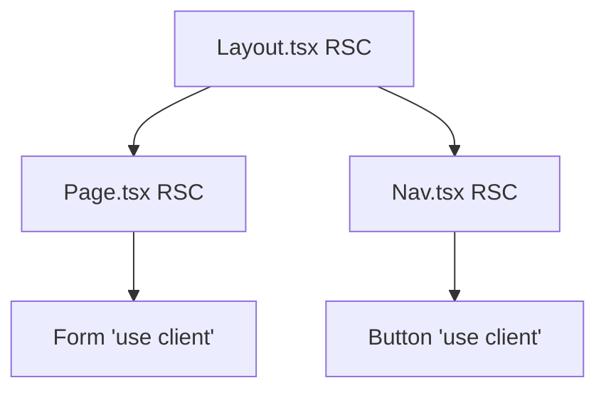

# Next.js App Router Skill

This skill enforces Next.js 14/15 App Router patterns with React Server Components, preventing common pitfalls when migrating from Pages Router or creating new applications.

## 🎯 Problem
Developers often carry over Pages Router patterns or misuse React Server Components.

**Bad Examples:**

1. Unnecessary Client Boundary at the top of a layout or page:
```tsx
// BAD: Makes the whole route a client boundary
'use client'
import { useState } from 'react';

export default function Page() {
  const [count, setCount] = useState(0);
  return <main>...</main>;
}
```

2. Using Pages router data fetching:
```tsx
// BAD: Pages Router pattern
export async function getServerSideProps() { ... }
```

3. Wrong router import:
```tsx
// BAD: Pages Router import
import { useRouter } from 'next/router';
```

4. Wrong Metadata pattern:
```tsx
// BAD: Using Head in App Router
import Head from 'next/head';

export default function Page() {
  return (
    <>
      <Head><title>My Page</title></Head>
      <div>Content</div>
    </>
  );
}
```

## ✅ Solution

**Good Examples:**

1. Server Component page with a client leaf:
```tsx
// GOOD: Page remains Server Component, only interactive part is client
import { Counter } from './counter'; // 'use client' inside

export default function Page() {
  return (
    <main>
      <h1>Server rendered heading</h1>
      <Counter />
    </main>
  );
}
```

2. Direct data fetch in async Server Component:
```tsx
// GOOD: Async component with direct fetch
export default async function Page() {
  const data = await fetch('https://api.example.com/data', { cache: 'no-store' }).then(r => r.json());
  return <div>{data.title}</div>;
}
```

3. Correct router import:
```tsx
// GOOD: App Router import
import { useRouter } from 'next/navigation';
```

4. Proper Metadata export:
```tsx
// GOOD: Using metadata export
export const metadata = {
  title: 'My Page',
};

export default function Page() {
  return <div>Content</div>;
}
```

## 📐 Anatomy of the skill
- Forces React Server Components (RSC) as the default.
- Pushes interactivity ('use client') to the leaves.
- Modern App Router specific API rules (Routing, Metadata, Caching).
- Server Actions security checklist (Zod + Auth).



## 🔧 How to install

### 1. Cursor
Copy `.cursorrules` to the root of your repository.

### 2. GitHub Copilot
Copy `copilot-instructions.md` to `.github/copilot-instructions.md`.

### 3. Gemini / Antigravity
Add `SKILL.md` to your skills directory.

## 📊 Expected impact
- Fewer unnecessary client bundles shipped to users.
- Faster Time To Interactive (TTI) and First Load times.
- SEO improvements via correct metadata implementations.
- Safer Server Actions.

## 🔗 References
- [Next.js App Router Docs](https://nextjs.org/docs/app)
- [cursor.directory/nextjs](https://cursor.directory/nextjs)
