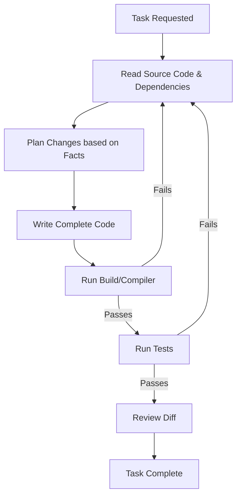

# Anti-Hallucination Verifier

## 🎯 Problem
AI coding assistants often hallucinate APIs, guess file structures, or leave placeholder code that breaks builds. 

**Bad Examples (Hallucinations):**
- Referencing `response.json()` on an Axios object that actually uses `response.data`.
- Importing from `@org/utils` when the package is actually named `@org/shared-utils`.
- Appending method calls like `.toJSON()` when the class only implements `.serialize()`.
- Leaving `// ... rest of implementation` placeholders instead of functional code.

## ✅ Solution
A rigorous verification loop that demands checking facts *before* coding and verifying results *after* coding.

**Good Examples (Verified Execution):**
- Reading `package.json` to verify the utility package name.
- Checking type definitions or source files for the correct object structure.
- Running the compiler and tests to catch errors immediately.

## 📐 Anatomy of the Skill
The verifier works by enforcing constraints on tool usage and output formatting:
1. **Pre-flight**: File reads and grep searches to anchor assumptions.
2. **Execution**: Emitting complete blocks of code without truncation.
3. **Post-flight**: Compiling, testing, and reviewing diffs to confirm success.

## 🔧 How to Install

### Antigravity / Gemini
Copy `SKILL.md` to your skills directory.

### Cursor
Copy `.cursorrules` to the root of your repository.

### GitHub Copilot
Copy `copilot-instructions.md` to `.github/copilot-instructions.md`.

## 📊 Expected Impact
- Dramatic reduction in "undefined method" errors.
- Fewer placeholder code blocks needing manual human completion.
- Higher success rates on autonomous agent runs.

## 🔗 References
- Windsurf community anti-hallucination rules.
- General LLM guardrail patterns.
