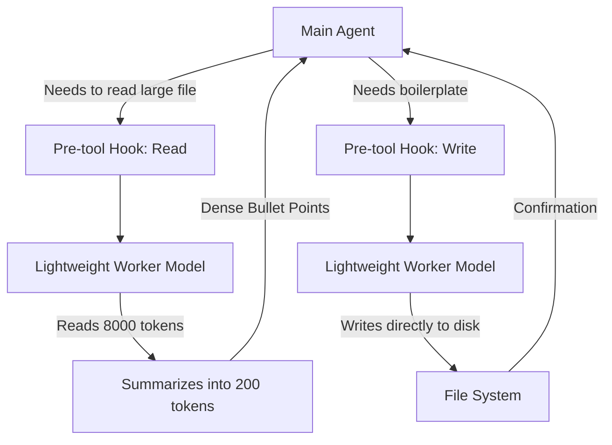

# Token Router Optimizer

## 🎯 Problem
Large context windows are expensive and lead to slow generation times and "lost in the middle" problems. Reading a 2000-line file just to understand a single method can waste ~8000 tokens per interaction. When generating repetitive DTOs, dumping 150 lines into the chat window wastes output tokens and slows down the main agent loop.

## ✅ Solution
Use a pre-tool hook to delegate heavy lifting to lightweight, fast, and cheap worker models (e.g., Claude Haiku or GPT-4o-mini). The main agent only receives dense, summarized insights.

## 📐 Anatomy of the Skill

### Context Budgeting
Instead of:
> Agent reads `UserService.java` (3000 lines / 12k tokens) -> Context saturated.

Do:
> Agent calls `python3 pre-tool-hook.py read --paths UserService.java --question "Where is the login method?"` -> Returns 5 lines.

## 🔧 How to Install

### Antigravity / Gemini
Copy `SKILL.md` to your skills directory and ensure `scripts/pre-tool-hook.py` is executable.

### Cursor
Copy `.cursorrules` to the root of your repository. Cursor naturally supports pre-tool hooks that can intercept file reads.

### GitHub Copilot
Copy `copilot-instructions.md` to `.github/copilot-instructions.md`.

## 📊 Expected Impact
- Up to 80% reduction in token consumption on large codebases.
- Faster response times during complex refactoring tasks.
- Improved agent focus (less context window dilution).

## 🔗 References
- agentic-token-optimization project in this repo.
- Cursor's pre-tool hooks documentation.
