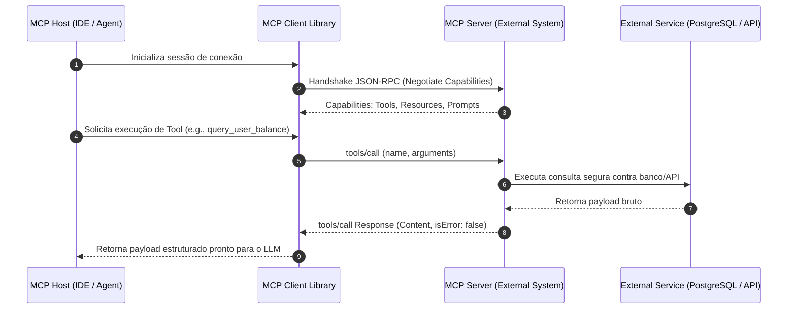
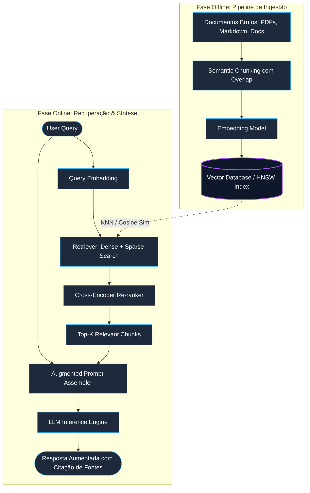
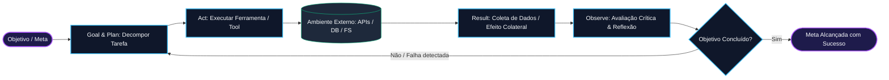
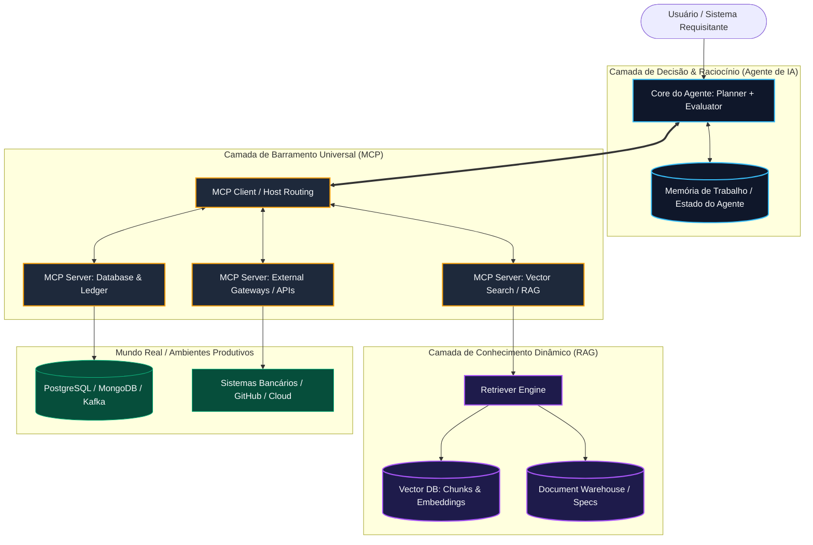

# Conectando IA ao Mundo Real: MCP, RAG e Agentes de IA

Na engenharia de sistemas inteligentes e arquiteturas distribuídas modernas, conectar Modelos de Linguagem de Grande Porte (**LLMs**) aos dados, ferramentas e fluxos de trabalho do mundo corporativo é o divisor de águas entre brinquedos estatísticos isolados e plataformas de produção orientadas a valor. 

Isolado em seu treinamento, um **LLM** opera estritamente sob **conhecimento paramétrico** estático — limitado a pesos congelados em um instante no tempo (*knowledge cutoff*) e desprovido de capacidade nativa de alterar o estado de ambientes externos. Para superar essa barreira epistêmica e operacional, três pilares arquiteturais emergiram como o padrão da indústria:

1. **MCP (Model Context Protocol)**: A camada de barramento e protocolo de padronização de interfaces (*Universal Connector*).
2. **RAG (Retrieval-Augmented Generation)**: A camada de conhecimento dinâmico e memória factual em tempo de execução (*Dynamic Grounding*).
3. **Agentes de IA (AI Agents)**: A camada de controle, raciocínio heurístico e orquestração autônoma (*Autonomous Execution*).

Abaixo, detalhamos cada conceito sob a ótica de engenharia de software distribuída, analisando sua anatomia, fluxos operacionais, protocolos subjacentes e como operam de maneira simbiótica.

---

## 1. MCP (Model Context Protocol)

O **Model Context Protocol (MCP)** é um protocolo de padrão aberto criado para atuar como um **adaptador universal** entre interfaces de inteligência artificial (**Hosts/Clients**) e provedores de ferramentas, recursos contextuais e dados empresariais (**Servers**).

```
   ┌───────────────┐                  ┌───────────────┐
   │   MCP Host    │                  │  MCP Server   │
   │ (IDE, Claude, │ ──[ JSON-RPC ]── │ (DB, GitHub,  │
   │  Agent Core)  │      stdio / SSE │  Slack, Files)│
   └───────────────┘                  └───────────────┘
```

### O Desafio Histórico: A Complexidade $N \times M$
Tradicionalmente, a integração de ferramentas em aplicações com LLMs exigia código cliente customizado para cada modelo e para cada serviço externo:
- Se tivéssemos $N$ clientes/modelos (OpenAI, Anthropic, Gemini, IDEs, CLIs) e $M$ ferramentas externas (GitHub, Jira, PostgreSQL, Slack, Filesystem), eram necessárias $N \times M$ integrações frágeis, cada uma com seus próprios schemas de *function calling*, serializações e mecanismos de autenticação.
- O **MCP** transforma essa topologia em um ecossistema desacoplado $N + M$, onde qualquer cliente compatível comunica-se nativamente com qualquer servidor MCP por meio de um contrato tipado e padronizado.

### Topologia e Componentes Arquiteturais
A especificação do MCP divide o ecossistema em três papéis fundamentais:

* **MCP Host (Cliente)**: Aplicações finais como IDEs (Cursor, VS Code via extensões, Claude Desktop, frameworks de agentes como LangGraph ou AutoGen). O Host é responsável pela experiência do usuário, pelo ciclo de vida das conexões, pela segurança do ambiente e pelo roteamento de intenções do modelo para o servidor correto.
* **MCP Client**: Biblioteca interna acoplada ao Host que implementa o protocolo cliente, gerenciando transporte, negociação de capacidades (*handshake*) e serialização de mensagens.
* **MCP Server**: Microsserviço ou processo desacoplado que expõe recursos controlados do mundo real (bancos de dados, sistemas de arquivos, APIs de observabilidade, SDKs de nuvem) por meio de três primitivas fundamentais:
  - **Tools**: Funções executáveis invocáveis pelo modelo com schemas definidos (e.g., `execute_sql_query`, `commit_git_change`).
  - **Resources**: Dados contextuais estáticos ou reativos expostos sob esquema URI (e.g., `file:///var/logs/app.log`, `postgres://schema/users`).
  - **Prompts**: Modelos de instrução e templates reutilizáveis pré-parametrizados pelos autores do servidor.

### Camada de Transporte e Protocolo
A comunicação entre Host e Server é estabelecida sobre **JSON-RPC 2.0**, utilizando primordialmente dois canais de transporte:
1. **`stdio` (Standard Input/Output)**: Ideal para processos locais com acoplamento seguro e baixa sobrecarga de rede (e.g., um binário executado localmente na máquina do desenvolvedor).
2. **`SSE` (Server-Sent Events) sobre HTTP**: Projetado para arquiteturas distribuídas em nuvem, permitindo que servidores remotos transmitam eventos assíncronos e atualizações em tempo real para os Hosts de forma resiliente a firewalls corporativos.



---

## 2. RAG (Retrieval-Augmented Generation)

O **Retrieval-Augmented Generation (RAG)** é um padrão arquitetural projetado para injetar contexto factual externo em tempo de execução no *prompt context window* do LLM, mitigando alucinações, garantindo explicabilidade através de citações de fontes e contornando a obsolescência de modelos sem a necessidade de re-treinamento ou *fine-tuning*.

```
   [User Query] ──> [Retriever / Vector Search] ──> [Relevant Chunks]
                                                           │
   [Augmented Prompt: Query + Chunks] ─────────────> [LLM Generation]
```

### O Problema da Alucinação Paramétrica
Os LLMs são geradores de texto probabilísticos treinados para prever o próximo token $P(w_t \mid w_{<t})$ com base em correlações estatísticas aprendidas durante o treinamento. Quando confrontados com dados proprietários, regras de negócio voláteis ou fatos não presentes em seu corpus de treino, eles tendem a gerar respostas sintaticamente perfeitas, porém factualmente falsas (**alucinações**). 

O RAG resolve esse desafio através de um desacoplamento em duas camadas: **Armazenamento de Fatos (Knowledge Base indexada)** e **Capacidade de Raciocínio (LLM)**.

### O Pipeline Arquitetural Completo
O fluxo de engenharia do RAG divide-se em duas fases contínuas:

#### A. Fase Offline: Ingestão e Indexação
* **Document Ingestion**: Coleta e normalização de documentos não estruturados (PDFs, Markdown, logs de auditoria, código-fonte, tickets de suporte).
* **Chunking**: Fragmentação semântica do documento em blocos de tamanho controlado (e.g., 512 ou 1024 tokens) com sobreposição (*chunk overlap* de 10-20%) para preservar continuidade semântica entre limites de bloco.
* **Embedding Generation**: Conversão de cada chunk em um vetor denso em espaço multidimensional (e.g., 768 ou 1536 dimensões) via modelos de embedding dedicados (e.g., `text-embedding-3-small`, `bge-large-en`).
* **Vector Indexing**: Armazenamento e indexação dos vetores em um **Vector Database** (e.g., Qdrant, Pinecone, pgvector, Milvus) utilizando estruturas de vizinhos mais próximos aproximados como **HNSW** (*Hierarchical Navigable Small World*) ou **IVFFlat**.

#### B. Fase Online: Recuperação e Geração em Tempo de Execução
O ciclo de execução sob demanda opera estritamente nas seguintes etapas:

* **Query do Usuário**: Recepção da requisição bruta (`User Query`) contendo a necessidade de informação.
* **Retriever no Vector Index**: O texto da query é convertido em embedding em tempo real e enviado ao **Retriever**, que executa uma busca de similaridade vetorial (como Distância Cosseno ou Produto Escalar) e/ou busca léxica (**BM25**), frequentemente combinadas via **Hybrid Search**.
* **Extração e Re-ranking de Chunks**: Os blocos mais aderentes são recuperados da **Knowledge Base**. Opcionalmente, um modelo de **Cross-Encoder / Re-ranker** (e.g., Cohere Rerank, BGE-Reranker) reordena os chunks pelo grau real de relevância semântica, descartando ruídos irrelevantes.
* **Montagem do Prompt Aumentado**: O contexto relevante extraído é consolidado em uma estrutura de instrução restritiva (*grounding system prompt*) juntamente com a pergunta original do usuário:
  $$\text{Prompt}_{\text{final}} = \text{System Instructions} + \text{Retrieved Chunks} + \text{Original Query}$$
* **Geração Baseada em Fatos**: O payload é submetido ao **LLM**, que sintetiza a resposta final condicionado unicamente às evidências injetadas, eliminando a dependência do conhecimento paramétrico especulativo.



---

## 3. Agentes de IA (AI Agents)

Enquanto um chatbot convencional opera sob o modelo estático **request-response** (onde uma entrada resulta imediatamente em uma única saída textual sem efeitos colaterais no mundo real), um **Agente de IA** é uma entidade de computação **autônoma**, **proativa** e **orientada a objetivos** (*Goal-driven*).

```
   [Goal / Intent] 
          │
          ▼
   ┌─────────────┐     Act      ┌─────────────┐
   │  Plan/Think │ ───────────> │ Environment │
   └─────────────┘              │   (Tools)   │
          ▲                     └─────────────┘
          │        Observe             │
          └────────────────────────────┘
                   (Feedback/State)
```

### Contraste: Chatbot Tradicional vs. Agente Autônomo

| Dimensão | Chatbot Convencional (Request-Response) | Agente de IA Autônomo |
| :--- | :--- | :--- |
| **Padrão de Execução** | Síncrono, turno único (*turn-based*), passivo | Assíncrono, multi-etapas (*multi-step*), proativo |
| **Tomada de Decisão** | Nenhuma (geração imediata de texto) | Dinâmica: planeja, decompõe e avalia desvios |
| **Manipulação do Ambiente** | Nenhuma (somente leitura / saída em texto) | Ativa: invoca APIs, muta bancos de dados, cria arquivos |
| **Tratamento de Erros** | Propaga a falha diretamente ao usuário | Auto-correção em loop fechado (*Self-Correction / PEV*) |
| **Estado (*State*)** | Janela de contexto volátil do chat | Memória episódica, semântica e operacional estruturada |

### O Ciclo de Ação Autônomo (Action Loop)
A autonomia de um agente é viabilizada através de um ciclo iterativo de raciocínio, execução e observação (fortemente inspirado nos padrões **ReAct**, **OODA Loop** e **Plan-Execute-Verify**):

* **Goal & Plan (Objetivo e Decomposição Estratégica)**:
  - O agente recebe um objetivo de alto nível (e.g., *"Auditar os endpoints de pagamento da API v5 e corrigir parâmetros depreciados"*).
  - O agente divide esse objetivo amplo em um grafo acíclico direcionado (**DAG**) ou lista sequencial de sub-tarefas menores e verificáveis.
  - Ele avalia quais pré-condições, ferramentas e acessos são necessários para cada etapa.
* **Act (Ação e Invocação de Ferramentas)**:
  - O agente seleciona a melhor ferramenta disponível em seu catálogo (chamada de API REST, consulta SQL, execução de comando shell, chamada de servidor MCP).
  - Ele gera argumentos estruturados estritos (via *JSON Schema* ou *Pydantic*) e dispara a execução no ambiente hospedeiro.
* **Result (Resultado do Ambiente)**:
  - O ambiente externo executa a operação e produz uma mutação de estado ou resposta (código HTTP, output de log, erro de compilação, payload JSON retornado).
  - O resultado é capturado de maneira determinística e repassado ao agente sem inferência prévia.
* **Observe (Observação e Análise Crítica)**:
  - O agente analisa criticamente o resultado obtido contra a meta daquela sub-tarefa.
  - Ele realiza inferência reflexiva: *"A resposta 403 Forbidden indica ausência de escopo OAuth; devo antes renovar o token de consentimento"*.
  - O agente atualiza sua memória de curto prazo (*scratchpad*) e ajusta o plano de execução caso ocorra qualquer divergência.
* **Loop (Iteração Recursiva até Conclusão)**:
  - Esse ciclo de raciocínio, ação, medição de resultado e observação repete-se sistematicamente.
  - O agente só encerra a execução ao satisfazer seus critérios de parada (*Termination Condition*) ou atingir um limite prudencial de orçamento computacional (*Max Iterations Guardrail*).



---

## 4. Matriz Comparativa & Análise de Sinergia

Para desenhar arquiteturas corporativas robustas, é crucial não enxergar **MCP**, **RAG** e **Agentes** como concorrentes, mas sim como camadas ortogonais e complementares de uma mesma pilha de software inteligente.

### Matriz Comparativa Técnica

| Característica | MCP (Model Context Protocol) | RAG (Retrieval-Augmented Generation) | Agentes de IA (AI Agents) |
| :--- | :--- | :--- | :--- |
| **Função Principal** | Protocolo de conectividade e abstração de ferramentas/recursos | Injeção dinâmica de conhecimento e fatos no contexto | Orquestração autônoma, raciocínio e execução orientada a metas |
| **Camada Arquitetural** | Barramento de Integração / Protocolo (*Integration Bus*) | Armazenamento & Recuperação de Memória (*Memory / Knowledge*) | Controlador de Raciocínio & Decisão (*Brain / Controller*) |
| **Padrão de Execução** | RPC bidirecional padronizado (JSON-RPC 2.0) | Busca vetorial e aumento estático de prompt em pipeline | Loop de ação iterativo em malha fechada (*Feedback Loop*) |
| **Estado (*State*)** | *Stateless* no nível do protocolo; gerencia sessão por conexão | *Stateless* por busca; base de conhecimento persistente | *Stateful*; mantém memória de trabalho, metas e histórico |
| **Interação com Ambiente** | Viabiliza o transporte para execução segura | Apenas leitura de bases indexadas | Leitura, escrita e alteração de estado no ambiente |
| **Mitigação Principal** | Fragmentação de código de integração ($N \times M$) | Alucinação paramétrica por falta de contexto factual | Incapacidade de resolver problemas complexos multi-etapas |

---

### Sinergia Arquitetural: O Sistema Integrado

Em um sistema corporativo de IA de nível de produção (*Enterprise AI Architecture*):

1. O **Agente de IA** atua como o **Cérebro / Orquestrador**: ele analisa a demanda do usuário, define a estratégia de resolução, decompõe o problema e coordena os passos de execução.
2. O **RAG** atua como a **Memória de Longo Prazo / Conhecimento Especializado**: quando o agente precisa entender normas internas, regras de negócio de pagamentos ou especificações técnicas, ele consulta a base de conhecimento via RAG para obter os fatos corretos.
3. O **MCP** atua como o **Sistema Nervoso / Barramento de Conexão**: quando o agente decide que precisa agir (seja consultando o RAG através de um servidor MCP especializado, consultando uma base SQL ou disparando uma transação bancária), ele faz isso através de **Servidores MCP padronizados**.



---

## 5. Resumo Arquitetural

Sintetizando as fronteiras de engenharia e responsabilidades de cada componente:

* **MCP (Model Context Protocol)** é o **protocolo de barramento de integração**: funciona como o "adaptador universal" e sistema nervoso padronizado. Ele desacopla clientes inteligentes (IDEs, agentes, modelos) dos provedores de infraestrutura (bancos, APIs, sistemas de arquivos) eliminando o acoplamento proprietário e resolvendo a explosão de complexidade de integrações customizadas por fornecedor.
* **RAG (Retrieval-Augmented Generation)** é a **camada de memória de longo prazo e conhecimento dinâmico**: atua como a biblioteca factual consultável em tempo de execução. Seu papel exclusivo é buscar com rigor trechos e evidências em bases indexadas para enriquecer o contexto de inferência, mitigando alucinações e garantindo respostas ancoradas na realidade estrita dos fatos.
* **Agentes de IA** são a **camada de orquestração e raciocínio autônomo**: representam os trabalhadores cognitivos dotados de iniciativa própria. Eles recebem metas complexas, traçam planos deliberados e utilizam iterativamente o barramento do **MCP** e as consultas do **RAG** dentro de um ciclo contínuo de ação, observação e auto-correção (*Goal $\rightarrow$ Plan $\rightarrow$ Act $\rightarrow$ Result $\rightarrow$ Observe $\rightarrow$ Loop*) até a resolução cabal do problema.

Em resumo: o **MCP** é o *cabo de conexão padrão*, o **RAG** é o método para *fornecer conhecimento específico e atualizado*, e os **Agentes de IA** são os *trabalhadores autônomos* que utilizam essas conexões e conhecimentos para resolver problemas complexos por conta própria.
