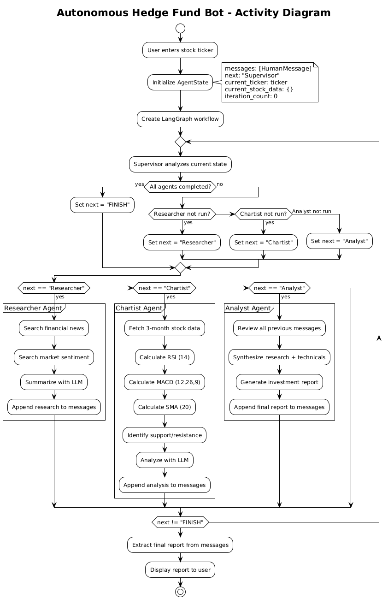
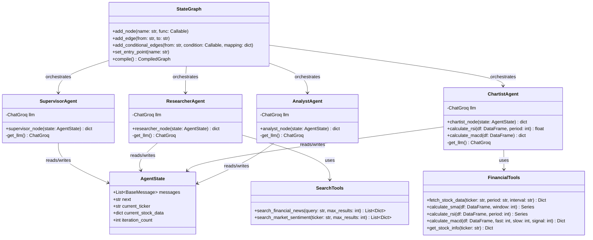
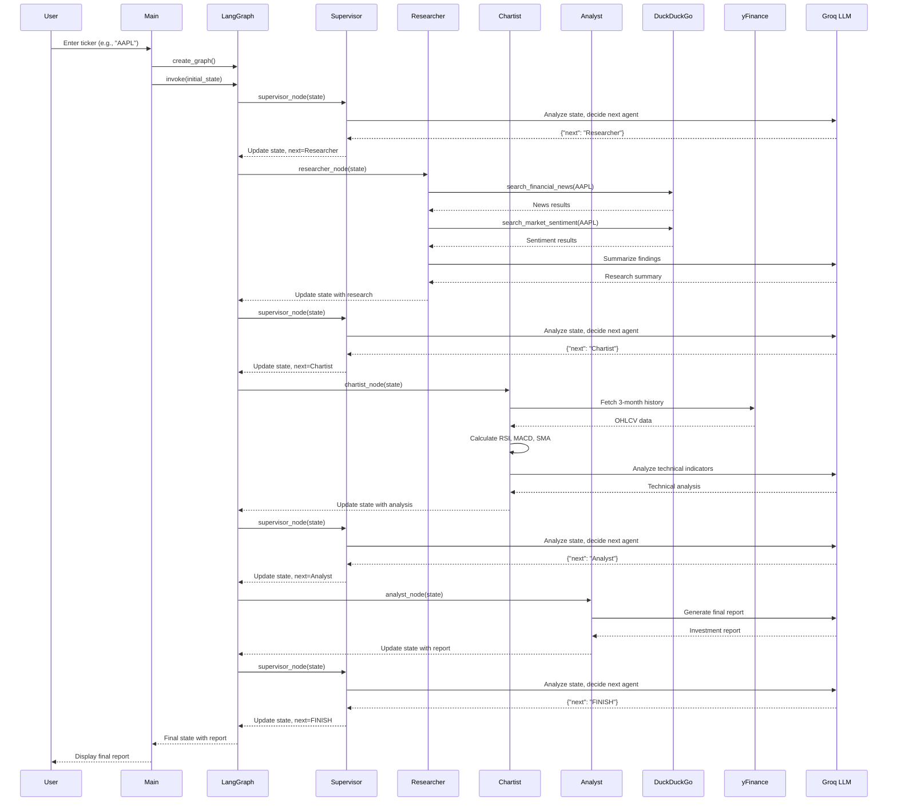
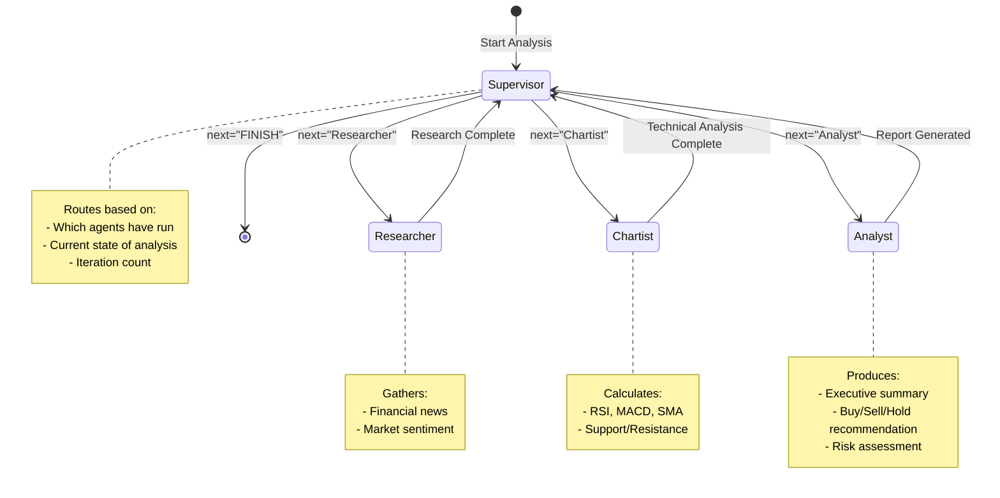

# Autonomous Hedge Fund Bot - Complete Documentation

## 📋 Table of Contents

1. [Overview](#overview)
2. [Architecture](#architecture)
3. [UML Diagrams](#uml-diagrams)
4. [Components](#components)
5. [Data Flow](#data-flow)
6. [Example Results](#example-results)
7. [Technical Stack](#technical-stack)
8. [Installation & Setup](#installation--setup)

---

## Overview

The **Autonomous Hedge Fund Bot** is a multi-agent AI system designed for automated stock analysis and investment recommendations. It leverages **LangGraph** for workflow orchestration, **Groq** as the LLM provider with **Llama 3.1 70B** model, and integrates real-time market data through various financial APIs.

### Key Features

- 🤖 **Multi-Agent Architecture**: Four specialized agents working collaboratively
- 📊 **Technical Analysis**: RSI, MACD, SMA, support/resistance levels
- 📰 **Fundamental Research**: Real-time news and sentiment analysis
- 🔄 **Autonomous Workflow**: Self-routing supervisor pattern
- 📝 **Structured Reports**: Professional investment recommendations

---

## Architecture

### High-Level System Design

```
┌─────────────────────────────────────────────────────────────────────────────┐
│                        AUTONOMOUS HEDGE FUND SYSTEM                          │
├─────────────────────────────────────────────────────────────────────────────┤
│                                                                              │
│    ┌──────────┐         ┌──────────────────────────────────────────────┐    │
│    │   USER   │─────────▶│              MAIN.PY (CLI)                  │    │
│    │  INPUT   │         │         Entry Point & Interface              │    │
│    └──────────┘         └──────────────────────────────────────────────┘    │
│                                          │                                   │
│                                          ▼                                   │
│         ┌────────────────────────────────────────────────────────────┐      │
│         │                    LANGGRAPH WORKFLOW                       │      │
│         │                      (graph.py)                             │      │
│         │  ┌──────────────────────────────────────────────────────┐  │      │
│         │  │                                                      │  │      │
│         │  │   ┌──────────┐     Routes to Agents                  │  │      │
│         │  │   │SUPERVISOR│◄────────────────────────┐             │  │      │
│         │  │   │  Agent   │                         │             │  │      │
│         │  │   └────┬─────┘                         │             │  │      │
│         │  │        │                               │             │  │      │
│         │  │        ▼                               │             │  │      │
│         │  │   ┌──────────┐  ┌──────────┐  ┌──────────┐           │  │      │
│         │  │   │RESEARCHER│  │ CHARTIST │  │ ANALYST  │           │  │      │
│         │  │   │  Agent   │  │  Agent   │  │  Agent   │           │  │      │
│         │  │   └────┬─────┘  └────┬─────┘  └────┬─────┘           │  │      │
│         │  │        │             │             │                 │  │      │
│         │  │        ▼             ▼             ▼                 │  │      │
│         │  │   ┌──────────┐  ┌──────────┐  ┌──────────┐           │  │      │
│         │  │   │  Search  │  │ yFinance │  │   LLM    │───────────┘  │      │
│         │  │   │  Tools   │  │  Tools   │  │ Synthesis│              │      │
│         │  │   └──────────┘  └──────────┘  └──────────┘              │      │
│         │  │                                                      │  │      │
│         │  └──────────────────────────────────────────────────────┘  │      │
│         └────────────────────────────────────────────────────────────┘      │
│                                          │                                   │
│                                          ▼                                   │
│                              ┌──────────────────┐                           │
│                              │   FINAL REPORT   │                           │
│                              │ (Investment Rec) │                           │
│                              └──────────────────┘                           │
│                                                                              │
└─────────────────────────────────────────────────────────────────────────────┘
```

### Agent Communication Flow

```
                    ┌─────────────┐
                    │    START    │
                    └──────┬──────┘
                           │
                           ▼
                    ┌──────────────┐
           ┌───────▶│  SUPERVISOR  │◀──────────────────┐
           │        │              │                    │
           │        └──────┬───────┘                    │
           │               │                            │
           │     ┌─────────┴─────────┬─────────┐       │
           │     ▼                   ▼         ▼       │
           │ ┌──────────┐     ┌──────────┐ ┌───────┐   │
           │ │RESEARCHER│     │ CHARTIST │ │ANALYST│   │
           │ └────┬─────┘     └────┬─────┘ └───┬───┘   │
           │      │                │           │       │
           │      └────────────────┴───────────┘       │
           │                       │                   │
           └───────────────────────┘                   │
                                                       │
                    ┌──────────────┐                   │
                    │    FINISH    │◀──────────────────┘
                    └──────────────┘
```

---

## UML Diagrams

### State Machine Diagram


### Component Diagram


### Activity Diagram



### Class Diagram



### Sequence Diagram



### State Machine Diagram



### Component Diagram

```
┌─────────────────────────────────────────────────────────────────────────┐
│                              hedge_fund_bot/                             │
├─────────────────────────────────────────────────────────────────────────┤
│                                                                          │
│  ┌────────────────┐                                                      │
│  │    main.py     │  CLI Interface                                       │
│  │  Entry Point   │  - User input handling                               │
│  └───────┬────────┘  - Report display                                    │
│          │                                                               │
│          ▼                                                               │
│  ┌────────────────────────────────────────────────────────────────┐     │
│  │                          src/                                   │     │
│  │  ┌──────────────┐  ┌───────────────┐  ┌───────────────────────┐│     │
│  │  │   graph.py   │  │   state.py    │  │       agents/         ││     │
│  │  │              │  │               │  │                       ││     │
│  │  │ - StateGraph │  │ - AgentState  │  │ ┌─────────────────┐  ││     │
│  │  │ - Workflow   │  │   TypedDict   │  │ │  supervisor.py  │  ││     │
│  │  │   Definition │  │               │  │ ├─────────────────┤  ││     │
│  │  │              │  │               │  │ │  researcher.py  │  ││     │
│  │  └──────────────┘  └───────────────┘  │ ├─────────────────┤  ││     │
│  │                                        │ │  chartist.py    │  ││     │
│  │                                        │ ├─────────────────┤  ││     │
│  │                                        │ │  analyst.py     │  ││     │
│  │                                        │ └─────────────────┘  ││     │
│  │                                        └───────────────────────┘│     │
│  │                                                                 │     │
│  │  ┌───────────────────────────────────────────────────────────┐ │     │
│  │  │                         tools/                             │ │     │
│  │  │  ┌─────────────────────┐  ┌────────────────────────────┐  │ │     │
│  │  │  │  search_tools.py    │  │  financial_tools.py        │  │ │     │
│  │  │  │                     │  │                            │  │ │     │
│  │  │  │ - DuckDuckGo search │  │ - yfinance data fetching   │  │ │     │
│  │  │  │ - News aggregation  │  │ - Technical indicators     │  │ │     │
│  │  │  │ - Sentiment search  │  │ - Stock info retrieval     │  │ │     │
│  │  │  └─────────────────────┘  └────────────────────────────┘  │ │     │
│  │  └───────────────────────────────────────────────────────────┘ │     │
│  └────────────────────────────────────────────────────────────────┘     │
│                                                                          │
│  ┌────────────────────────────────────────────────────────────────┐     │
│  │                      External Services                          │     │
│  │  ┌─────────────┐  ┌─────────────┐  ┌─────────────────────────┐ │     │
│  │  │  Groq API   │  │  yFinance   │  │     DuckDuckGo API      │ │     │
│  │  │ (Llama 3.1) │  │ (Yahoo Fin) │  │    (Web Search)         │ │     │
│  │  └─────────────┘  └─────────────┘  └─────────────────────────┘ │     │
│  └────────────────────────────────────────────────────────────────┘     │
│                                                                          │
└─────────────────────────────────────────────────────────────────────────┘
```

---

## Components

### 1. Main Entry Point (`main.py`)

The CLI interface that:
- Validates environment configuration (GROQ_API_KEY)
- Accepts stock ticker input from users
- Initializes the LangGraph workflow
- Displays the final investment report

### 2. State Management (`src/state.py`)

Defines `AgentState` TypedDict with:
| Field | Type | Description |
|-------|------|-------------|
| `messages` | List[BaseMessage] | Append-only conversation history |
| `next` | str | Next agent to execute or "FINISH" |
| `current_ticker` | str | Stock ticker being analyzed |
| `current_stock_data` | dict | Structured data scratchpad |
| `iteration_count` | int | Loop guard counter |

### 3. Graph Orchestration (`src/graph.py`)

Creates the LangGraph workflow:
- Adds all agent nodes
- Defines edge connections (agents → Supervisor)
- Implements conditional routing from Supervisor
- Sets entry point and compiles the graph

### 4. Agents (`src/agents/`)

#### Supervisor Agent
- **Role**: Workflow router and orchestrator
- **LLM**: Llama 3.3 70B (temperature=0)
- **Logic**: Determines next agent based on completed work
- **Output**: JSON with `{"next": "AgentName", "reasoning": "..."}`

#### Researcher Agent
- **Role**: News and sentiment analysis
- **LLM**: Llama 3.3 70B (temperature=0.3)
- **Tools**: DuckDuckGo search
- **Output**: Summary of news, sentiment, catalysts/red flags

#### Chartist Agent
- **Role**: Technical analysis
- **LLM**: Llama 3.3 70B (temperature=0)
- **Tools**: yFinance, custom indicators (RSI, MACD, SMA)
- **Output**: Technical indicators and trend analysis

#### Analyst Agent
- **Role**: Final report synthesis
- **LLM**: Llama 3.3 70B (temperature=0.4)
- **Output**: Investment recommendation (BUY/SELL/HOLD)

### 5. Tools (`src/tools/`)

#### Search Tools
- `search_financial_news()`: Fetches recent news articles
- `search_market_sentiment()`: Gathers sentiment data

#### Financial Tools
- `fetch_stock_data()`: Historical OHLCV data
- `calculate_sma()`: Simple Moving Average
- `calculate_rsi()`: Relative Strength Index
- `calculate_macd()`: Moving Average Convergence Divergence
- `get_stock_info()`: Company fundamentals

---

## Data Flow

```
1. User Input (Ticker: "AAPL")
        │
        ▼
2. Initial State Created
   {
     messages: [HumanMessage("Analyze stock AAPL")],
     next: "Supervisor",
     current_ticker: "AAPL",
     current_stock_data: {},
     iteration_count: 0
   }
        │
        ▼
3. Supervisor Routes to Researcher
        │
        ▼
4. Researcher Executes
   - Searches: "AAPL stock news"
   - Searches: "AAPL stock analysis market sentiment"
   - Summarizes findings with LLM
   - Appends: [RESEARCHER - AAPL] message
        │
        ▼
5. Supervisor Routes to Chartist
        │
        ▼
6. Chartist Executes
   - Fetches 3-month historical data
   - Calculates: RSI (14), MACD, SMA (20)
   - Identifies support/resistance levels
   - Appends: [CHARTIST - AAPL] message
        │
        ▼
7. Supervisor Routes to Analyst
        │
        ▼
8. Analyst Executes
   - Synthesizes all previous analysis
   - Generates investment report
   - Appends: [ANALYST - FINAL REPORT] message
        │
        ▼
9. Supervisor Returns FINISH
        │
        ▼
10. Final Report Displayed to User
```

---

## Example Results

### Input
```
Enter ticker (or 'exit'): AAPL
```

### Execution Log
```
Starting analysis for AAPL...
2025-12-06 23:55:33,965 - INFO - HTTP Request: POST https://api.groq.com/openai/v1/chat/completions "HTTP/1.1 200 OK"
2025-12-06 23:55:33,985 - INFO - Supervisor: Researcher
2025-12-06 23:55:35,956 - INFO - Researcher executed for AAPL
2025-12-06 23:55:36,473 - INFO - Supervisor: Chartist
2025-12-06 23:55:41,024 - INFO - Chartist executed for AAPL
2025-12-06 23:55:41,471 - INFO - Supervisor: Analyst
2025-12-06 23:55:43,124 - INFO - Analyst executed for AAPL
2025-12-06 23:55:43,588 - INFO - Supervisor: FINISH
```

### Output Report

```markdown
============================================================
FINAL REPORT
============================================================

### Executive Summary
Apple Inc. (AAPL) has demonstrated a moderate increase in its stock price 
over the past 20 days, with a 3.9% change. The current price of $278.78 
is above the 20-day Simple Moving Average (SMA) of $274.76, indicating 
a positive trend. However, the lack of recent news or events directly 
related to Apple Inc. limits the fundamental analysis.

### Fundamental Analysis
There is no recent news or events related to Apple Inc. (AAPL) that 
would significantly impact the stock price. The absence of news suggests 
that the current price movement may be driven by broader market trends 
or technical factors.

### Technical Analysis
The Relative Strength Index (RSI) of 58.9 indicates that the stock is 
not overbought or oversold, suggesting a stable momentum. The Moving 
Average Convergence Divergence (MACD) of 4.8717 is above the signal 
line of 4.6680, with a positive histogram of 0.2037, indicating a 
bullish trend. The stock price is below the 30-day high resistance 
of $288.62.

### Recommendation
**HOLD**

### Justification
The technical indicators suggest a stable momentum with a bullish trend, 
but the lack of recent news and the proximity to the 30-day high 
resistance level warrant caution. Therefore, a hold recommendation 
is appropriate to wait for further developments or a breakout above 
the resistance level.

### Risk Level
**Medium**
The moderate price increase and stable technical indicators contribute 
to a medium risk level.
```

---

## Technical Stack

| Technology | Purpose | Version |
|------------|---------|---------|
| **Python** | Core language | 3.11+ |
| **LangGraph** | Multi-agent orchestration | Latest |
| **LangChain** | LLM integration framework | Latest |
| **Groq** | LLM API provider | Latest |
| **Llama 3.1 70B** | Large Language Model | Versatile |
| **yfinance** | Financial data API | Latest |
| **DuckDuckGo Search** | Web search API | Latest |
| **pandas** | Data manipulation | Latest |

---

## Installation & Setup

### Prerequisites
- Python 3.11+
- Groq API Key

### Quick Start

```bash
# Clone and navigate
cd hedge_fund_bot

# Create virtual environment
python3 -m venv venv
source venv/bin/activate

# Install dependencies
pip install -r requirements.txt

# Configure environment
cp .env.example .env
# Edit .env and add your GROQ_API_KEY

# Run the application
python main.py
```

### Environment Variables

| Variable | Description | Required |
|----------|-------------|----------|
| `GROQ_API_KEY` | Groq API authentication key | Yes |

---

## License

This project is for educational and research purposes.

---

*Documentation generated on December 6, 2025*
