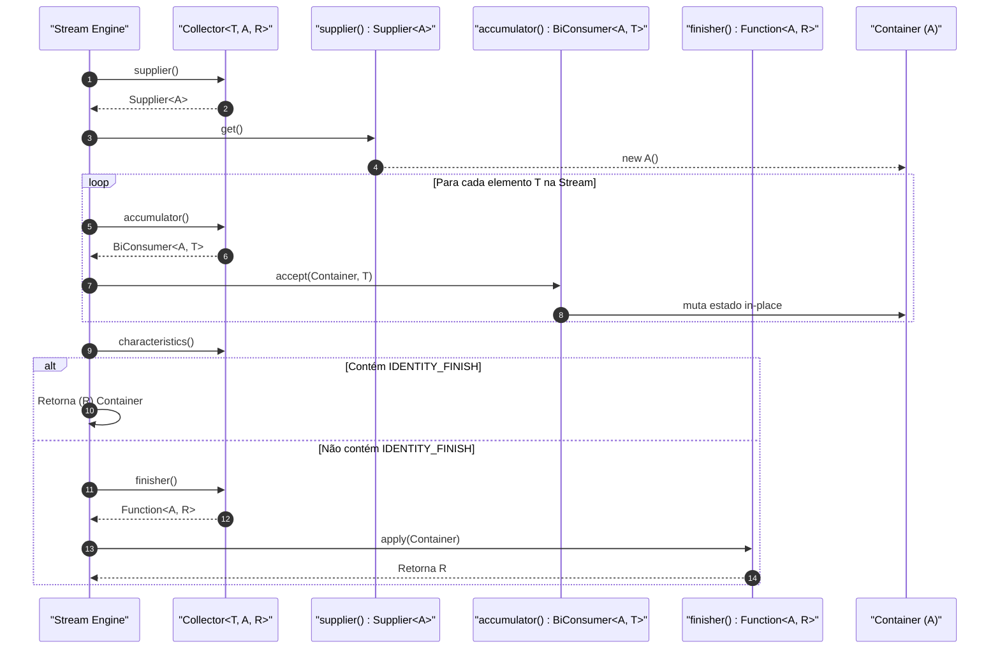
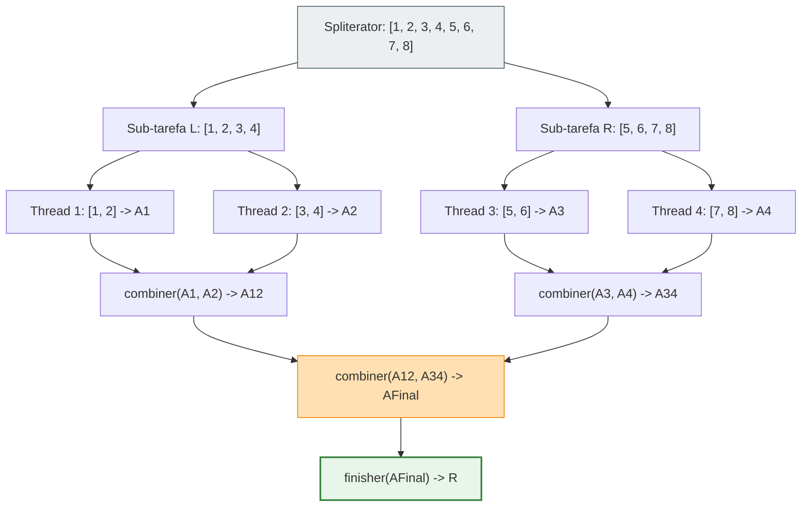

# Anatomia da API Collector<T, A, R> no Java

> **Módulo:** Java Collectors & Gatherers  
> **Tópicos:** Java Streams API, Redução Mutável, `Collector<T, A, R>`, `Collector.Characteristics`, Paralelismo, Stream Pipeline  
> **Versão de Referência:** Java 8 até Java 25+ LTS  

---

## 1. Introdução: O que é um Collector e por que ele existe?

Na API de Streams do Java (introduzida no Java 8 e aprimorada continuamente até as versões modernas como Java 21 e Java 25), operações terminais são responsáveis por consumir os elementos que fluem pelo pipeline e produzir um resultado ou efeito colateral. Entre essas operações, destacam-se duas formas de agregação: **redução imutável** (`Stream.reduce()`) e **redução mutável** (`Stream.collect()`).

Compreender o `Collector<T, A, R>` começa por entender por que a redução mutável é indispensável para sistemas de alto desempenho.

### Redução Imutável vs. Redução Mutável

Em linguagens funcionais puras, a agregação de dados é tradicionalmente feita via operações como `foldLeft` ou `reduce`, onde a cada passo um **novo valor acumulado** é gerado de forma puramente imutável:

```java
// ❌ Redução Imutável Ineficiente com Streams para coleções:
List<String> result = stream.reduce(
    new ArrayList<String>(),
    (List<String> list, String item) -> {
        List<String> newList = new ArrayList<>(list); // Cria uma nova lista a cada elemento!
        newList.add(item);
        return newList;
    },
    (List<String> list1, List<String> list2) -> {
        List<String> merged = new ArrayList<>(list1);
        merged.addAll(list2);
        return merged;
    }
);
```

> [!WARNING]
> Se você acumular $N$ elementos copiando a lista a cada passo, o custo de tempo se torna **$O(N^2)$** e a alocação de memória dispara exponencialmente, saturando a JVM com coleta de lixo (*Garbage Collection churn*).

Para evitar essa sobrecarga catastrófica, o Java introduziu o conceito de **Redução Mutável** (*Mutable Reduction*). Em vez de alocar novos objetos imutáveis a cada elemento, a stream acumula os elementos mutando um container de estado já existente (como um `ArrayList`, um `StringBuilder` ou um `HashMap`):

```java
// ✅ Redução Mutável Eficiente: complexidade O(N)
List<String> result = stream.collect(Collectors.toList());
```

Um **`Collector<T, A, R>`** é precisamente a especificação dessa redução mutável: uma receita declarativa e reutilizável que instrui a Stream sobre como inicializar o acumulador, como incorporar cada item, como fundir resultados parciais em execuções concorrentes ou paralelas e como extrair o resultado final.

---

## 2. A Assinatura de Tipos: `Collector<T, A, R>`

A interface genérica `Collector<T, A, R>` define três parâmetros de tipo com responsabilidades muito bem delimitadas:

| Parâmetro | Nome Conceitual | Descrição | Exemplo |
| :--- | :--- | :--- | :--- |
| **`T`** | *Input Type* | O tipo dos elementos de entrada que transitam pela stream. | `String`, `Transaction`, `Integer` |
| **`A`** | *Accumulation Type* | O tipo do container de acumulação intermediário mutável. Frequentemente é um detalhe de implementação interno que não deve vazar para a API pública (motivo pelo qual muitas factories retornam `Collector<T, ?, R>`). | `ArrayList<T>`, `StringBuilder`, `long[2]` |
| **`R`** | *Result Type* | O tipo final do resultado devolvido pela operação terminal `collect()`. | `List<T>`, `String`, `BigDecimal` |


---

## 3. Os 4 Componentes Fundamentais da Interface

A interface `Collector<T, A, R>` é composta por quatro funções principais que formam o ciclo de vida completo da redução:

```java
package java.util.stream;

import java.util.Set;
import java.util.function.BiConsumer;
import java.util.function.BinaryOperator;
import java.util.function.Function;
import java.util.function.Supplier;

public interface Collector<T, A, R> {
    Supplier<A> supplier();
    BiConsumer<A, T> accumulator();
    BinaryOperator<A> combiner();
    Function<A, R> finisher();
    Set<Characteristics> characteristics();
}
```

Vamos dissecar cada um desses componentes:

### 3.1. `supplier()` → `Supplier<A>`
* **O que faz:** Cria e devolve uma nova instância vazia do container intermediário de acumulação (`A`).
* **Quando é chamado:** No início da coleta sequencial (uma vez), ou no início de cada thread/chunk de trabalho em streams paralelas.
* **Exemplo:** `ArrayList::new`, `StringBuilder::new`, `HashMap::new`.

### 3.2. `accumulator()` → `BiConsumer<A, T>`
* **O que faz:** Dobra (*folds*) um elemento de entrada `T` dentro do container mutável `A`.
* **Assinatura:** `void accept(A container, T element)`. Não gera retorno; sua ação ocorre por mutação in-place do container.
* **Quando é chamado:** Para cada elemento processado no pipeline da Stream.
* **Exemplo:** `List::add`, `StringBuilder::append`, `Map::put`.

### 3.3. `combiner()` → `BinaryOperator<A>`
* **O que faz:** Recebe dois containers parciais de acumulação `A` e os funde em um único container.
* **Assinatura:** `A apply(A container1, A container2)`.
* **Quando é chamado:** Exclusivamente em execuções paralelas (ou quando sub-tarefas do framework Fork-Join precisam mesclar seus resultados parciais). Em streams estritamente sequenciais, este método **nunca é executado**.
* **Propriedade Crítica:** O combiner deve ser **associativo**, isto é:
  $$\text{combiner}(a, \text{combiner}(b, c)) \equiv \text{combiner}(\text{combiner}(a, b), c)$$
* **Otimização comum:** Modificar o primeiro container in-place e retorná-lo:
  ```java
  (left, right) -> { left.addAll(right); return left; }
  ```

### 3.4. `finisher()` → `Function<A, R>`
* **O que faz:** Converte o container intermediário `A` no tipo final `R`.
* **Assinatura:** `R apply(A container)`.
* **Quando é chamado:** Ao final de todo o processamento de itens e combinações parciais.
* **Exemplos:**
  - Quando `A` e `R` são o mesmo tipo (ex: acumulando em `ArrayList<T>` para retornar `List<T>`), o finisher pode ser `Function.identity()`.
  - Quando `A` é diferente de `R` (ex: `StringBuilder` para `String`, ou `List<T>` para uma coleção imutável `Collections.unmodifiableList(list)`), o finisher executa a transformação necessária.

---

## 4. Diagrama de Fluxo do Collector Pipeline

O ciclo de vida da execução de um Collector varia significativamente entre o modo **Sequencial** e o modo **Paralelo**.

### Fluxo Sequencial

No fluxo sequencial, apenas um único container de acumulação é instanciado e alimentado elemento a elemento:



### Fluxo Paralelo (Fork-Join & Combiner)

Em execuções paralelas, a stream divide os dados via `Spliterator`. Cada thread opera em seu próprio container isolado, eliminando contenção de concorrência durante o processamento intermediário. No final, os containers parciais são mesclados usando o `combiner`:

```mermaid
graph TD
    subgraph Particionamento
        Source["Stream de Entrada: [E1, E2, E3, E4]"] -->|Spliterator.trySplit()| P1["Partição 1: [E1, E2]"]
        Source -->|Spliterator.trySplit()| P2["Partição 2: [E3, E4]"]
    end

    subgraph Processamento Paralelo
        P1 -->|supplier.get()| A1["Container A1"]
        P2 -->|supplier.get()| A2["Container A2"]
        
        P1 -->|accumulator.accept(A1, E1)| A1
        P1 -->|accumulator.accept(A1, E2)| A1
        
        P2 -->|accumulator.accept(A2, E3)| A2
        P2 -->|accumulator.accept(A2, E4)| A2
    end

    subgraph Redução e Finalização
        A1 & A2 -->|combiner.apply(A1, A2)| ACombined["Container Combinado (A)"]
        ACombined -->|finisher.apply(A)| FinalResult["Resultado Final (R)"]
    end

    style Source fill:#eceff1,stroke:#607d8b
    style A1 fill:#fff8e1,stroke:#ffa000
    style A2 fill:#fff8e1,stroke:#ffa000
    style ACombined fill:#ffe0b2,stroke:#fb8c00
    style FinalResult fill:#e8f5e9,stroke:#43a047,stroke-width:2px
```

---

## 5. `Collector.Characteristics`: Otimizando a Execução

A interface `Collector` expõe um método que retorna um `Set<Characteristics>`:

```java
public enum Characteristics {
    CONCURRENT,
    UNORDERED,
    IDENTITY_FINISH
}
```

Essas flags são metadados que permitem à JVM tomar atalhos agressivos de otimização durante a execução do pipeline.

### Análise Detalhada das Características

| Característica | Significado Semântico | Impacto no Pipeline / Otimização da JVM |
| :--- | :--- | :--- |
| **`IDENTITY_FINISH`** | A função `finisher()` é a função identidade `Function.identity()`, ou seja, o container `A` pode ser diretamente convertido para `R` via *cast* sem nenhuma alteração. | A engine da Stream **ignora completamente a invocação de `finisher()`**, pulando essa chamada de método e reduzindo overhead de dispatch virtual. |
| **`UNORDERED`** | A redução não preserva e não depende da ordem de encontro (*encounter order*) dos elementos da stream. | Permite que operações como `limit()`, `distinct()` e o agrupamento concorrente sejam reordenados e otimizados pelo motor de execução da Stream. |
| **`CONCURRENT`** | O container de acumulação é seguro para concorrência (thread-safe) e o `accumulator` pode ser chamado concorrentemente por múltiplas threads na **mesma instância de container**. | Em streams paralelas, se o coletor for `CONCURRENT` e a stream for `UNORDERED` (ou a fonte não tiver ordem fixa), a stream **não particiona múltiplos containers**. Ela cria um **único container compartilhado** onde todas as threads acumulam diretamente via `accumulator`, eliminando totalmente as chamadas ao `combiner()`. |

> [!IMPORTANT]
> Nunca adicione `Characteristics.CONCURRENT` a um coletor cujo acumulador seja uma coleção não-sincronizada (como `ArrayList` ou `HashSet`). Fazer isso em streams paralelas provocará corrupção silenciosa de memória, perda de dados ou exceções imprevisíveis como `ArrayIndexOutOfBoundsException` e `ConcurrentModificationException`.

---

## 6. Relação com `Stream.collect()`: Como a Stream Invoca o Coletor

A interface `Stream<T>` fornece duas sobrecargas para o método `collect`:

### Sobrecarga 1: Usando a Abstração `Collector`
```java
<R, A> R collect(Collector<? super T, A, R> collector);
```

Esta é a assinatura mais comum do dia a dia. A stream delega a gestão de todo o ciclo de vida para o objeto `Collector`.

Internamente, em uma execução sequencial simplificada, o código executado pela stream equivale conceitualmente ao seguinte:

```java
public <T, A, R> R collectSimulado(Iterable<T> streamElements, Collector<T, A, R> collector) {
    // 1. Obtém o container mutável inicial
    A container = collector.supplier().get();
    
    // 2. Extrai o acumulador
    BiConsumer<A, T> accumulator = collector.accumulator();
    
    // 3. Itera consumindo os elementos
    for (T element : streamElements) {
        accumulator.accept(container, element);
    }
    
    // 4. Otimização com base nas Características
    if (collector.characteristics().contains(Collector.Characteristics.IDENTITY_FINISH)) {
        @SuppressWarnings("unchecked")
        R result = (R) container;
        return result;
    }
    
    // 5. Aplica a finalização caso não seja IDENTITY_FINISH
    return collector.finisher().apply(container);
}
```

### Sobrecarga 2: Os Três Componentes Inline
```java
<R> R collect(Supplier<R> supplier,
              BiConsumer<R, ? super T> accumulator,
              BiConsumer<R, R> combiner);
```

Esta versão é chamada de forma "desconstruída" (*three-argument collect*). Repare nas diferenças cruciais em relação ao `Collector<T, A, R>`:
1. **Não há `finisher`**: O acumulador e o resultado final devem ser do mesmo tipo `R` (`A == R`), comportando-se tacitamente como `IDENTITY_FINISH`.
2. **O combiner é um `BiConsumer<R, R>` em vez de `BinaryOperator<R>`**: A assinatura espera que o segundo container seja mesclado dentro do primeiro (`left.addAll(right)`), sem retorno explícito.

> [!NOTE]
> Essa dualidade de assinaturas é evidente ao analisar a implementação interna de streams e coletores.
> Ao reimplementar streams do zero em ambientes legados (compatíveis com Java 7 via Retrolambda), demonstra-se como a assinatura de três argumentos pode ser facilmente traduzida em um `Collector` completo convertendo o `BiConsumer<R, R>` em um `BinaryOperator<R>`:
>
> ```java
> private static <T> BinaryOperator<T> toOperator(BiConsumer<T, T> consumer) {
>     return (first, second) -> {
>         consumer.accept(first, second);
>         return first;
>     };
> }
> ```

---

## 7. `Collector.of()` vs. Implementação Direta da Interface

Existem duas formas de criar coletores customizados: através dos métodos de fábrica estáticos `Collector.of()` ou implementando diretamente a interface `Collector<T, A, R>`.

### 7.1. Fábrica Estática `Collector.of()`

Para a maioria esmagadora dos casos práticos em projetos reais, `Collector.of()` é a opção preferida por sua concisão, legibilidade e suporte a lambdas e method references.

Existem duas sobrecargas principais:

```java
// Variante 1: Com finisher explícito (A != R)
Collector<T, A, R> of(Supplier<A> supplier,
                      BiConsumer<A, T> accumulator,
                      BinaryOperator<A> combiner,
                      Function<A, R> finisher,
                      Characteristics... characteristics);

// Variante 2: Sem finisher explícito (assume A == R e IDENTITY_FINISH)
Collector<T, R, R> of(Supplier<R> supplier,
                      BiConsumer<R, T> accumulator,
                      BinaryOperator<R> combiner,
                      Characteristics... characteristics);
```

#### Exemplo Prático com `Collector.of()`: Média Móvel / Acumulador de Estatísticas Customizadas

Imagine que você precise coletar uma stream de medições de sensores e calcular simultaneamente a contagem, a soma e o desvio médio sem usar bibliotecas externas:

```java
public record ImmutableStats(long count, double sum, double average) {}

public final class CustomCollectors {

    // Container mutável intermediário (A)
    private static final class StatsAccumulator {
        private long count = 0;
        private double sum = 0.0;

        void add(double value) {
            count++;
            sum += value;
        }

        StatsAccumulator merge(StatsAccumulator other) {
            this.count += other.count;
            this.sum += other.sum;
            return this;
        }

        ImmutableStats toStats() {
            double avg = count > 0 ? sum / count : 0.0;
            return new ImmutableStats(count, sum, avg);
        }
    }

    public static Collector<Double, ?, ImmutableStats> toImmutableStats() {
        return Collector.of(
            StatsAccumulator::new,           // supplier (Supplier<StatsAccumulator>)
            StatsAccumulator::add,           // accumulator (BiConsumer<StatsAccumulator, Double>)
            StatsAccumulator::merge,         // combiner (BinaryOperator<StatsAccumulator>)
            StatsAccumulator::toStats        // finisher (Function<StatsAccumulator, ImmutableStats>)
            // Sem IDENTITY_FINISH, pois A (StatsAccumulator) != R (ImmutableStats)
        );
    }
}
```

### 7.2. Implementação Direta da Interface `Collector<T, A, R>`

Implementar explicitamente a interface criando uma classe dedicada é indicado quando:
1. **O coletor possui dependências ou configurações complexas:** Quando precisamos injetar instâncias (ex: `Clock`, `Validator`, regras de negócio dinâmicas).
2. **Reaproveitamento e Encapsulamento em Bibliotecas Públicas:** Para evitar a alocação desnecessária de wrappers de lambda repetidos ou documentar formalmente cada componente com JavaDoc específico por método.
3. **Polimorfismo e Testabilidade:** Facilita testes unitários isolados para cada método do coletor (`supplier()`, `accumulator()`, etc.).

#### Exemplo: Implementação via Classe Completa

```java
import java.util.Collections;
import java.util.EnumSet;
import java.util.Set;
import java.util.function.BiConsumer;
import java.util.function.BinaryOperator;
import java.util.function.Function;
import java.util.function.Supplier;
import java.util.stream.Collector;

public final class FrequencyDistributionCollector<T> 
        implements Collector<T, java.util.Map<T, Long>, java.util.Map<T, Long>> {

    private final boolean unmodifiable;

    public FrequencyDistributionCollector(boolean unmodifiable) {
        this.unmodifiable = unmodifiable;
    }

    @Override
    public Supplier<java.util.Map<T, Long>> supplier() {
        return java.util.HashMap::new;
    }

    @Override
    public BiConsumer<java.util.Map<T, Long>, T> accumulator() {
        return (map, item) -> map.merge(item, 1L, Long::sum);
    }

    @Override
    public BinaryOperator<java.util.Map<T, Long>> combiner() {
        return (left, right) -> {
            right.forEach((key, count) -> left.merge(key, count, Long::sum));
            return left;
        };
    }

    @Override
    public Function<java.util.Map<T, Long>, java.util.Map<T, Long>> finisher() {
        return unmodifiable ? Collections::unmodifiableMap : Function.identity();
    }

    @Override
    public Set<Characteristics> characteristics() {
        return unmodifiable 
            ? Collections.unmodifiableSet(EnumSet.of(Characteristics.UNORDERED))
            : Collections.unmodifiableSet(EnumSet.of(Characteristics.IDENTITY_FINISH, Characteristics.UNORDERED));
    }
}
```

### Resumo Comparativo: `Collector.of()` vs. Implementação de Classe

| Critério | `Collector.of()` | Implementação de Classe (`implements Collector`) |
| :--- | :--- | :--- |
| **Verbosidade** | Mínima (direto ao ponto, 5 a 15 linhas) | Mais verboso (requer declaração formal de métodos) |
| **Casos Típicos** | Funções utilitárias, código de domínio interno, scripts | Bibliotecas de infraestrutura, SDKs corporativos |
| **Configurabilidade** | Passada por parâmetros de método estático | Mantida em campos `final` da instância da classe |
| **Gerenciamento de Características** | Varargs simples na chamada | `Set<Characteristics>` pré-alocado e imutável |

---

## 8. Paralelismo: O Papel Crítico do `combiner()`

Em streams paralelas, o pipeline divide a carga de dados entre múltiplos núcleos da CPU utilizando o framework **Fork-Join**.

Para ilustrar o que acontece, considere uma stream com 8 elementos executada em paralelo:



### Requisitos Mandatórios do Combiner

1. **Associatividade:**
   A ordem das fusões em árvore não deve afetar o resultado final:
   $$\text{combiner}(a, \text{combiner}(b, c)) == \text{combiner}(\text{combiner}(a, b), c)$$
2. **Compatibilidade com Identidade:**
   Se um container vazio for combinado com qualquer outro container, o estado deste último deve ser mantido inalterado:
   $$\text{combiner}(a, \text{supplier.get()}) \equiv a$$
3. **Eficiência de Alocação:**
   O padrão estabelecido pela biblioteca padrão Java é incorporar o conteúdo do segundo container no primeiro e retornar o primeiro:
   ```java
   (c1, c2) -> { c1.addAll(c2); return c1; }
   ```

> [!CAUTION]
> Se o seu `combiner` violar a associatividade (por exemplo, dependendo de contadores globais com efeitos colaterais impuros), a stream paralela produzirá resultados **não-determinísticos** ou silenciosamente corrompidos.

---

## 9. Anatomia dos Coletores Padrão: Como Funcionam por Baixo dos Panos

Para consolidar o conhecimento, vamos analisar a engenharia interna de três coletores essenciais providos pela classe `java.util.stream.Collectors`:

### 9.1. `Collectors.toList()`

O `toList()` acumula elementos em uma lista dinâmica (`ArrayList`).

```java
// Reconstrução conceitual fiel do Collectors.toList()
public static <T> Collector<T, ?, List<T>> toList() {
    return Collector.of(
        ArrayList::new,                  // supplier: cria nova ArrayList
        List::add,                       // accumulator: adiciona o elemento
        (left, right) -> {               // combiner: mescla os pedaços
            left.addAll(right); 
            return left; 
        },
        Collector.Characteristics.IDENTITY_FINISH // container é a própria List!
    );
}
```

* **Por que `IDENTITY_FINISH`?** Porque o container intermediário é `ArrayList<T>`, que implementa `List<T>`. Não há transformação pós-coleta necessária.

---

### 9.2. `Collectors.toSet()`

O `toSet()` agrupa elementos únicos, descartando duplicatas.

```java
// Reconstrução conceitual fiel do Collectors.toSet()
public static <T> Collector<T, ?, Set<T>> toSet() {
    return Collector.of(
        HashSet::new,                    // supplier: cria nova HashSet
        Set::add,                        // accumulator: adiciona elemento no conjunto
        (left, right) -> {               // combiner: une os conjuntos
            if (left.size() < right.size()) {
                right.addAll(left);
                return right;
            } else {
                left.addAll(right);
                return left;
            }
        },
        Collector.Characteristics.IDENTITY_FINISH,
        Collector.Characteristics.UNORDERED // Sets não mantêm ordenação de encontro
    );
}
```

* **Por que `UNORDERED`?** O `HashSet` não preserva a ordem de iteração da stream. Informar isso à runtime permite à stream pular operações de preservação de ordem em streams paralelas.

---

### 9.3. `Collectors.joining(delimiter, prefix, suffix)`

O coletor `joining` concatena sequências textuais de caracteres. Aqui, a distinção entre os tipos `A` e `R` fica cristalina:
* `T` = `CharSequence`
* `A` = `StringJoiner` (container mutável intermediário)
* `R` = `String` (resultado final imutável)

```java
// Reconstrução conceitual fiel do Collectors.joining(...)
public static Collector<CharSequence, ?, String> joining(
        CharSequence delimiter, 
        CharSequence prefix, 
        CharSequence suffix) {
    return Collector.of(
        () -> new StringJoiner(delimiter, prefix, suffix), // supplier: cria StringJoiner
        StringJoiner::add,                                 // accumulator: adiciona texto
        StringJoiner::merge,                               // combiner: funde dois StringJoiners
        StringJoiner::toString                             // finisher: extrai a String final
        // Sem flags: StringJoiner != String (não é IDENTITY_FINISH) e a ordem importa
    );
}
```

* **Por que o finisher é essencial aqui?** Um `StringJoiner` não é uma `String`. O método `StringJoiner.toString()` só pode ser avaliado uma única vez no final, evitando a criação intermediária de dezenas de strings descartáveis durante o processo de redução.

---

## 10. Exemplo Prático Completo e Executável

O exemplo a seguir reúne todos os conceitos discutidos: tipos `T, A, R`, uso de `Collector.of()`, `combiner` seguro para concorrência, e `finisher` de transformação:

```java
package com.example.collectors;

import java.util.Collections;
import java.util.List;
import java.util.Map;
import java.util.stream.Collector;
import java.util.stream.IntStream;

public class CollectorAnatomyDemo {

    // Record representando o resultado consolidado imutável (R)
    public record BucketSummary(int count, int sum, int min, int max, double average) {}

    // Classe acumuladora mutável interna (A)
    private static final class SummaryAccumulator {
        private int count = 0;
        private int sum = 0;
        private int min = Integer.MAX_VALUE;
        private int max = Integer.MIN_VALUE;

        void accept(int value) {
            count++;
            sum += value;
            min = Math.min(min, value);
            max = Math.max(max, value);
        }

        SummaryAccumulator combine(SummaryAccumulator other) {
            if (other.count == 0) return this;
            if (this.count == 0) return other;

            this.count += other.count;
            this.sum += other.sum;
            this.min = Math.min(this.min, other.min);
            this.max = Math.max(this.max, other.max);
            return this;
        }

        BucketSummary finish() {
            if (count == 0) {
                return new BucketSummary(0, 0, 0, 0, 0.0);
            }
            return new BucketSummary(count, sum, min, max, (double) sum / count);
        }
    }

    public static Collector<Integer, ?, BucketSummary> toBucketSummary() {
        return Collector.of(
            SummaryAccumulator::new,      // supplier
            SummaryAccumulator::accept,   // accumulator
            SummaryAccumulator::combine,  // combiner (suporta streams paralelas!)
            SummaryAccumulator::finish    // finisher
        );
    }

    public static void main(String[] args) {
        List<Integer> dataset = IntStream.rangeClosed(1, 1_000_000).boxed().toList();

        // Execução Sequencial
        BucketSummary seqResult = dataset.stream()
            .collect(toBucketSummary());
        System.out.println("Resultado Sequencial: " + seqResult);

        // Execução Paralela (ativa o combiner em múltiplas threads)
        BucketSummary parResult = dataset.parallelStream()
            .collect(toBucketSummary());
        System.out.println("Resultado Paralelo:   " + parResult);

        assert seqResult.equals(parResult) : "Os resultados devem ser idênticos!";
    }
}
```

---

## 11. Referências e Leituras Recomendadas

1. **Java Platform Standard Edition Documentation (Java 25 LTS)**  
   *Interface `java.util.stream.Collector<T, A, R>`*  
   Disponível em: [Oracle JavaDoc - Collector](https://docs.oracle.com/en/java/javase/25/docs/api/java.base/java/util/stream/Collector.html)

2. **Java Platform Standard Edition Documentation (Java 25 LTS)**  
   *Class `java.util.stream.Collectors`*  
   Disponível em: [Oracle JavaDoc - Collectors](https://docs.oracle.com/en/java/javase/25/docs/api/java.base/java/util/stream/Collectors.html)
