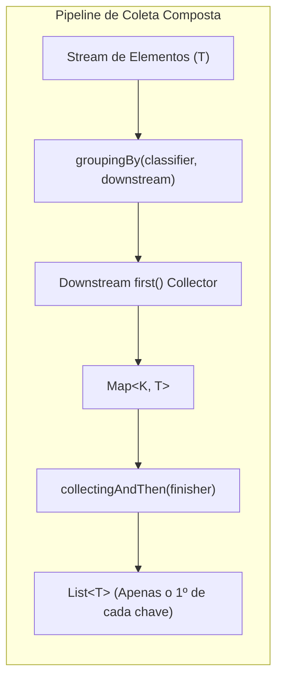
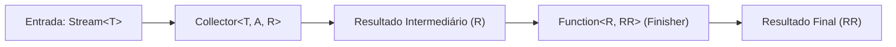
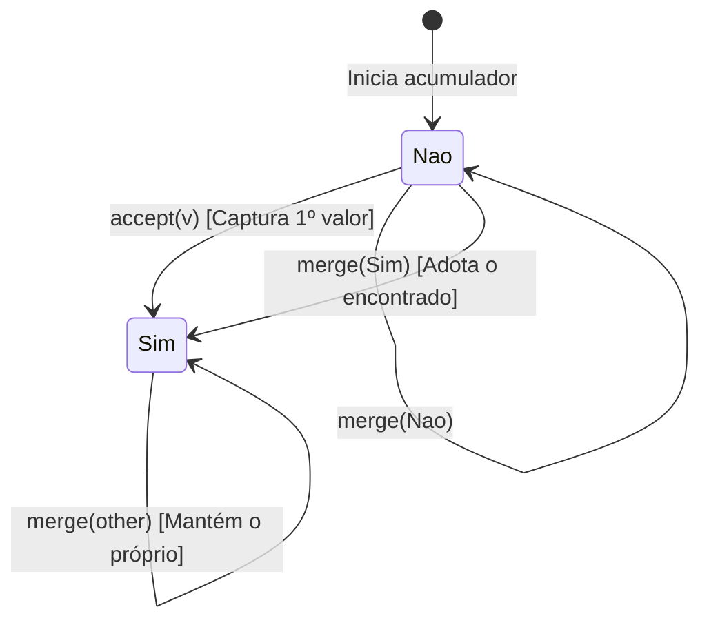

# Composição de Collectors Existentes

> **Tópicos:** Java Streams API, `Collector.of`, `Collectors.groupingBy`, `Collectors.collectingAndThen`, Sealed Interfaces, Programação Funcional vs. Mutabilidade

---

## Introdução: O Poder da Composição de Coletores

A Stream API do Java (introduzida no Java 8 e continuamente aprimorada até as versões LTS modernas como Java 21 e Java 25) oferece um modelo declarativo e funcional para processamento de coleções de dados. No coração da fase de redução terminal (*terminal reduction*) está a interface `Collector<T, A, R>`.

Muitos desenvolvedores limitam o uso de coletores a operações básicas como `Collectors.toList()`, `Collectors.toSet()` ou `Collectors.joining()`. No entanto, a verdadeira expressividade da API reside na **composição**: a capacidade de plugar coletores dentro de outros coletores (*downstream collectors*) e aplicar pós-processamentos através de combinadores funcionais.

Neste estudo, exploramos como resolver um problema recorrente de engenharia de software — **filtrar e reter apenas a primeira ocorrência de elementos pertencentes a uma mesma categoria/chave** — aproveitando a composição de coletores padrão (`groupingBy` e `collectingAndThen`) aliada a um coletor downstream especializado (`first()`), construído de forma elegante com recursos modernos do Java (`sealed interface` e records).



---

## 1. `Collectors.groupingBy(classifier)`: Agrupamento e Variantes

O coletor `Collectors.groupingBy` é uma das operações de agregação mais poderosas da biblioteca padrão. Em sua essência, ele particiona o fluxo de dados em baldes (*buckets*), onde cada balde é indexado por uma chave extraída dos elementos.

### 1.1 A Assinatura Básica e a Preservação da Ordem

Na sua forma mais simples, `groupingBy` recebe apenas uma função classificadora:

```java
public static <T, K> Collector<T, ?, Map<K, List<T>>> 
groupingBy(Function<? super T, ? extends K> classifier)
```

Por padrão, essa variante delega internamente para `groupingBy(classifier, toList())` e instancia um `HashMap` padrão para armazenar os grupos:

```java
List<Transacao> transacoes = obterTransacoes();
Function<Transacao, String> porCategoria = Transacao::categoria;

Map<String, List<Transacao>> agrupadas = transacoes.stream()
    .collect(Collectors.groupingBy(porCategoria));
```

#### Preservação da Ordem de Aparição:
Há dois níveis de ordenação a considerar:
1. **Ordem dentro de cada lista (grupo):** O coletor downstream padrão é `Collectors.toList()`. Ele garante a preservação estrita da ordem de encontro (*encounter order*) dos elementos atribuídos àquela chave específica.
2. **Ordem das chaves no Mapa:** Por utilizar um `HashMap` padrão, a ordem em que as chaves aparecem na iteração de `agrupadas.keySet()` ou `agrupadas.values()` **não é garantida**. Se for crucial manter a ordem da primeira aparição de cada chave no stream de entrada, precisamos recorrer à sobrecarga que aceita uma fábrica de mapa (`mapFactory`).

---

### 1.2 As Três Sobrecargas do `groupingBy`

A API do Java disponibiliza três assinaturas de `groupingBy`, oferecendo níveis incrementais de customização:

| Assinatura | Fábrica de Mapa Padrão | Coletor Downstream Padrão | Retorno |
| :--- | :--- | :--- | :--- |
| `groupingBy(classifier)` | `HashMap::new` | `Collectors.toList()` | `Collector<T, ?, Map<K, List<T>>>` |
| `groupingBy(classifier, downstream)` | `HashMap::new` | Customizado (`D`) | `Collector<T, ?, Map<K, D>>` |
| `groupingBy(classifier, mapFactory, downstream)` | Customizada (`M`) | Customizado (`D`) | `Collector<T, ?, M>` |

#### 1. Variante de 2 Argumentos: `groupingBy(classifier, downstream)`
Permite substituir o agrupador de lista por outro coletor downstream para reduzir imediatamente os elementos agregados por cada chave:

```java
// Contar o número de transações por categoria
Map<String, Long> totalPorCategoria = transacoes.stream()
    .collect(Collectors.groupingBy(
        Transacao::categoria,
        Collectors.counting()
    ));

// Coletar apenas os IDs únicos de transações por categoria em um Set
Map<String, Set<UUID>> idsPorCategoria = transacoes.stream()
    .collect(Collectors.groupingBy(
        Transacao::categoria,
        Collectors.mapping(Transacao::id, Collectors.toSet())
    ));
```

#### 2. Variante de 3 Argumentos: `groupingBy(classifier, mapFactory, downstream)`
Permite controlar explicitamente a implementação do `Map` que armazenará as chaves e valores. Isso é indispensável quando a ordem cronológica de aparição das chaves precisa ser respeitada via `LinkedHashMap`, ou quando precisamos de ordenação natural via `TreeMap`:

```java
// Preserva a ordem cronológica exata da primeira ocorrência de cada categoria
Map<String, Set<UUID>> ordenadoPorAparicao = transacoes.stream()
    .collect(Collectors.groupingBy(
        Transacao::categoria,
        LinkedHashMap::new,
        Collectors.mapping(Transacao::id, Collectors.toSet())
    ));
```

---

## 2. `Collectors.collectingAndThen(collector, finisher)`: Pós-Processamento Funcional

O método `Collectors.collectingAndThen` é um combinador de ordem superior que adapta um `Collector` existente, anexando uma função de transformação adicional (*finisher*) que será invocada exatamente uma vez sobre o resultado final da redução.

### 2.1 Mecânica e Assinatura

```java
public static <T, A, R, RR> Collector<T, A, RR> collectingAndThen(
    Collector<T, A, R> downstream,
    Function<R, RR> finisher
)
```

- **`T`:** O tipo dos elementos de entrada do stream.
- **`A`:** O tipo de acumulador intermediário do coletor downstream.
- **`R`:** O tipo do resultado intermediário produzido pelo coletor downstream.
- **`RR`:** O tipo do resultado final após a aplicação do `finisher`.



Essa construção evita que o código cliente precise quebrar a fluência do pipeline, executando transformações manuais sobre a coleção resultante.

---

### 2.2 Exemplo Inicial: `groupingBy` + `collectingAndThen` para o Primeiro de Cada Grupo

Suponha que precisamos extrair a primeira transação que surgiu para cada categoria. Uma primeira abordagem ingênua pode utilizar o `groupingBy` padrão (que agrupa listas completas) e, em seguida, pós-processar o mapa no `finisher` para extrair a cabeça de cada lista:

```java
List<Transacao> elementos = obterTransacoes();
Function<Transacao, String> classifier = Transacao::categoria;

List<Transacao> primeirosIngenuos = elementos.stream()
    .collect(
        Collectors.collectingAndThen(
            Collectors.groupingBy(classifier),
            grupos -> grupos.values()
                            .stream()
                            .map(List::getFirst) // Java 21+ Sequenced Collections (ou list.get(0))
                            .toList()
        )
    );
```

> [!WARNING]
> **O Gargalo de Memória e Performance da Abordagem Ingênua:**  
> Embora o código acima funcione corretamente, ele aloca um `ArrayList` para cada categoria e guarda **todos** os elementos repetidos na memória apenas para, ao final, ler o índice 0 (`getFirst()`) e descartar todo o restante. Se o fluxo processar 1.000.000 de registros com apenas 10 categorias, teremos criado listas com centenas de milhares de elementos que serão imediatamente descartados pelo Garbage Collector.

A pergunta natural de design é: **podemos evitar a criação de listas intermediárias e guardar apenas o primeiro elemento no momento exato em que ele surge?**

A resposta é sim: basta criar um coletor downstream especializado que chamaremos de `first()`.

---

## 3. Implementação Completa do Coletor `first()`

Para que o `groupingBy` retenha apenas o primeiro elemento de cada chave sem instanciar listas, precisamos de um `Collector<T, ?, T>` que:
1. No primeiro elemento que receber, guarde seu valor.
2. Em qualquer elemento subsequente, simplesmente ignore o novo valor e mantenha o inicial.
3. No caso de processamento paralelo, funda dois acumuladores priorizando o que já possui valor.

### 3.1 Modelagem Funcional com `sealed interface`

Podemos modelar o estado de busca como uma máquina de estados finita de dois estados utilizando os recursos de tipos selados (`sealed interface`) introduzidos no Java 17:
- **`Nao<V>`:** Estado inicial. Nenhum elemento foi encontrado ainda.
- **`Sim<V>`:** Estado final/estável. O primeiro elemento já foi encontrado e capturado.



Vejamos a definição formal da interface selada e seus membros:

```java
sealed interface Achei<V> {
    V v();
    Achei<V> accept(V v);
    Achei<V> merge(Achei<V> other);

    // Estado 1: Ainda não achou
    record Nao<V>() implements Achei<V> {
        @Override
        public V v() {
            return null;
        }

        @Override
        public Achei<V> accept(V v) {
            // Ao receber o primeiro valor, transiciona para o estado 'Sim'
            return new Achei.Sim<>(v);
        }

        @Override
        public Achei<V> merge(Achei<V> other) {
            // Se eu não achei, o resultado da mescla é o que o outro encontrou
            return other;
        }
    }

    // Estado 2: Já achou
    record Sim<V>(V v) implements Achei<V> {
        @Override
        public Achei<V> accept(V v) {
            // Idempotência: já temos o primeiro elemento, ignora qualquer novo
            return this;
        }

        @Override
        public Achei<V> merge(Achei<V> other) {
            // Mantém a si mesmo prioritariamente
            return this;
        }
    }

    // Container mutável para atender o contrato do Collector.of
    final class Wrapper<V> implements Achei<V> {
        private Achei<V> wrapped = new Achei.Nao<>();

        @Override
        public V v() {
            return wrapped.v();
        }

        @Override
        public Achei<V> accept(V v) {
            this.wrapped = this.wrapped.accept(v);
            return this;
        }

        @Override
        public Achei<V> merge(Achei<V> other) {
            this.wrapped = this.wrapped.merge(other);
            return this;
        }
    }
}
```

---

### 3.2 O Papel do `Wrapper<V>`: Imutabilidade vs. Contrato do `Collector`

Por que precisamos da classe `Wrapper<V>` se os records `Sim` e `Nao` já expressam a transição perfeitamente?

O método de conveniência `Collector.of(...)` do Java espera as seguintes funções de acumulação:
- **`Supplier<A> supplier`**: Cria uma nova instância do acumulador.
- **`BiConsumer<A, T> accumulator`**: Aceita o acumulador e o elemento atual. O retorno deve ser `void` — a semântica de um `BiConsumer` exige **mutação in-place** do objeto acumulador `A`.
- **`BinaryOperator<A> combiner`**: Mescla dois acumuladores `(a1, a2) -> a3` (usado em streams paralelos).
- **`Function<A, R> finisher`**: Mapeia o acumulador `A` para o resultado final `R`.

Como `records` no Java são estritamente **imutáveis**, a chamada `wrapped.accept(v)` retorna uma *nova* instância (`Sim<V>`). Um `BiConsumer` não tem como substituir a referência do acumulador no chamador se ele for imutável.

O `Wrapper<V>` atua como uma casca mutável (ponte imperativa) que armazena a referência volátil para o estado funcional imutável (`Achei<V>`), satisfazendo o contrato da JVM sem abrir mão da pureza das regras de transição.

---

### 3.3 O Método `first()`

Com a infraestrutura de `Achei` pronta, o coletor `first()` pode ser instanciado de maneira limpa com referências a métodos:

```java
/**
 * Retorna um Collector que retém apenas o primeiro elemento encontrado no stream.
 *
 * @param <T> Tipo do elemento de entrada e saída
 * @return Collector que acumula e extrai o primeiro elemento
 */
public static <T> Collector<T, ?, T> first() {
    return Collector.<T, Achei<T>, T>of(
        Achei.Wrapper::new,  // Supplier: Cria um wrapper no estado 'Nao'
        Achei::accept,       // Accumulator: Invoca accept(v) mutando o wrapper
        Achei::merge,        // Combiner: Invoca merge(other) para streams paralelos
        Achei::v             // Finisher: Extrai o valor final armazenado no record
    );
}
```

> [!NOTE]
> **Compatibilidade de Assinatura:**  
> O método `Achei::accept` possui a assinatura `Achei<V> accept(V v)`. No Java, uma referência de método que retorna um valor pode ser perfeitamente atribuída a um `BiConsumer<Achei<V>, V>`, pois o valor de retorno é simplesmente descartado pela invocação do consumidor.

---

## 4. Montagem do `firstFromKind()`

Agora temos todas as peças para compor o coletor de alto nível: `firstFromKind(classifier)`.

Ele combina:
1. `Collectors.groupingBy(classifier, first())`: Agrupa os dados pela chave informada, mas usa `first()` como downstream, produzindo um `Map<K, T>` com espaço de memória $O(K)$, onde $K$ é o número de categorias distintas (em vez de alocar listas de tamanho $O(N)$).
2. `Collectors.collectingAndThen(...)`: Recebe o `Map<K, T>` gerado e extrai apenas a coleção de valores como uma lista imutável via `List.copyOf(grupos.values())`.

### 4.1 Código do `firstFromKind`

```java
import java.util.List;
import java.util.Map;
import java.util.function.Function;
import java.util.stream.Collector;
import java.util.stream.Collectors;

public final class CustomCollectors {

    private CustomCollectors() {
        // Construtor privado para classe utilitária
    }

    /**
     * Retorna um Collector que extrai o primeiro elemento de cada grupo 
     * discriminado pela função classificadora.
     *
     * @param classifier Função discriminadora da chave
     * @param <T> Tipo do elemento manipulado
     * @param <K> Tipo da chave discriminadora
     * @return Collector que entrega uma lista com os primeiros elementos únicos
     */
    public static <T, K> Collector<T, ?, List<T>> firstFromKind(Function<T, K> classifier) {
        return Collectors.collectingAndThen(
            Collectors.groupingBy(classifier, first()),
            grupos -> List.copyOf(grupos.values())
        );
    }

    public static <T> Collector<T, ?, T> first() {
        return Collector.<T, Achei<T>, T>of(
            Achei.Wrapper::new,
            Achei::accept,
            Achei::merge,
            Achei::v
        );
    }
}
```

---

### 4.2 Exemplo Completo de Uso em Produção

Vejamos um caso de uso real: um processador de eventos em um sistema de telemetria ou pagamentos, onde queremos descartar eventos duplicados e registrar apenas o primeiro evento registrado para cada dispositivo:

```java
import java.time.Instant;
import java.util.List;

public class ExemploUso {

    public record DispositivoEvento(
        String dispositivoId,
        String status,
        Instant timestamp
    ) {}

    public static void main(String[] args) {
        List<DispositivoEvento> eventos = List.of(
            new DispositivoEvento("DEV-001", "CONECTADO", Instant.parse("2026-09-10T10:00:00Z")),
            new DispositivoEvento("DEV-002", "INICIALIZANDO", Instant.parse("2026-09-10T10:01:00Z")),
            new DispositivoEvento("DEV-001", "ERRO_BATERIA", Instant.parse("2026-09-10T10:02:00Z")),
            new DispositivoEvento("DEV-003", "STANDBY", Instant.parse("2026-09-10T10:03:00Z")),
            new DispositivoEvento("DEV-002", "CONECTADO", Instant.parse("2026-09-10T10:04:00Z"))
        );

        // Coleta apenas o primeiro evento de cada dispositivoId
        List<DispositivoEvento> primeirosEventos = eventos.stream()
            .collect(CustomCollectors.firstFromKind(DispositivoEvento::dispositivoId));

        primeirosEventos.forEach(System.out::println);
        // Saída esperada:
        // DispositivoEvento[dispositivoId=DEV-001, status=CONECTADO, ...]
        // DispositivoEvento[dispositivoId=DEV-002, status=INICIALIZANDO, ...]
        // DispositivoEvento[dispositivoId=DEV-003, status=STANDBY, ...]
    }
}
```

> [!TIP]
> **Preservando a Ordem Estrita de Inserção das Chaves:**  
> Se for indispensável garantir que a lista final de primeiros elementos apareça na exata ordem cronológica em que a chave foi vista pela primeira vez no stream, substitua o `groupingBy` de dois argumentos pela variante com `mapFactory`:
> ```java
> public static <T, K> Collector<T, ?, List<T>> firstFromKindOrdered(Function<T, K> classifier) {
>     return Collectors.collectingAndThen(
>         Collectors.groupingBy(classifier, java.util.LinkedHashMap::new, first()),
>         grupos -> List.copyOf(grupos.values())
>     );
> }
> ```

---

## 5. Insights Arquiteturais e Trade-offs

### 5.1 A Elegância da `sealed interface`

A modelagem de `Achei<V>` utilizando `sealed interface` traz benefícios arquiteturais notáveis:

1. **Auto-documentação e Domínio Rígido:**  
   Não é necessário gerenciar variáveis booleanas (`boolean jaAchei = false; V valor = null;`) com condicionais cheias de ramos dentro do acumulador. Os comportamentos de transição de estado estão encapsulados nas próprias estruturas de dados.
2. **Exaustividade no Compilador:**  
   Sendo selada (`permits Nao, Sim, Wrapper`), o compilador garante que nenhum outro estado não previsto possa ser injetado.
3. **Semântica Idempotente:**  
   O registro `Sim` simplesmente retorna `this` em `accept()` e em `merge()`. Isso transforma operações que normalmente requereriam checagens lógicas em no-ops imediatas na JVM, altamente otimizáveis via JIT (Just-In-Time Compiler).

---

### 5.2 Imutabilidade vs. Mutabilidade no Design de Coletores

O Java Streams adota um compromisso pragmático entre programação funcional pura e eficiência de hardware:

```
[Pureza Funcional]                          [Performance na JVM]
Records & Objetos Imutáveis      <== Ponte ==>     Wrapper Mutável Local
(Segurança, Sem Efeitos Colaterais)                  (Zero Overhead de GC em Loops)
```

- **Por que não imutabilidade completa em coletores?**  
  Se cada elemento consumido pelo stream precisasse gerar um novo objeto acumulador (estilo `foldLeft` funcional clássico de Scala ou Haskell), o volume de alocações no heap em coleções de dezenas de milhões de itens saturaria a Eden Space do Garbage Collector.
- **Por que o `Wrapper` é seguro?**  
  A mutabilidade do `Wrapper` fica totalmente encapsulada e restrita à thread que executa o processamento do coletor. No modelo de streams paralelos do Java (*Fork-Join Pool*), cada thread possui sua própria instância de acumulador criada pelo `Supplier`, e as instâncias só são combinadas ao final pelo `Combiner`. Portanto, a mutabilidade é local e livre de *race conditions*.

---

### 5.3 Quadro Comparativo de Abordagens

A tabela abaixo compara as diferentes estratégias para resolver a seleção de primeiros elementos por classificação:

| Abordagem | Consumo de Memória | Legibilidade / Elegância | Facilidade de Manutenção | Suporte a Streams Paralelos |
| :--- | :--- | :--- | :--- | :--- |
| **Ingênua (`groupingBy` + `List::getFirst`)** | Alto ($O(N)$ elementos mantidos em listas temporárias) | Baixa (desperdício evidente de alocações) | Média | Sim |
| **Composta (`groupingBy` + `first()` + `collectingAndThen`)** | Ótimo ($O(K)$ chaves únicas) | Altíssima (separação clara de responsabilidades) | Alta (componentes isolados e testáveis) | Sim (graças ao `Achei::merge`) |
| **Direta com `LinkedHashMap` (`Collector.of`)** | Ótimo ($O(K)$ chaves únicas) | Média (lógica de `putIfAbsent` e laços no `combiner`) | Média | Complexa (lógica do combiner manual) |
| **Java 24+ Stream Gatherers (`ofSequential`)** | Ótimo (apenas o `Set<K>` com as chaves consumidas) | Muito Alta (modelo orientado a downstream intermediário) | Alta | Limitado se for sequencial |

---

## 6. Conclusão

Compor coletores existentes com o ecossistema padrão do Java é um dos padrões mais refinados da programação orientada a streams. Ao combinar `Collectors.groupingBy` com coletores downstream dedicados e o poder de `Collectors.collectingAndThen`, transformamos um problema de manipulação de dados que normalmente demandaria laços imperativos prolixos ou alocações redundantes de listas em um componente reutilizável, modular e com desempenho ideal de memória.

Para cenários onde o processamento não deve terminar no coletor, mas sim continuar fluindo por estágios subsequentes do stream, o Java moderno oferece os **Stream Gatherers** (JEP 461/473/485), que estendem esse mesmo raciocínio para operações intermediárias.

---

## Referências e Leituras Recomendadas

- ORACLE. **Class Collectors (Java SE 25 & JDK 25 API Documentation)**. Disponível em: <https://docs.oracle.com/en/java/javase/25/docs/api/java.base/java/util/stream/Collectors.html>.
- ORACLE. **Interface Collector (Java SE 25 & JDK 25 API Documentation)**. Disponível em: <https://docs.oracle.com/en/java/javase/25/docs/api/java.base/java/util/stream/Collector.html>.
- OPENJDK. **JEP 485: Stream Gatherers**. Disponível em: <https://openjdk.org/jeps/485>.
