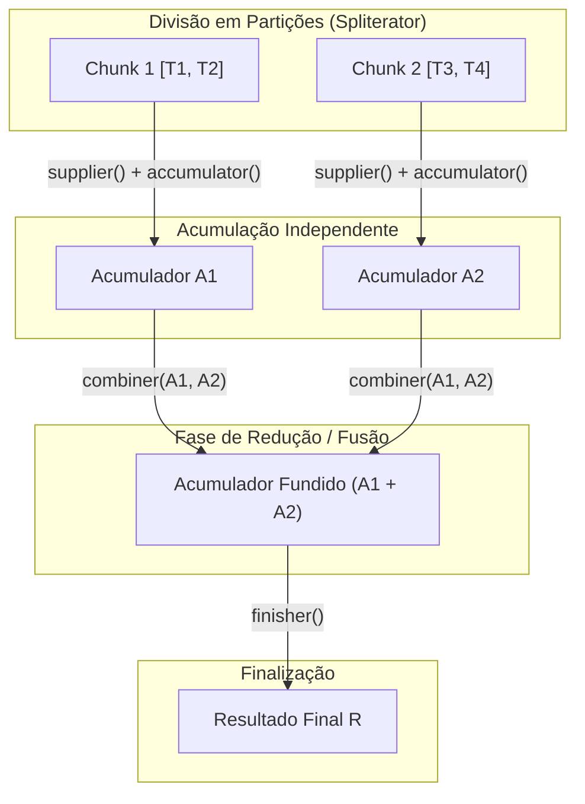
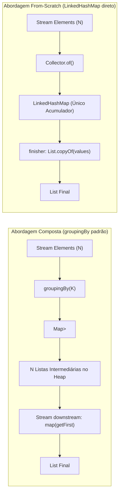
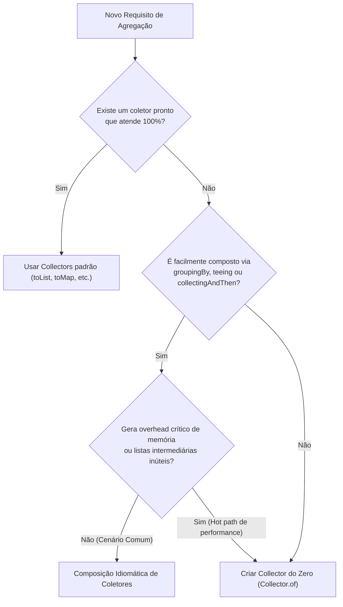

# 🛠️ Criando Collectors Customizados do Zero no Java (Custom Collectors from Scratch)

> **Guia Técnico de Estudo & Engenharia de Software**  
> **Idioma:** Português do Brasil (`pt-BR`)  
> **Versões Alvo:** Java 17, 21 (LTS) e extensões até Java 24/25

---

## 📑 Sumário

1. [Introdução & Motivação: O Limite dos Coletores Padrão](#1-introdução--motivação-o-limite-dos-coletores-padrão)
2. [Anatomia Interna da Interface Collector](#2-anatomia-interna-da-interface-collectort-a-r)
3. [Collector Próprio com LinkedHashMap (Filtrando Inéditos)](#3-collector-próprio-com-linkedhashmap-filtrando-inéditos)
4. [Comparação Arquitetural: Versão Composta vs. From Scratch](#4-comparação-arquitetural-versão-composta-vs-from-scratch)
5. [O Desafio dos Repetidos: Por que From Scratch é mais Difícil?](#5-o-desafio-dos-repetidos-por-que-from-scratch-é-mais-difícil)
6. [Guia Prático: Quando Criar do Zero vs. Compor Coletores](#6-guia-prático-quando-criar-do-zero-vs-compor-coletores)
7. [Visão de Futuro: Stream Gatherers (Java 24+)](#7-visão-de-futuro-stream-gatherers-java-24)
8. [Referências & Leitura Complementar](#8-referências--leitura-complementar)

---

## 1. Introdução & Motivação: O Limite dos Coletores Padrão

A API de Streams do Java (`java.util.stream`), introduzida no Java 8, fornece na classe utilitária `Collectors` uma série de operações comuns para redução terminal: `toList()`, `toSet()`, `groupingBy()`, `joining()`, `partitioningBy()`, entre outras.

Entretanto, em cenários do mundo real de engenharia de software, surgem requisitos de processamento que não se encaixam perfeitamente nos coletores pré-fabricados da JDK:

### O Problema do "Distinct por Propriedade" Preservando a Ordem

Considere um cenário clássico de sanitização ou processamento de lotes: recebemos uma coleção de registros com duplicidades com base em uma chave de negócio específica (por exemplo, `CPF`, `e-mail`, `orderId` ou categoria), e precisamos extrair:

1. **Os Inéditos:** Apenas o **primeiro** objeto encontrado para cada chave, mantendo rigorosamente a **ordem de aparição original**.
2. **Os Repetidos / Inválidos:** Todos os demais elementos excedentes que possuem chaves duplicadas (para fins de auditoria, logs ou descarte).

No código imperativo tradicional, esse problema costuma ser resolvido com um loop manual:

```java
record Registro(String chave, String dados) {}

public Set<Registro> detectaInvalidos(List<Registro> todosRegistros) {
    Set<Registro> invalidos = new HashSet<>();
    Set<String> chavesValidas = new HashSet<>();

    for (final var item : todosRegistros) {
        final var chave = item.chave();
        // Se já existia a chave no conjunto, o item atual é uma repetição
        if (!chavesValidas.add(chave)) {
            invalidos.add(item);
        }
    }

    return invalidos;
}
```

Para recuperar os registros válidos (inéditos), comumente vemos:

```java
List<Registro> todos = ...;
Set<Registro> invalidos = detectaInvalidos(todos);

List<Registro> validos = new ArrayList<>(todos);
validos.removeAll(invalidos); // O(N * M) ou O(N) dependendo da estrutura
```

### Por que os operadores padrão do Stream não resolvem diretamente?

- **`Stream.distinct()` nativo:** Depende exclusivamente da implementação de `equals()` e `hashCode()` do próprio objeto `Registro`. Ele não aceita um seletor dinâmico de chave (`Function<T, K>`).
- **`filter(predicateWithState)`:** Criar um `filter` que consulta um `HashSet` externo viola o princípio de funções puras e causa falhas imprevisíveis (condições de corrida) caso o Stream seja paralelizado (`.parallel()`).
- **`Collectors.toMap(classifier, Function.identity(), (a, b) -> a)`:** Retorna um `Map<K, T>`, mas descarta o fluxo original e exige passos extras para recuperar a lista final ordenada.

Diante disso, a solução idiomática, reutilizável e thread-safe no ecossistema funcional do Java é a **criação de um `Collector` customizado**.

---

## 2. Anatomia Interna da Interface `Collector<T, A, R>`

Um coletor representa uma receita de agregação funcional que reduz um fluxo de elementos do tipo `T` em um resultado final do tipo `R`, utilizando um acumulador intermediário mutável do tipo `A`.

```
                    ┌─────────────────────────┐
                    │ Stream de Elementos [T] │
                    └────────────┬────────────┘
                                 │
                   Supplier: () -> A (Cria acumulador)
                                 │
                   Accumulator: (A, T) -> void
                                 ▼
                     ┌───────────────────────┐
                     │    Acumulador [A]     │
                     └───────────┬───────────┘
                                 │
                   Finisher: A -> R (Transformação final)
                                 ▼
                    ┌─────────────────────────┐
                    │     Resultado [R]       │
                    └─────────────────────────┘
```

A interface genérica é definida como:

```java
public interface Collector<T, A, R> {
    Supplier<A> supplier();
    BiConsumer<A, T> accumulator();
    BinaryOperator<A> combiner();
    Function<A, R> finisher();
    Set<Characteristics> characteristics();
}
```

### Os 5 Componentes Fundamentais

| Componente | Assinatura Funcional | Responsabilidade |
| :--- | :--- | :--- |
| **`supplier()`** | `Supplier<A>` | Instancia um novo acumulador mutável vazio `A`. |
| **`accumulator()`** | `BiConsumer<A, T>` | Incorpora um novo elemento `T` do stream dentro do acumulador `A`. |
| **`combiner()`** | `BinaryOperator<A>` | Mescla dois acumuladores parciais `A` gerados em threads separadas em um único `A` (execução paralela). |
| **`finisher()`** | `Function<A, R>` | Converte o acumulador intermediário `A` no resultado final `R`. |
| **`characteristics()`**| `Set<Characteristics>` | Metadados para otimização da JVM (`IDENTITY_FINISH`, `CONCURRENT`, `UNORDERED`). |

### Execução em Streams Paralelas (Map-Reduce com Combiner)



> [!IMPORTANT]
> Em streams sequenciais, o método `combiner()` nunca é invocado pela JVM. Contudo, implementá-lo corretamente é **obrigatório** caso o coletor venha a ser consumido em pipelines paralelas (`parallelStream()`).

---

## 3. Collector Próprio com `LinkedHashMap` (Filtrando Inéditos)

Para resolver o problema dos **inéditos** (o primeiro elemento de cada classe/chave, preservando a ordem original), podemos construir um coletor utilizando `Collector.of(...)`.

### Estratégia de Implementação

1. **Acumulador (`A`):** `LinkedHashMap<K, T>`.  
   - O `LinkedHashMap` mantém os elementos na exata ordem em que foram inseridos.
   - O tempo de acesso e inserção por chave é amortizado em $O(1)$.
2. **Operação de Acumulação (`accumulator`):** `putIfAbsent(chave, elemento)`.  
   - Se a chave ainda não foi registrada, o par `(chave, elemento)` é inserido.
   - Se já existe um elemento para aquela chave, o método não faz nada, descartando silenciosamente as ocorrências posteriores.
3. **Fusão Concorrente (`combiner`):**  
   - Ao fundir o mapa da esquerda `x` com o da direita `y`, iteramos sobre as entradas `y.entrySet()`.
   - Para cada par, aplicamos `x.putIfAbsent(chave, valor)`. Se `x` já possuir a chave, o valor da esquerda prevalece (pois apareceu antes no stream original).
4. **Finalizador (`finisher`):** `List.copyOf(map.values())`.  
   - Extrai a coleção ordenada de valores e gera uma lista imutável e defensiva.

### Código de Produção

```java
package com.example.collectors;

import java.util.LinkedHashMap;
import java.util.List;
import java.util.Map;
import java.util.Objects;
import java.util.function.Function;
import java.util.stream.Collector;

public final class CustomCollectors {

    private CustomCollectors() {
        // Construtor privado para classe utilitária
    }

    /**
     * Coletor que seleciona apenas a primeira ocorrência de cada grupo classificado
     * pela função informada, preservando rigorosamente a ordem de inserção do stream.
     *
     * @param classifier Função de extração da chave de agrupamento
     * @param <T> Tipo dos elementos de entrada
     * @param <K> Tipo da chave identificadora
     * @return Collector que acumula em List<T> os primeiros elementos de cada categoria
     */
    public static <T, K> Collector<T, ?, List<T>> firstFromKind(Function<T, K> classifier) {
        Objects.requireNonNull(classifier, "O classificador não pode ser nulo");

        return Collector.of(
            // 1. Supplier: Inicia um mapa que preserva a ordem de inserção
            LinkedHashMap<K, T>::new,

            // 2. Accumulator: Insere apenas se a chave for inédita
            (map, element) -> {
                final K key = classifier.apply(element);
                map.putIfAbsent(key, element);
            },

            // 3. Combiner: Mescla dois acumuladores garantindo precedência temporal
            (left, right) -> {
                for (final Map.Entry<K, T> entry : right.entrySet()) {
                    left.putIfAbsent(entry.getKey(), entry.getValue());
                }
                return left;
            },

            // 4. Finisher: Extrai a lista imutável dos valores coletados
            map -> List.copyOf(map.values())
        );
    }
}
```

### Exemplo Prático de Uso

```java
record Usuario(Long id, String departamento, String nome) {}

public class ExemploUso {
    public static void main(String[] args) {
        var usuarios = List.of(
            new Usuario(1L, "TI", "Alice"),
            new Usuario(2L, "RH", "Bob"),
            new Usuario(3L, "TI", "Charlie"),
            new Usuario(4L, "FINANCEIRO", "Diana"),
            new Usuario(5L, "RH", "Eduardo")
        );

        // Coleta apenas o primeiro funcionário de cada departamento
        List<Usuario> primeiroDeCadaDepto = usuarios.stream()
            .collect(CustomCollectors.firstFromKind(Usuario::departamento));

        primeiroDeCadaDepto.forEach(System.out::println);
        // Saída esperada:
        // Usuario[id=1, departamento=TI, nome=Alice]
        // Usuario[id=2, departamento=RH, nome=Bob]
        // Usuario[id=4, departamento=FINANCEIRO, nome=Diana]
    }
}
```

---

## 4. Comparação Arquitetural: Versão Composta vs. From Scratch

Antes de criar um coletor customizado, a reação natural do desenvolvedor Java é tentar **compor** coletores existentes na JDK. Vamos analisar essa alternativa para entender exatamente os ganhos e custos de cada abordagem.

### Abordagem Composta 1: `groupingBy` com Pós-Processamento

Uma forma comum de resolver esse problema sem criar coletores novos é agrupar tudo e remapear:

```java
List<T> elementos = ...;
Function<T, K> classifier = ...;

List<T> ineditos = elementos.stream()
    .collect(Collectors.collectingAndThen(
        Collectors.groupingBy(classifier, LinkedHashMap::new, Collectors.toList()),
        grupos -> grupos.values()
            .stream()
            .map(List::getFirst) // Java 21+ Sequenced Collections
            .toList()
    ));
```

### Abordagem Composta 2: Criando um Coletor `first()` Downstream

Para evitar que o `groupingBy` aloque uma lista inteira para cada chave, poderíamos tentar criar um sub-coletor `first()` que retém somente o primeiro item:

```java
// Estado mutável para capturar o primeiro elemento
final class FirstHolder<V> {
    private V value;
    private boolean present = false;

    void accept(V v) {
        if (!present) {
            this.value = v;
            this.present = true;
        }
    }

    FirstHolder<V> combine(FirstHolder<V> other) {
        if (!this.present && other.present) {
            this.value = other.value;
            this.present = true;
        }
        return this;
    }

    V get() {
        return value;
    }
}

public static <T> Collector<T, ?, T> first() {
    return Collector.of(
        FirstHolder<T>::new,
        FirstHolder::accept,
        FirstHolder::combine,
        FirstHolder::get
    );
}

// Composição com groupingBy
public static <T, K> Collector<T, ?, List<T>> firstFromKindComposto(Function<T, K> classifier) {
    return Collectors.collectingAndThen(
        Collectors.groupingBy(classifier, LinkedHashMap::new, first()),
        grupos -> List.copyOf(grupos.values())
    );
}
```

### Comparativo Estrutural e de Performance



| Métrica / Critério | Versão Composta (`groupingBy + toList`) | Versão Composta (`groupingBy + first()`) | Versão From Scratch (`LinkedHashMap`) |
| :--- | :--- | :--- | :--- |
| **Alocações no Heap (GC Pressure)** | **Alta:** Cria um `ArrayList` para cada chave distinta. | **Média:** Cria uma instância `FirstHolder` para cada chave distinta. | **Mínima:** Cria apenas um único `LinkedHashMap` e suas entradas normais de nó. |
| **Complexidade Temporal** | $O(N)$ com overhead de iteração secundária sobre as listas. | $O(N)$ com overhead de delegação de chamadas funcionais. | $O(N)$ direto com chamadas inline de `putIfAbsent`. |
| **Número de Streams Internas** | 2 streams (`stream().collect(...)` e `grupos.values().stream()`). | 1 stream principal. | 1 stream principal, sem pipelines aninhadas. |
| **Legibilidade do Código** | Alta para quem conhece coletores padrões, mas prolixa. | Baixa (exige entender o holder do `first()`). | **Excelente:** Encapsulada em uma única função autoexplicativa. |

> [!TIP]
> Em aplicações de alto throughput e microsserviços sob alta concorrência, o coletor **from scratch** economiza alocações massivas de listas e wrappers intermediários, reduzindo pausas de Garbage Collector (GC pauses).

---

## 5. O Desafio dos Repetidos: Por que From Scratch é mais Difícil?

E se o nosso objetivo for o inverso: **descartar o primeiro item de cada chave e coletar todos os repetidos**?

À primeira vista, pode parecer tentador tentar construir outro `Collector.of(...)` direto com um acumulador customizado. Porém, a complexidade explode rapidamente quando consideramos o método `combiner()`.

### O Dilema do `combiner()` em Streams Paralelas

Imagine que o stream é particionado em duas threads:
- **Partição Esquerda (Chunk A):** `["A1", "B1", "A2"]`
- **Partição Direita (Chunk B):** `["A3", "C1", "B2", "B3"]`

Ao processar isoladamente:
- No Chunk A: `"A1"` e `"B1"` foram as cabeças (inéditos). `"A2"` é repetido.
- No Chunk B: `"A3"` e `"C1"` foram as cabeças do seu bloco local. `"B2"` e `"B3"` foram marcados como repetidos localmente.

Quando o `combiner(left, right)` é chamado:
1. O elemento `"A3"` era considerado inédito no Chunk B, mas ele é **repetido** em relação ao Chunk A! Ele precisa ser movido para a coleção de repetidos.
2. O elemento `"B2"` já era repetido no Chunk B e continua repetido.
3. O elemento `"C1"` continua sendo inédito globalmente, pois não existia no Chunk A.

Para implementar isso do zero, o acumulador intermediário precisaria manter:
- Um conjunto/mapa de primeiras ocorrências (`Map<K, T>`).
- Uma lista de elementos repetidos (`List<T>`).
- Uma lógica de fusão condicional complexa entre dois estados híbridos.

### A Vitória da Abordagem Composta

Neste caso específico, tentar criar um coletor from-scratch resulta em código frágil e propenso a bugs de concorrência. A abordagem composta usando `groupingBy` e `skip(1)` se torna **infinitamente superior em simplicidade e segurança**:

```java
package com.example.collectors;

import java.util.LinkedHashMap;
import java.util.List;
import java.util.Objects;
import java.util.function.Function;
import java.util.stream.Collector;
import java.util.stream.Collectors;

public final class DuplicateCollectors {

    private DuplicateCollectors() {}

    /**
     * Coleta todos os elementos repetidos (excluindo a primeira ocorrência de cada chave),
     * preservando a ordem relativa dos elementos.
     */
    public static <T, K> Collector<T, ?, List<T>> duplicatesFromKind(Function<T, K> classifier) {
        Objects.requireNonNull(classifier, "O classificador não pode ser nulo");

        return Collectors.collectingAndThen(
            // Agrupa preservando a ordem original dos grupos
            Collectors.groupingBy(
                classifier,
                LinkedHashMap::new,
                Collectors.toList()
            ),
            // Pós-processamento: para cada grupo, descarta a cabeça com skip(1) e aplaina
            grupos -> grupos.values()
                .stream()
                .flatMap(lista -> lista.stream().skip(1))
                .toList()
        );
    }
}
```

### Por que o `skip(1)` é tão elegante?

1. **Tratamento natural de elementos únicos:** Se um grupo possui apenas 1 elemento, `lista.stream().skip(1)` produz um stream vazio, sem lançar exceções de índice (como ocorreria com `subList(1, size)`).
2. **Delegação da fusão:** Toda a complexidade de particionamento e junção paralela é transferida para o `groupingBy` nativo da JDK, que é exaustivamente testado e otimizado.

---

## 6. Guia Prático: Quando Criar do Zero vs. Compor Coletores

A decisão entre implementar via `Collector.of(...)` ou através da composição de coletores pré-existentes deve ser guiada por requisitos arquiteturais claros:



### Matriz de Decisão Arquitetural

| Critério | Criar From Scratch (`Collector.of`) | Compor Coletores (`collectingAndThen`, etc.) |
| :--- | :--- | :--- |
| **Estrutura de Acumulação Única** | Ideal quando existe uma estrutura única ideal (ex: `LinkedHashMap`, `BitSet`, `LongSummaryStatistics`). | Ideal quando a composição de duas etapas reflete naturalmente o modelo de domínio. |
| **Impacto no Garbage Collector** | **Mínimo:** Evita buffers intermediários. | **Moderado/Alto:** Coletores como `groupingBy` alocam coleções para cada entrada de mapa. |
| **Complexidade do Combiner** | Deve ser simples e intuitivo (ex: união simples de mapas ou somatórios). Se o combiner for muito complexo, evite. | O combiner é tratado automaticamente pela composição da JDK. |
| **Custo de Manutenção** | Exige testes unitários dedicados cobrindo execuções sequenciais e paralelas. | Código autoexplicativo baseado em blocos padrão da biblioteca do Java. |

---

## 7. Visão de Futuro: Stream Gatherers (Java 24+)

A partir do Java 24 (via [JEP 485: Stream Gatherers](https://openjdk.org/jeps/485)), o Java introduziu uma abstração complementar aos Collectors: os **Gatherers**.

### Collector vs. Gatherer

- **`Collector`:** Modela uma **operação terminal** ($Stream \to R$). Ele consome todo o fluxo e devolve um único objeto final.
- **`Gatherer`:** Modela uma **operação intermediária customizada** ($Stream \to Stream$). Ele transforma o fluxo permitindo que outros operadores continuem encadeados downstream (`.map()`, `.filter()`, `.limit()`, etc.).

### Implementando Inéditos e Repetidos com Gatherers

Com Gatherers, o problema original pode ser resolvido no meio da pipeline, sem fechar a stream prematuramente:

```java
import java.util.HashSet;
import java.util.List;
import java.util.function.Function;
import java.util.stream.Gatherer;

public class GathererExamples {

    // Emite downstream apenas o primeiro elemento de cada chave
    public static <T, K> Gatherer<T, ?, T> ineditos(Function<T, K> classifier) {
        return Gatherer.ofSequential(
            HashSet<K>::new, // Estado local (Set de chaves consumidas)
            Gatherer.Integrator.ofGreedy((state, element, downstream) -> {
                final K key = classifier.apply(element);
                if (state.add(key)) {
                    return downstream.push(element); // Emite para o próximo estágio
                }
                return !downstream.isRejecting();
            })
        );
    }

    // Emite downstream apenas os elementos repetidos
    public static <T, K> Gatherer<T, ?, T> repetidos(Function<T, K> classifier) {
        return Gatherer.ofSequential(
            HashSet<K>::new,
            Gatherer.Integrator.ofGreedy((state, element, downstream) -> {
                final K key = classifier.apply(element);
                if (state.add(key)) {
                    return !downstream.isRejecting(); // Ignora a primeira ocorrência
                }
                return downstream.push(element); // Emite as duplicidades
            })
        );
    }
}
```

### Utilização com `.gather(...)`

```java
var numeros = List.of(1, 2, 3, 4, 5, 6, 7, 8, 9, 10, 11, 12);

// Inéditos por módulo 3: [1, 2, 3]
List<Integer> firsts = numeros.stream()
    .gather(GathererExamples.ineditos(i -> i % 3))
    .toList();

// Repetidos por módulo 3: [4, 5, 6, 7, 8, 9, 10, 11, 12]
List<Integer> duplicates = numeros.stream()
    .gather(GathererExamples.repetidos(i -> i % 3))
    .toList();
```

> [!NOTE]
> Observe a impressionante simetria entre o `Integrator.ofGreedy` do Gatherer e o loop `for` imperativo original visto no início do artigo: ambos utilizam um `HashSet` como estado e o retorno booleano de `state.add(k)` para desviar o fluxo. A diferença é que o Gatherer preserva toda a composabilidade preguiçosa (lazy evaluation) das streams.

---

## 8. Referências & Leitura Complementar

- [Oracle Docs - Interface java.util.stream.Collector (Java SE 21/25)](https://docs.oracle.com/en/java/javase/21/docs/api/java.base/java/util/stream/Collector.html)
- [JEP 485: Stream Gatherers (Java 24)](https://openjdk.org/jeps/485)
- [Oracle Java Magazine: Deep Dive into Custom Collectors](https://blogs.oracle.com/javamagazine/)
