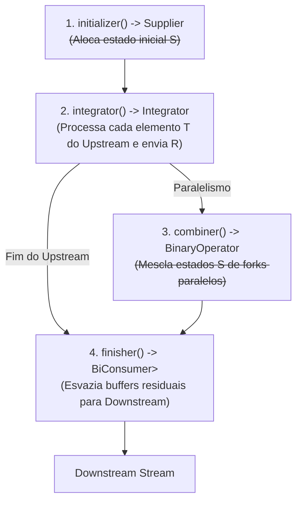
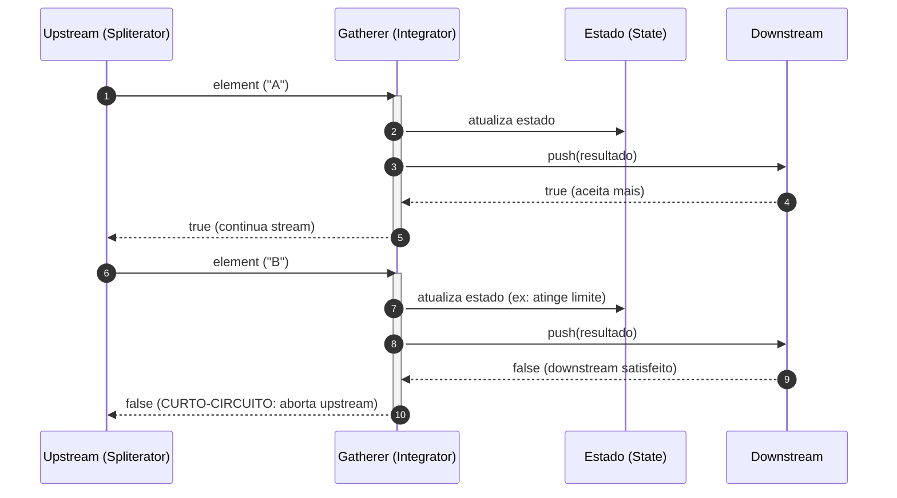
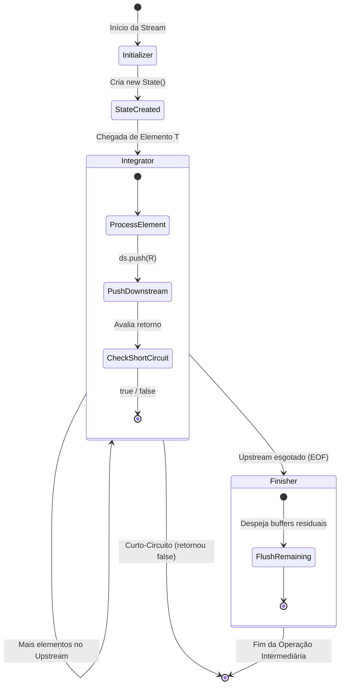

# Anatomia da API Gatherer (Java 24+)

> **Guia Técnico de Engenharia de Software**  
> **Referências:** [JEP 485: Stream Gatherers](https://openjdk.org/jeps/485) | [JavaDoc Oficial: java.util.stream.Gatherer](https://docs.oracle.com/en/java/javase/24/docs/api/java.base/java/util/stream/Gatherer.html)

---

## 1. O que são Gatherers? A Generalização de Operações Intermediárias

Desde o lançamento da **Stream API** no Java 8 (2014), o processamento funcional em Java possuía uma assimetria arquitetural fundamental:

- **Operações Terminais (`Collector`):** Abertas e extensíveis. Qualquer desenvolvedor podia implementar a interface `Collector<T, A, R>` para reduzir uma stream a coleções arbitrárias, árvores de decisão ou resumos estatísticos complexos (`stream.collect(...)`).
- **Operações Intermediárias:** Fechadas e engessadas. O conjunto de transformações intermediárias era estático no JDK (`filter`, `map`, `flatMap`, `distinct`, `sorted`, `peek`, `limit`, `skip`, `takeWhile`, `dropWhile`). Operações comuns como janelamento deslizante (*sliding window*), agrupamento em lotes (*batching*), desduplicação por atributo (`distinctBy`) ou mapeamento com concorrência controlada exigiam hacks externos, `Spliterator` customizado de alta complexidade ou o abandono da Stream API em favor de bibliotecas de terceiros (RxJava, Project Reactor, Vavr).

Com a introdução dos **Stream Gatherers** no **Java 24** (JEP 485, após rodadas de preview nas JEPs 461 e 473), o modelo se torna simétrico. Um **Gatherer** é a generalização extensível de uma **operação intermediária**.

```
[Upstream Elements] ───> [ Gatherer (Transformação/Estado/Janelamento) ] ───> [Downstream Elements] ───> [Terminal Collector]
```

### A Diferença Central: Collector vs. Gatherer

| Dimensão | `Collector<T, A, R>` | `Gatherer<T, S, R>` |
| :--- | :--- | :--- |
| **Tipo de Operação** | **Terminal** (`stream.collect(...)`) | **Intermediária** (`stream.gather(...)`) |
| **Fluxo do Pipeline** | **Consome e encerra** o stream | **Transforma e propaga** para jusante (*downstream*) |
| **Cardinalidade de Saída** | Sempre $N \to 1$ (agregação final) | $1 \to 1$ (map), $1 \to 0..1$ (filter), $1 \to N$ (expand), $N \to 1$ (window/batch), $N \to M$ |
| **Composição** | Apenas no encerramento (`collectingAndThen`) | Encadeável livremente (`.gather(g1).filter(...).gather(g2)`) |
| **Curto-Circuito** | Não suporta cancelamento no meio da agregação | Suporta curto-circuito bidirecional (upstream e downstream) |

A nova operação de instância em `java.util.stream.Stream`:

```java
default <R> Stream<R> gather(Gatherer<? super T, ?, R> gatherer)
```

Ela recebe um `Gatherer` e devolve um novo `Stream<R>`, permitindo continuar encadeando outras operações intermediárias antes de invocar uma operação terminal.

---

## 2. Anatomia de `Gatherer<T, S, R>`

A interface funcional `java.util.stream.Gatherer<T, S, R>` é parametrizada por três tipos genéricos:

```java
package java.util.stream;

public interface Gatherer<T, S, R> {
    Supplier<S> initializer();
    Integrator<S, T, R> integrator();
    BinaryOperator<S> combiner();
    BiConsumer<S, Downstream<? super R>> finisher();
}
```

```
           ┌──────────────────────────────────────────────┐
           │              Gatherer<T, S, R>               │
           └──────────────────────────────────────────────┘
              ▲                    │                    │
              │                    ▼                    ▼
   [ Elementos Upstream ]    [ Estado Interno ]   [ Elementos Downstream ]
          Tipo T                   Tipo S                 Tipo R
```

### Significado dos Parâmetros Genéricos

1. **`T` (Input Type / Upstream):** O tipo dos elementos que chegam da etapa anterior da stream.
2. **`S` (Intermediate State Type):** O tipo do estado intermediário mutável ou imutável mantido pelo gatherer.
   - **Encapsulamento com Wildcard (`?`):** Na assinatura pública de métodos fábrica de gatherers, é convenção consolidada declarar o tipo de estado como wildcard (`Gatherer<T, ?, R>`). Isso esconde os detalhes de implementação do estado (ex.: `HashSet`, `State` local), permitindo alterar a estrutura interna sem quebrar código de clientes.
3. **`R` (Output Type / Downstream):** O tipo dos elementos emitidos para a próxima etapa da stream.

---

## 3. Os Quatro Componentes do Gatherer

Assim como um `Collector` é definido por funções fundamentais (`supplier`, `accumulator`, `combiner`, `finisher`), um `Gatherer` é composto por quatro peças complementares:



### 1. `initializer()` $\to$ `Supplier<S>`
- **Função:** Cria e aloca uma nova instância do estado intermediário `S` para cada avaliação do pipeline.
- **Quando é chamado:** No início da execução da stream (ou no início de cada thread paralela se houver paralelismo).
- **Default:** Retorna um supplier neutro (`() -> null`) para gatherers *stateless*.

### 2. `integrator()` $\to$ `Integrator<S, T, R>`
- **Função:** O motor de processamento. Chamado para **cada elemento `T`** recebido do upstream.
- **Assinatura:** `boolean integrate(S state, T element, Downstream<? super R> downstream)`.
- **Papel:** Modifica o estado `state`, inspeciona o elemento `element` e decide se/quando emitir zero, um ou vários elementos `R` chamando `downstream.push(...)`.
- **Retorno booleano:** Indica se o upstream deve continuar fornecendo dados (`true`) ou se a operação deve encerrar imediatamente (*curto-circuito*, `false`).

### 3. `combiner()` $\to$ `BinaryOperator<S>`
- **Função:** Combina dois estados intermediários em um único quando a stream é executada em paralelo (`.parallel()`).
- **Quando é chamado:** Durante a redução das subtarefas do `ForkJoinPool`.
- **Default:** `Gatherer.defaultCombiner()`, que indica que a operação não é paralelizável ou é puramente sequencial.

### 4. `finisher()` $\to$ `BiConsumer<S, Downstream<? super R>>`
- **Função:** Execução de encerramento chamada quando todo o upstream foi consumido (e não houve curto-circuito).
- **Papel:** Permite emitir dados acumulados em buffers locais que ainda não haviam sido descarregados para jusante (ex.: resto de lotes, elementos de ordenação ou janelas parciais).
- **Default:** `Gatherer.defaultFinisher()`, uma operação sem efeito (`(state, downstream) -> {}`).

---

## 4. O Coração do Gatherer: `Integrator`, Curto-Circuito e Backpressure

A interface `Gatherer.Integrator<S, T, R>` é o componente central de qualquer gatherer.

```java
@FunctionalInterface
public interface Integrator<A, T, R> {
    boolean integrate(A state, T element, Downstream<? super R> downstream);
}
```

### `Integrator.ofGreedy` vs. `Integrator.of`

O JDK oferece duas fábricas fundamentais para instanciar integrators, com impactos diretos de performance e otimização da JVM:

```
                                  ┌───────────────────────────────┐
                                  │   Gatherer.Integrator         │
                                  └───────────────────────────────┘
                                                  │
                  ┌───────────────────────────────┴───────────────────────────────┐
                  ▼                                                               ▼
  ┌───────────────────────────────┐                               ┌───────────────────────────────┐
  │ Integrator.ofGreedy(...)      │                               │ Integrator.of(...)            │
  ├───────────────────────────────┤                               ├───────────────────────────────┤
  │ • NUNCA faz curto-circuito    │                               │ • PODE fazer curto-circuito   │
  │ • Consome todo o upstream     │                               │ • Retorna false quando atinge │
  │ • Permite otimizações na JVM  │                               │   condição de parada (ex:limit│
  │ • Ex: map, filter, distinct   │                               │ • Ex: limit, takeWhile        │
  └───────────────────────────────┘                               └───────────────────────────────┘
```

#### 1. `Gatherer.Integrator.ofGreedy(...)` (Ganancioso / Sem Curto-Circuito)
- Use quando a lógica de negócio **precisa processar todo o fluxo até o final** ou não decide parar por conta própria.
- **Otimização:** A JVM sabe que o gatherer não aborta a leitura por decisão interna. Ele só interrompe a execução se o próprio `downstream` passar a rejeitar novos elementos.
- Retorna uma instância que implementa a interface de marcação `Gatherer.Integrator.Greedy`.

#### 2. `Gatherer.Integrator.of(...)` (Com Potencial de Curto-Circuito)
- Use quando o próprio gatherer possui uma condição de parada que deve abortar a leitura do upstream antes do fim natural do fluxo (ex.: `limit(n)`, `takeWhile(predicate)`).
- Se o método retornar `false`, o runtime do stream interrompe imediatamente a extração de novos elementos do `Spliterator` a montante.

### A Interface `Downstream<R>`

O terceiro parâmetro do integrador é a interface `Gatherer.Downstream<? super R>`:

```java
public interface Downstream<T> {
    boolean push(T element);
    default boolean isRejecting() { return false; }
}
```

- **`downstream.push(element)`:** Envia o elemento `element` para a próxima etapa do pipeline de streams.
  - **Retorno:** Retorna `true` se o downstream ainda aceita elementos, ou `false` se o downstream entrou em curto-circuito (ex.: se houver um `.limit(5)` mais à frente que já atingiu a contagem, ou um `.findFirst()`).
- **`downstream.isRejecting()`:** Permite consultar proativamente se a jusante já não aceita novos dados sem precisar chamar `push()`. Muito útil para evitar computações pesadas caso o pipeline já tenha sido abortado downstream.

> [!IMPORTANT]
> **Propagação Correta de Status:**
> Em integrators gananciosos (`ofGreedy`), se você não chamar `push` para um elemento (como em um `filter` quando o predicado falha), você **NÃO** deve retornar `false`! Retornar `false` abortaria a stream inteira! Em vez disso, retorne `!downstream.isRejecting()`.

---

## 5. As Fábricas de Gatherer: `Gatherer.of` vs. `Gatherer.ofSequential`

O JDK disponibiliza métodos utilitários estáticos na interface `Gatherer` para montagem rápida:

```java
// Stateless & Paralelizável (map, filter)
Gatherer.of(integrator);

// Stateful & Paralelizável (requer combiner)
Gatherer.of(initializer, integrator, combiner, finisher);

// Stateful & Estritamente Sequencial (skip, limit, distinct, dropWhile)
Gatherer.ofSequential(initializer, integrator);
Gatherer.ofSequential(initializer, integrator, finisher);
```

### Quando usar `Gatherer.ofSequential`?
Use `Gatherer.ofSequential` quando a **ordem relativa de chegada dos elementos for determinante** para a integridade do estado e não for viável ou desejável mesclar estados de threads concorrentes:
- **`limit(n)`:** Precisamos dos $N$ primeiros elementos exatos da stream global.
- **`skip(n)`:** Precisamos pular os $N$ primeiros elementos.
- **`distinct()` (versão simples):** A primeira ocorrência determina a inclusão.
- **`dropWhile(p)`:** Uma vez que o predicado falha pela primeira vez, a trava de descarte é liberada permanentemente.

### Quando usar `Gatherer.of`?
Use `Gatherer.of` para operações:
1. **Stateless:** Não guardam estado entre elementos (`map`, `filter`, `peek`). Podem ser paralelizadas naturalmente pelo runtime sem necessidade de combiner.
2. **Stateful Paralelizáveis:** Quando você implementa formalmente a função `combiner()`, ensinando o Java a mesclar dois estados `S` de forma determinística e comutatOriginalmente compatível.

---

## 6. O Padrão de Estado Local: `class State` dentro do Método

Ao implementar um gatherer com estado intermediário específico que não corresponde a uma coleção padrão do Java (como `HashSet` ou `ArrayList`), qual é o melhor design?

Em versões anteriores do Java, desenvolvedores costumavam apelar para truques inseguros ou feios, como:
- Vetores de um elemento: `boolean[] drop = new boolean[]{true};`
- `AtomicBoolean` / `AtomicInteger` (overhead desnecessário em pipelines sequenciais)
- Poluição de escopo criando DTOs ou records públicos no arquivo só para guardar duas variáveis.

### O Padrão Canônico: Classes Locais de Método

No Java moderno, defina uma `class State` **dentro do próprio método da fábrica**:

```java
public static <T> Gatherer<T, ?, T> dropWhile(Predicate<? super T> predicate) {
    // Classe local ao método: invisível externamente, sem poluição de namespace
    class State {
        boolean dropping = true;
    }

    return Gatherer.ofSequential(
        State::new,
        Gatherer.Integrator.ofGreedy((state, element, ds) -> {
            if (state.dropping) {
                if (!predicate.test(element)) {
                    state.dropping = false;
                    return ds.push(element);
                }
                return !ds.isRejecting();
            }
            return ds.push(element);
        })
    );
}
```

### Benefícios deste padrão:
1. **Encapsulamento Absoluto:** O estado `State` não vaza para outras classes nem para o autocompletar da IDE.
2. **Mutabilidade Local Limpa:** Dentro da instância criada pelo `State::new`, os campos podem ser mutáveis normais (`boolean`, `long`, `List`), sem custo de sincronização concorrente, pois cada execução sequencial do gatherer ganha sua própria instância de `State`.
3. **Generics Opacos:** O retorno é tipado como `Gatherer<T, ?, T>`, garantindo isolamento de tipagem.

---

## 7. Exemplos Práticos: Reimplementando Streams com Gatherers

Para compreender a fundo a mecânica de execução, vamos reimplementar as operações clássicas da `Stream API` exclusivamente com `Gatherer`.

### a) `map` (Stateless, Paralelizável, Greedy)

O mapeamento transforma 1 elemento $T$ em 1 elemento $R$. Não necessita de estado e consome até o fim:

```java
public static <T, R> Gatherer<T, ?, R> map(Function<? super T, ? extends R> mapper) {
    return Gatherer.of(
        Gatherer.Integrator.ofGreedy((_, element, ds) -> ds.push(mapper.apply(element)))
    );
}
```

> [!NOTE]
> Usamos a sintaxe de variável não nomeada (`_`) do Java 22+ para indicar que o estado intermediário é nulo e ignorado.

---

### b) `filter` (Stateless, Greedy com Backpressure)

O filtro decide se repassa o elemento. Se rejeitar o elemento atual, deve retornar o status de saúde do downstream (`!ds.isRejecting()`):

```java
public static <T> Gatherer<T, ?, T> filter(Predicate<? super T> predicate) {
    return Gatherer.of(
        Gatherer.Integrator.ofGreedy((_, element, ds) -> {
            if (predicate.test(element)) {
                return ds.push(element);
            }
            // Não enviamos nada, mas avisamos o upstream se o downstream ainda quer dados
            return !ds.isRejecting();
        })
    );
}
```

---

### c) `distinct` (Stateful Sequencial com `HashSet`)

Mantém um conjunto dos itens já observados. Requer ordem determinística:

```java
public static <T> Gatherer<T, ?, T> distinct() {
    return Gatherer.ofSequential(
        HashSet::new,
        Gatherer.Integrator.ofGreedy((state, element, ds) -> {
            if (state.add(element)) {
                return ds.push(element);
            }
            return !ds.isRejecting();
        })
    );
}
```

---

### d) `dropWhile` (Stateful com Flag Booleana Local)

Descarta elementos enquanto o predicado for verdadeiro. No primeiro `false`, muda a flag e repassa todos os elementos subsequentes:

```java
public static <T> Gatherer<T, ?, T> dropWhile(Predicate<? super T> predicate) {
    class State {
        boolean dropping = true;
    }

    return Gatherer.ofSequential(
        State::new,
        Gatherer.Integrator.ofGreedy((state, element, ds) -> {
            if (state.dropping) {
                if (!predicate.test(element)) {
                    state.dropping = false;
                    return ds.push(element);
                }
                return !ds.isRejecting();
            }
            return ds.push(element);
        })
    );
}
```

---

### e) `limit` (Short-Circuiting / Curto-Circuito Ativo)

Exemplo fundamental de **curto-circuito**. Utiliza `Gatherer.Integrator.of` (não-greedy) e retorna `false` assim que a contagem atinge o limite, abortando o upstream:

```java
public static <T> Gatherer<T, ?, T> limit(long maxSize) {
    if (maxSize < 0) {
        throw new IllegalArgumentException("maxSize não pode ser negativo: " + maxSize);
    }

    class State {
        long count = 0;
    }

    return Gatherer.ofSequential(
        State::new,
        Gatherer.Integrator.of((state, element, ds) -> {
            if (state.count >= maxSize) {
                // CURTO-CIRCUITO: aborta o consumo do upstream imediatamente!
                return false;
            }
            state.count++;
            boolean wantsMore = ds.push(element);
            return wantsMore && state.count < maxSize;
        })
    );
}
```

---

### f) Exemplos Bônus Avançados

#### `distinctBy` (Desduplicação por Chave/Atributo de Objeto)
Uma das funções mais pedidas na história do Java, finalmente possível de forma nativa e limpa:

```java
public static <T, K> Gatherer<T, ?, T> distinctBy(Function<? super T, ? extends K> keyExtractor) {
    class State {
        final Set<K> seenKeys = new HashSet<>();
    }

    return Gatherer.ofSequential(
        State::new,
        Gatherer.Integrator.ofGreedy((state, element, ds) -> {
            K key = keyExtractor.apply(element);
            if (state.seenKeys.add(key)) {
                return ds.push(element);
            }
            return !ds.isRejecting();
        })
    );
}
```

#### `takeWhile` (Curto-circuito imediato no primeiro false)
```java
public static <T> Gatherer<T, ?, T> takeWhile(Predicate<? super T> predicate) {
    return Gatherer.ofSequential(
        Gatherer.Integrator.of((_, element, ds) -> {
            if (predicate.test(element)) {
                return ds.push(element);
            }
            // Condição violada: curto-circuito disparado
            return false;
        })
    );
}
```

#### `windowFixed` / `batch` (Agrupamento em Lotes com `finisher`)
Demonstração clássica do uso de **`finisher`** para esvaziar o buffer restante no final da stream:

```java
public static <T> Gatherer<T, ?, List<T>> windowFixed(int batchSize) {
    if (batchSize <= 0) {
        throw new IllegalArgumentException("batchSize deve ser > 0");
    }

    class State {
        final List<T> buffer = new ArrayList<>(batchSize);
    }

    return Gatherer.ofSequential(
        State::new,
        Gatherer.Integrator.ofGreedy((state, element, ds) -> {
            state.buffer.add(element);
            if (state.buffer.size() == batchSize) {
                List<T> batch = List.copyOf(state.buffer);
                state.buffer.clear();
                return ds.push(batch);
            }
            return !ds.isRejecting();
        }),
        (state, ds) -> {
            // FINISHER: Descarrega os elementos residuais que não fecharam um lote completo
            if (!state.buffer.isEmpty() && !ds.isRejecting()) {
                ds.push(List.copyOf(state.buffer));
                state.buffer.clear();
            }
        }
    );
}
```

---

## 8. Memória Muscular: Padrões e Guia de Decisão ao Criar Gatherers

Ao planejar a implementação de um novo Gatherer para sua aplicação, siga este checklist mental de cinco perguntas:

```
                          1. Precisa guardar estado?
                                     │
                     ┌───────────────┴───────────────┐
                    NÃO                             SIM
                     │                               │
           Stateless: Gatherer.of(...)    2. A ordem de chegada importa?
                     │                               │
                     │                     ┌─────────┴─────────┐
                     │                    SIM                 NÃO
                     │                     │                   │
                     │            Gatherer.ofSequential   Gatherer.of (com combiner)
                     │                     │                   │
                     └─────────────────────┼───────────────────┘
                                           │
                              3. Faz curto-circuito?
                                           │
                             ┌─────────────┴─────────────┐
                            NÃO                         SIM
                             │                           │
                   Integrator.ofGreedy            Integrator.of
```

### Checklist de Implementação:
1. **Preciso de estado intermediário?**
   - **Não:** Use `Gatherer.of(Integrator.ofGreedy((_, elem, ds) -> ...))` sem `initializer`.
   - **Sim:** Crie uma `class State` dentro do método e passe `State::new` como `initializer`.
2. **A ordem relativa importa?**
   - Se for dependente da ordem sequencial (`limit`, `skip`, `window`, `dropWhile`), use `Gatherer.ofSequential(...)`.
   - Se for combinável em árvores de processamento paralelo, forneça um `BinaryOperator<S> combiner`.
3. **O gatherer decide quando parar antes do fim do fluxo?**
   - **Sim (Curto-circuito):** Use `Gatherer.Integrator.of(...)` e retorne `false` na condição de parada.
   - **Não (Consome tudo):** Use `Gatherer.Integrator.ofGreedy(...)`.
4. **Sobram dados no buffer após o último elemento?**
   - Se a operação agrupa dados (`window`, `batch`, `buffer`, `sorted`), implemente obrigatoriamente a lambda do `finisher: (state, ds) -> { ... }`.
5. **Estou propagando o status de rejeição?**
   - Quando não emitir um elemento (`push`), retorne `!ds.isRejecting()`, e **nunca** retorne `false` acidentalmente em um integrador greedy.

---

## 9. Diagramas Mermaid: Fluxo e Ciclo de Vida do Gatherer

### Fluxo de Dados e Backpressure (Upstream $\to$ Gatherer $\to$ Downstream)



### Ciclo de Vida dos Quatro Componentes em Stream Sequencial



---

## 10. Testes de Validação Completa

Abaixo está uma suíte executável ilustrando os Gatherers customizados operando em conjunto:

```java
import java.util.ArrayList;
import java.util.HashSet;
import java.util.List;
import java.util.Set;
import java.util.function.Function;
import java.util.function.Predicate;
import java.util.stream.Gatherer;
import java.util.stream.Stream;

public class GathererAnatomyDemo {

    // 1. Mapeamento customizado
    public static <T, R> Gatherer<T, ?, R> customMap(Function<? super T, ? extends R> mapper) {
        return Gatherer.of(
            Gatherer.Integrator.ofGreedy((_, element, ds) -> ds.push(mapper.apply(element)))
        );
    }

    // 2. Filtro customizado
    public static <T> Gatherer<T, ?, T> customFilter(Predicate<? super T> predicate) {
        return Gatherer.of(
            Gatherer.Integrator.ofGreedy((_, element, ds) -> {
                if (predicate.test(element)) {
                    return ds.push(element);
                }
                return !ds.isRejecting();
            })
        );
    }

    // 3. Desduplicação por chave (distinctBy)
    public static <T, K> Gatherer<T, ?, T> distinctBy(Function<? super T, ? extends K> keyExtractor) {
        class State {
            final Set<K> seen = new HashSet<>();
        }
        return Gatherer.ofSequential(
            State::new,
            Gatherer.Integrator.ofGreedy((state, element, ds) -> {
                if (state.seen.add(keyExtractor.apply(element))) {
                    return ds.push(element);
                }
                return !ds.isRejecting();
            })
        );
    }

    // 4. Limite com curto-circuito
    public static <T> Gatherer<T, ?, T> customLimit(long maxSize) {
        class State {
            long count = 0;
        }
        return Gatherer.ofSequential(
            State::new,
            Gatherer.Integrator.of((state, element, ds) -> {
                if (state.count >= maxSize) {
                    return false;
                }
                state.count++;
                return ds.push(element) && state.count < maxSize;
            })
        );
    }

    // 5. Agrupamento em lotes com finisher
    public static <T> Gatherer<T, ?, List<T>> windowFixed(int batchSize) {
        class State {
            final List<T> buffer = new ArrayList<>(batchSize);
        }
        return Gatherer.ofSequential(
            State::new,
            Gatherer.Integrator.ofGreedy((state, element, ds) -> {
                state.buffer.add(element);
                if (state.buffer.size() == batchSize) {
                    List<T> batch = List.copyOf(state.buffer);
                    state.buffer.clear();
                    return ds.push(batch);
                }
                return !ds.isRejecting();
            }),
            (state, ds) -> {
                if (!state.buffer.isEmpty() && !ds.isRejecting()) {
                    ds.push(List.copyOf(state.buffer));
                    state.buffer.clear();
                }
            }
        );
    }

    record Developer(String name, String language, int yearsExperience) {}

    public static void main(String[] args) {
        List<Developer> devs = List.of(
            new Developer("Alice", "Java", 5),
            new Developer("Bob", "Kotlin", 3),
            new Developer("Carlos", "Java", 8),
            new Developer("Diana", "Go", 4),
            new Developer("Eduardo", "Kotlin", 6),
            new Developer("Fernanda", "Java", 2),
            new Developer("Gabriel", "Rust", 7)
        );

        // Pipeline combinando múltiplos gatherers customizados:
        List<List<String>> result = devs.stream()
            // 1. Desduplica por linguagem principal (mantém primeiro de cada linguagem)
            .gather(distinctBy(Developer::language))
            // 2. Extrai apenas o nome e linguagem
            .gather(customMap(d -> d.name() + " (" + d.language() + ")"))
            // 3. Limita aos primeiros 3 únicos
            .gather(customLimit(3))
            // 4. Agrupa em lotes de 2
            .gather(windowFixed(2))
            .toList();

        System.out.println("Lotes resultantes: " + result);
        // Saída esperada: [[Alice (Java), Bob (Kotlin)], [Diana (Go)]]
    }
}
```

---

## 11. Conclusão & Leituras Recomendadas

Com a chegada definitiva no Java 24, os **Stream Gatherers** consolidam a Stream API como uma plataforma funcional de primeira classe, eliminando a última grande barreira que separava o Java de ecossistemas reativos especializados para manipulações in-memory.

Para aprofundamento adicional, consulte:
- [JEP 485: Stream Gatherers (JDK 24)](https://openjdk.org/jeps/485)
- [Javadoc oficial da classe java.util.stream.Gatherers](https://docs.oracle.com/en/java/javase/24/docs/api/java.base/java/util/stream/Gatherers.html) (catálogo de gatherers nativos pré-fabricados como `windowFixed`, `windowSliding`, `fold`, `scan` e `mapConcurrent`)
