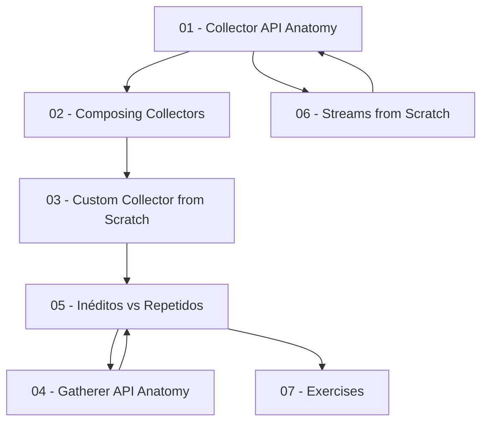

# ☕ Java Collectors, Gatherers & Functional Streams — Study Guide

> **Deep-dive study guide on Java Stream Collectors, custom Collectors, Gatherers (Java 24+), and functional programming patterns with Streams.**

---

## 📋 Table of Contents

| # | Module | Topic | Key Concepts |
|---|--------|-------|--------------|
| 01 | [Collector API Anatomy](./01-collector-api-anatomy.md) | Anatomia do `Collector<T, A, R>` | supplier, accumulator, combiner, finisher, Characteristics |
| 02 | [Composing Collectors](./02-composing-collectors.md) | Composição de Collectors existentes | groupingBy, collectingAndThen, sealed interface `Achei` |
| 03 | [Custom Collector from Scratch](./03-custom-collector-from-scratch.md) | Collector totalmente próprio | LinkedHashMap, putIfAbsent, trade-offs |
| 04 | [Gatherer API Anatomy](./04-gatherer-api-anatomy.md) | Anatomia do `Gatherer` (Java 24+) | Integrator, Downstream, ofSequential, ofGreedy |
| 05 | [Inéditos vs Repetidos](./05-ineditos-repetidos.md) | Caso completo de estudo | Collectors + Gatherers aplicados ao mesmo problema |
| 06 | [Streams from Scratch](./06-streams-from-scratch.md) | Reinventando Streams (Java 7→8) | Iterable, Iterator, lazy evaluation, reduce, collect |
| 07 | [Exercises](./07-exercises.md) | Exercícios práticos | Hands-on challenges para fixação |

---

## 🎯 Prerequisites

| Requirement | Version | Notes |
|-------------|---------|-------|
| Java JDK | 24+ | Gatherers require Java 24+ (finalized in JEP 485) |
| Familiarity with Streams | Java 8+ | Basic `map`, `filter`, `collect` usage |
| Functional interfaces | Java 8+ | `Function`, `Predicate`, `Consumer`, `Supplier` |

> **💡 Tip:** You can use the [dev.java Playground](https://dev.java/playground/) to run the examples without a local setup.

---

## 📖 Core Topics & Case Studies

| Topic | Focus | Key Themes |
|-------|-------|------------|
| Custom Collectors & Classification | Terminal Operations | Custom Collectors, `first()`, inéditos vs repetidos, Gatherers |
| Streams from the Ground Up | Engine Mechanics | Streams from scratch, Collector anatomy, Java 7 constraints |
| Intermediate Stream Operations | Extensibility (Java 24+) | Gatherer API, reimplementing intermediate operations |

---

## 🧭 Suggested Learning Path

1. Start with [06 - Streams from Scratch](./06-streams-from-scratch.md) if you need a refresher on how Streams work internally
2. Then [01 - Collector API](./01-collector-api-anatomy.md) for the foundational Collector interface
3. [02 - Composing](./02-composing-collectors.md) → [03 - Custom](./03-custom-collector-from-scratch.md) for building collectors
4. [04 - Gatherers](./04-gatherer-api-anatomy.md) for the modern Java 24+ approach
5. [05 - Case Study](./05-ineditos-repetidos.md) ties everything together
6. [07 - Exercises](./07-exercises.md) for hands-on practice

---

## 🏷️ Tech Stack

`Java 24+` `Streams API` `Collector<T, A, R>` `Gatherer<T, S, R>` `Functional Programming` `LinkedHashMap` `sealed interfaces`

---

## 📚 Additional References

- [Java Stream JavaDoc](https://docs.oracle.com/en/java/javase/25/docs/api/java.base/java/util/stream/Stream.html)
- [Collector JavaDoc](https://docs.oracle.com/en/java/javase/25/docs/api/java.base/java/util/stream/Collector.html)
- [Collectors JavaDoc](https://docs.oracle.com/en/java/javase/25/docs/api/java.base/java/util/stream/Collectors.html)
- [Gatherer JavaDoc](https://docs.oracle.com/en/java/javase/24/docs/api/java.base/java/util/stream/Gatherer.html)
- [JEP 485: Stream Gatherers](https://openjdk.org/jeps/485)
- [Todd Ginsberg's Gatherers guide](https://todd.ginsberg.com/post/java/gatherers/)
