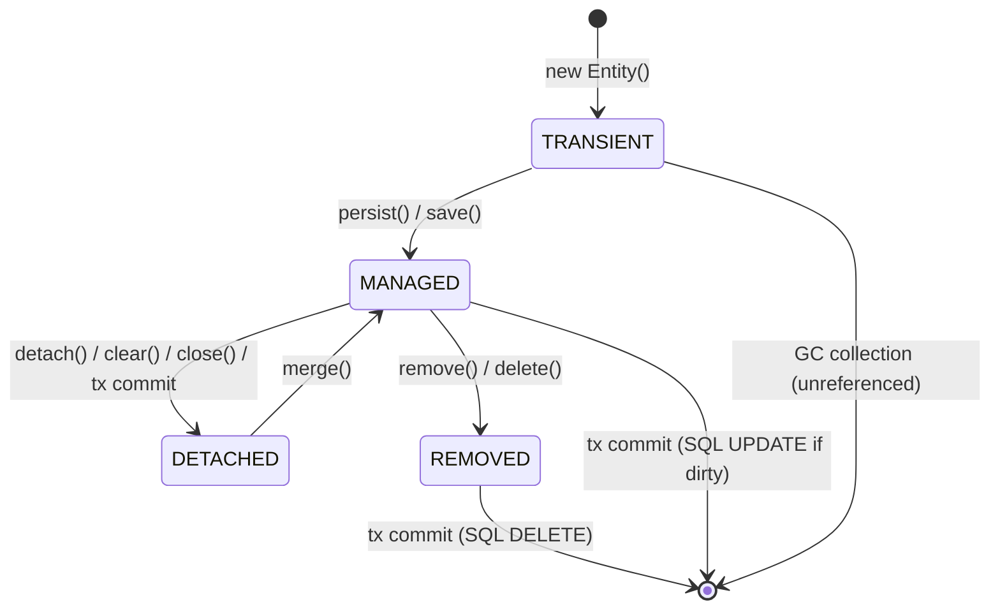

# 🔬 Deep Dive: Behind the Scenes of JPA & Hibernate ORM

> **Audience**: Principal Engineers, Distributed Systems Architects, and Senior Java Developers  
> **Framework**: Micronaut Data JPA 4.4 + Hibernate ORM 6.x  
> **Java Version**: Java 21 / 25 LTS  

---

## 📑 Table of Contents
1. [The Persistence Context Lifecycle State Machine](#1-the-persistence-context-lifecycle-state-machine)
2. [Hibernate Dirty Checking & Snapshot Engine](#2-hibernate-dirty-checking--snapshot-engine)
3. [Flush Timing & FlushMode Mechanics](#3-flush-timing--flushmode-mechanics)
4. [First-Level Cache (L1) vs. Second-Level Cache (L2)](#4-first-level-cache-l1-vs-second-level-cache-l2)
5. [The N+1 Query Problem Anatomy & Mitigations](#5-the-n1-query-problem-anatomy--mitigations)
6. [SQL Generation Pipeline: AST to PreparedStatement](#6-sql-generation-pipeline-ast-to-preparedstatement)
7. [Concurrency & Locking: Optimistic vs. Pessimistic](#7-concurrency--locking-optimistic-vs-pessimistic)
8. [Practical Diagnostics with Micronaut & Docker](#8-practical-diagnostics-with-micronaut--docker)

---

## 1. The Persistence Context Lifecycle State Machine

At the core of JPA is the **Persistence Context** (`EntityManager`), an in-memory transactional cache managing entity instances and tracking their lifecycle states.



### Detailed Lifecycle States

| State | In Persistence Context? | Has Database Identity (PK)? | Dirty Checking Active? | Description |
|:---|:---:|:---:|:---:|:---|
| **TRANSIENT** | ❌ No | ❌ No (null ID) | ❌ No | Instantiated via `new Vehicle()`. Pure JVM object; Hibernate is unaware of its existence. |
| **MANAGED** | ✅ Yes | ✅ Yes (assigned PK) | ✅ Yes | Associated with active Persistence Context. All mutations are monitored by dirty checking. |
| **DETACHED** | ❌ No | ✅ Yes | ❌ No | Was managed, but session closed, transaction committed, or `detach()`/`clear()` was called. Changes in memory are **not** synchronized to DB unless re-merged via `merge()`. |
| **REMOVED** | ✅ Yes (transitional) | ✅ Yes | ❌ No | Marked for deletion via `remove()`. SQL `DELETE` will be emitted upon flush. |

### Transitions & Code Examples

```java
// 1. TRANSIENT -> MANAGED
Vehicle vehicle = new Vehicle("VH-01", "Delivery Van", AssetStatus.ACTIVE, "FL-100", "VIN123", 50000L, FuelType.DIESEL);
entityManager.persist(vehicle); // Now MANAGED. Assigned PK. Registered in L1 Cache.

// 2. MANAGED -> DETACHED
entityManager.detach(vehicle); // Evicted from L1 Cache.
vehicle.setMileage(55000L);     // Mutation will NOT trigger SQL UPDATE!

// 3. DETACHED -> MANAGED
Vehicle managedCopy = entityManager.merge(vehicle); // Returns a NEW managed reference with state copied.
// managedCopy is MANAGED; vehicle remains DETACHED!

// 4. MANAGED -> REMOVED
entityManager.remove(managedCopy); // Scheduled for SQL DELETE on next flush.
```

---

## 2. Hibernate Dirty Checking & Snapshot Engine

A foundational JPA principle is: **You don't need to call `repository.save()` to update managed entities.**

### How the Snapshot Mechanism Works

1. **Entity Loading**: When an entity is fetched via `findById()`, JPQL query, or `persist()`, Hibernate creates **two** structures in the Persistence Context:
   - The entity instance itself.
   - An immutable internal **Snapshot Array** (`Object[]`) holding the raw property values as read from the JDBC `ResultSet`.
2. **Entity Mutation**: The application invokes business methods or setters: `vehicle.setMileage(120_500L)`. Hibernate does not intercept the setter immediately (unless bytecode enhancement is active).
3. **Flush / Commit Comparison**: During the flush cycle, Hibernate's `DefaultFlushEntityEventListener` iterates over all managed entities:
   - It performs an element-by-element equality check between the current entity fields and the cached snapshot array.
   - If a difference is detected, the entity is marked **dirty**.
   - Hibernate's SQL generator synthesizes an `UPDATE` statement containing only the updated column values (or all columns, unless `@DynamicUpdate` is specified).

```text
[Database Row] ──────────> SELECT ──────────> [ResultSet]
                                                   │
                   ┌───────────────────────────────┴───────────────────────────────┐
                   ▼                                                               ▼
       [Current Entity Instance]                                       [Entity Snapshot Array]
       Vehicle { mileage: 100_000 }                                     [0] = 100_000 (mileage)
                   │                                                               │
     vehicle.setMileage(105_000);                                                  │
                   │                                                               │
                   ▼                                                               ▼
       Vehicle { mileage: 105_000 }  ───> [Dirty Check: 105_000 != 100_000] <──────┘
                   │                                     │
                   │ Dirty detected!                     ▼
                   └───────────────────────────> Emit SQL: UPDATE vehicles SET mileage = 105000 WHERE id = 1
```

---

## 3. Flush Timing & FlushMode Mechanics

**Flushing** is the process of synchronizing in-memory Persistence Context state with the underlying database by executing pending SQL `INSERT`, `UPDATE`, and `DELETE` statements.

> [!IMPORTANT]
> **Flush $\neq$ Commit**:
> - `flush()` sends SQL statements over the JDBC connection into the database transaction buffer. Database locks are acquired, constraints are checked, but changes can still be rolled back.
> - `commit()` makes the changes permanent in the database transaction log and releases database locks. A commit **always triggers a flush** first.

### Flush Modes

| Flush Mode | When Does Flush Occur? | Typical Use Case |
|:---|:---|:---|
| `FlushModeType.AUTO` *(Default)* | Before any JPQL/HQL query execution that touches dirty tables, and upon transaction commit. | Prevents stale reads: if you modify `vehicle.setMileage()` and then execute `SELECT * FROM Vehicle WHERE mileage > 100000`, Hibernate flushes first so the query sees the modified value. |
| `FlushModeType.COMMIT` | Strictly upon transaction commit. Queries do not trigger flushes. | High-throughput batch writes where intermediate queries should not interrupt JDBC batching. |
| **Manual `flush()`** | Explicitly via `entityManager.flush()`. | Batch processing to prevent heap memory saturation and keep L1 cache bounded (`flush()` + `clear()`). |

---

## 4. First-Level Cache (L1) vs. Second-Level Cache (L2)

```text
  Transaction A (Thread 1)                Transaction B (Thread 2)
┌───────────────────────────────┐      ┌───────────────────────────────┐
│     Persistence Context       │      │     Persistence Context       │
│  ┌─────────────────────────┐  │      │  ┌─────────────────────────┐  │
│  │   First-Level Cache     │  │      │  │   First-Level Cache     │  │
│  │   (Session Scope)       │  │      │  │   (Session Scope)       │  │
│  └────────────┬────────────┘  │      │  └────────────┬────────────┘  │
└───────────────┼───────────────┘      └───────────────┼───────────────┘
                │                                      │
                ▼                                      ▼
     ┌───────────────────────────────────────────────────────────┐
     │             Second-Level (L2) Cache                       │
     │             (Process / Cluster Scope)                     │
     │             Ehcache / Hazelcast / Infinispan              │
     └─────────────────────────────┬─────────────────────────────┘
                                   │
                                   ▼
     ┌───────────────────────────────────────────────────────────┐
     │                  Database (PostgreSQL)                    │
     └───────────────────────────────────────────────────────────┘
```

### Architectural Comparison

| Dimension | First-Level (L1) Cache | Second-Level (L2) Cache |
|:---|:---|:---|
| **Scope** | Single `EntityManager` / `@Transactional` execution | JVM Process or Distributed Cluster (`EntityManagerFactory`) |
| **Concurrency** | Single-threaded; completely thread-safe without locks | Multi-threaded; requires concurrent read/write strategies |
| **Lifecycle** | Destroyed when transaction/session closes | Survives across transactions until explicitly evicted or TTL expires |
| **Configuration** | **Always mandatory**; cannot be disabled in Hibernate | Optional; requires JCache / Ehcache provider configuration |
| **Object Equality** | `v1 == v2` (Guaranteed JVM memory reference identity) | Returns cloned or deserialized instances (`v1.equals(v2)`) |
| **Query Cache** | N/A | Caches result sets of query ASTs (IDs of matching entities) |

---

## 5. The N+1 Query Problem Anatomy & Mitigations

The **N+1 Problem** occurs when an application executes 1 query to fetch $N$ parent entities, and then lazily executes $N$ additional queries to fetch a related collection or association.

### Visualizing the Trap

Suppose you fetch 10 `MaintenanceSchedule` entities and loop through each schedule to inspect its `logs`:

```sql
-- Query 1: Initial query (1 query fetches 10 schedules)
SELECT s.id, s.description, s.scheduled_date FROM maintenance_schedules s;

-- Queries 2 through 11: 10 individual queries to fetch logs for EACH schedule!
SELECT l.id, l.entry_date, l.notes FROM maintenance_logs l WHERE l.schedule_id = 1;
SELECT l.id, l.entry_date, l.notes FROM maintenance_logs l WHERE l.schedule_id = 2;
...
SELECT l.id, l.entry_date, l.notes FROM maintenance_logs l WHERE l.schedule_id = 10;
```
**Total queries**: $1 + 10 = 11$ roundtrips! In production with 500 parents, this results in 501 network roundtrips, degrading latency from 5ms to 800ms.

### 3 Production Mitigation Strategies

#### Mitigation 1: Hibernate `@BatchSize` (Recommended for Collections)
Annotate the lazy collection with `@BatchSize(size = 25)`:
```java
@BatchSize(size = 25)
@OneToMany(mappedBy = "schedule", cascade = CascadeType.ALL)
private List<MaintenanceLog> logs = new ArrayList<>();
```
**Generated SQL**:
```sql
-- Query 1: Fetch schedules
SELECT * FROM maintenance_schedules;

-- Query 2: Hibernate batches IDs into a single IN clause!
SELECT * FROM maintenance_logs WHERE schedule_id IN (1, 2, 3, 4, 5, 6, 7, 8, 9, 10);
```
*Queries reduced from $N+1$ to $1 + \lceil N / 25 \rceil$.*

#### Mitigation 2: Micronaut Data Declarative `@Join(FETCH)`
In the repository interface, declare join fetch instructions:
```java
@Join(value = "logs", type = Join.Type.LEFT_FETCH)
List<MaintenanceSchedule> findAllWithLogs();
```
**Generated SQL**:
```sql
SELECT s.*, l.* 
FROM maintenance_schedules s 
LEFT OUTER JOIN maintenance_logs l ON l.schedule_id = s.id;
```
*Queries reduced from $N+1$ to strictly 1 query.*

#### Mitigation 3: Constructor-Expression DTO Projections
When only a subset of fields is needed for read-only displays, bypass entity loading entirely:
```java
@Query("""
    SELECT new com.portfolio.fleet.dto.ScheduleSummaryDTO(s.id, s.description, COUNT(l.id))
    FROM MaintenanceSchedule s
    LEFT JOIN s.logs l
    GROUP BY s.id, s.description
""")
List<ScheduleSummaryDTO> getScheduleSummaries();
```

---

## 6. SQL Generation Pipeline: AST to PreparedStatement

How does Micronaut Data and Hibernate transform Java code into database execution?

```text
  [Repository Method / JPQL Query]
                │
                ▼
  [Semantic AST Parsing (SQM - Semantic Query Model)]
  Analyzes entity types, property paths, polymorphic relationships
                │
                ▼
  [Dialect-Specific SQL Translation]
  PostgreSQL Dialect applies dialect features (RETURNING, LIMIT/OFFSET, JSONB)
                │
                ▼
  [JDBC PreparedStatement Creation]
  Replaces named parameters (:status) with positional markers (?)
                │
                ▼
  [Parameter Binding Logging]
  org.hibernate.orm.jdbc.bind TRACE logs parameter values:
  binding parameter (1:VARCHAR) <- [ACTIVE]
                │
                ▼
  [JDBC Driver -> Network Socket -> PostgreSQL Engine]
```

---

## 7. Concurrency & Locking: Optimistic vs. Pessimistic

| Feature | Optimistic Locking (`@Version`) | Pessimistic Locking (`LockModeType.PESSIMISTIC_WRITE`) |
|:---|:---|:---|
| **Mechanism** | Application-level version verification | Database-level row lock (`SELECT ... FOR UPDATE`) |
| **Database Overhead** | None; pure application comparison | Holds lock in DB engine; blocks other readers/writers |
| **Deadlock Risk** | Zero (no DB locks held) | Possible if multiple resources locked in different order |
| **Best Used When** | Low to moderate collision frequency; long think times | High collision frequency; financial balance transfers; inventory deduction |
| **Failure Behavior** | `OptimisticLockException` thrown on commit | Transaction blocks until timeout (`LockTimeoutException`) |

### Optimistic Locking SQL Behind the Scenes
When an entity has `@Version private Long version;`:
```sql
UPDATE assets 
SET mileage = ?, version = version + 1 
WHERE id = ? AND version = ?;
```
If another transaction updated `version` from `1` to `2` in the background, the `WHERE id = ? AND version = 1` condition matches **0 rows**. Hibernate checks the JDBC update count:
```java
if (rowsUpdated == 0) {
    throw new OptimisticLockException("Row was updated or deleted by another transaction");
}
```

---

## 8. Practical Diagnostics with Micronaut & Docker

The repository includes a dedicated interactive diagnostic suite exposed via REST API and automated via Makefile:

```bash
# 1. Start full containerized stack
make up

# 2. Execute full automated JPA diagnostic suite
make verify-jpa

# 3. View live formatted SQL queries and parameter bindings
make logs
```

The diagnostic suite prints formatted console banners detailing each step of the Hibernate execution engine in real time.
