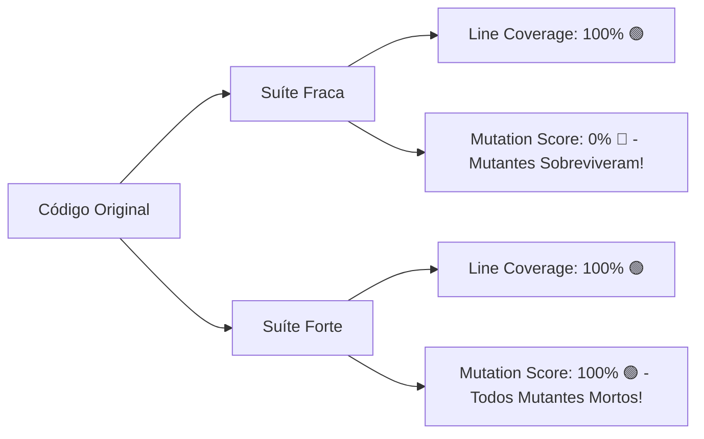

# Teste Mutante (Mutation Testing) em Python

> *"100% de Cobertura de Código não garante 100% de qualidade nos testes. A Cobertura de Linha mede apenas se o código foi executado, mas o Teste Mutante mede se o seu teste é capaz de detectar bugs."*

---

## 📌 O Que É Teste Mutante?

O **Teste Mutante (Mutation Testing)** é uma técnica de validação de suítes de testes. Ele funciona injetando bugs intencionais (chamados de **Mutantes**) no código-fonte original para verificar se a sua suíte de testes unitários consegue **detectar a falha e reprovar o teste (Matar o Mutante)**.

- **Mutante Morto (Killed)** ✅: Pelo menos um teste falhou ao rodar contra o código modificado. A suíte é eficaz!
- **Mutante Sobrevivente (Survived)** ❌: Todos os testes passaram mesmo com o código quebrado. A suíte tem pontos cegos!

---

## 🔀 A Ilusão dos 100% de Cobertura



---

## 🏗️ Estrutura do Repositório

```
mutation-testing/
├── README.md                           # Visão geral e instruções rápidas
├── docs/
│   ├── 01-conceitos-mutation-testing.md # Glossário, Mutantes Mortos/Sobreviventes, Fórmula do Score
│   ├── 02-operadores-de-mutacao.md      # Operadores ROR, AOR, LCR, CR e tabelas explicativas
│   └── 03-teste-mutante-na-era-ai.md    # Uso do Teste Mutante para validar testes gerados por LLMs
├── src/
│   ├── discount_calculator.py          # Regra de negócio (Calculadora de Desconto e Frete)
│   ├── custom_mutator.py               # Motor didático de mutação via AST (Abstract Syntax Tree)
│   └── mutants/                        # Mutantes com falhas intencionais (Boundary, Operator, Constant, Logical)
│       ├── mutant_boundary.py
│       ├── mutant_operator.py
│       ├── mutant_constant.py
│       └── mutant_logical.py
├── tests/
│   ├── test_weak.py                    # Suíte Fraca (100% Cobertura de Linha, mas 0% Escore de Mutação)
│   └── test_strong.py                  # Suíte Forte (100% Cobertura de Linha E 100% Escore de Mutação)
├── walkthrough_mutation.py             # CLI Interativo para executar a comparação no terminal
├── requirements.txt
└── pyproject.toml
```

---

## ⚡ Como Executar os Exemplos

### 1. Configurar o Ambiente Virtual

```bash
cd mutation-testing
python3 -m venv .venv
source .venv/bin/activate
pip install -r requirements.txt
```

### 2. Rodar o Walkthrough Interativo (CLI)

Execute o script `walkthrough_mutation.py` para visualizar a comparação entre a Suíte Fraca (onde mutantes sobrevivem) e a Suíte Forte (onde todos os mutantes são mortos):

```bash
python walkthrough_mutation.py
```

### 3. Rodar os Testes Automatizados com Cobertura (Pytest + Pytest-Cov)

```bash
pytest --cov=src tests/
```

### 4. Rodar a Ferramenta Oficial Python `mutmut`

Você também pode rodar o mutmut diretamente no código alvo:

```bash
mutmut run
```

Para visualizar o relatório de mutantes gerados pelo mutmut:

```bash
mutmut results
```

---

## 📖 Leitura Recomendada (`/docs`)

- [01 - Conceitos Fundamentais de Teste Mutante](docs/01-conceitos-mutation-testing.md)
- [02 - Operadores de Mutação (ROR, AOR, LOR, CR)](docs/02-operadores-de-mutacao.md)
- [03 - Teste Mutante na Era dos Agentes de IA](docs/03-teste-mutante-na-era-ai.md)
