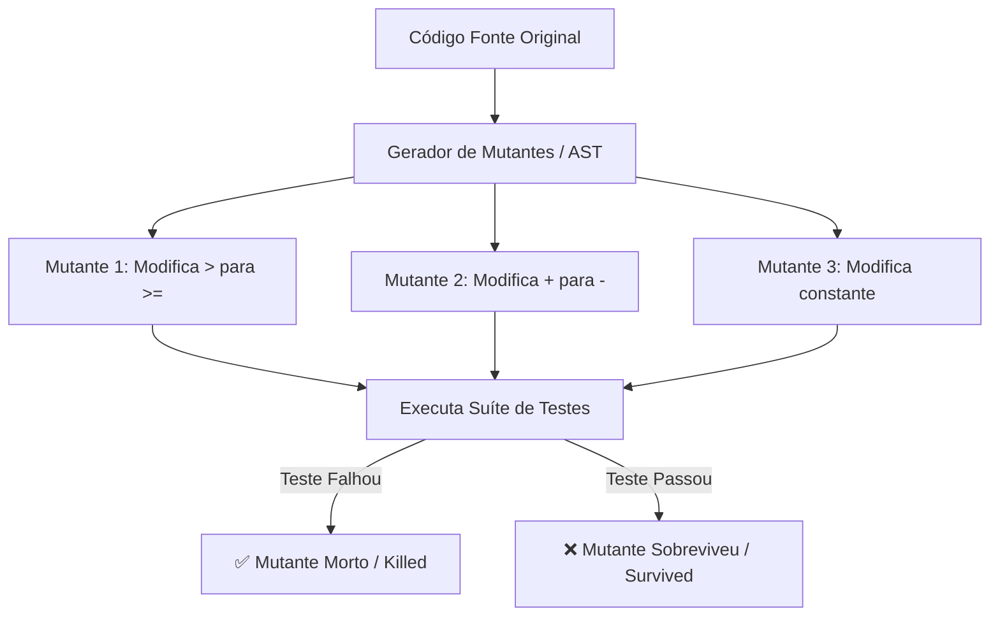

# 01 - Conceitos Fundamentais de Teste Mutante (Mutation Testing)

## 1. O Que É Teste Mutante?

O **Teste Mutante** é uma técnica de teste baseada em defeitos que avalia a **qualidade e a sensibilidade** da sua suíte de testes unitários.

Em vez de testar o seu código-fonte, o Teste Mutante **testa os seus próprios testes**.

---

## 2. A Ilusão da Cobertura de Código (Code Coverage)

Muitas equipes de software buscam métricas como 80%, 90% ou até 100% de *Line Coverage* (Cobertura de Linhas). No entanto, **cobertura de código mede apenas quais linhas foram EXECUTADAS durante os testes, não se o resultado foi devidamente ASSERIONADO (verificado).**

### Exemplo do Problema:
Um teste pode chamar uma função complexa, fazer com que 100% das suas linhas sejam executadas, mas se o teste não fizer `assert` nos valores retornados ou nos efeitos colaterais, a cobertura será de 100%, mas a eficácia do teste será zero.

---

## 3. Glossário do Teste Mutante

| Termo | Definição |
| :--- | :--- |
| **Mutante (Mutant)** | Uma versão ligeiramente modificada do código original, contendo um único defeito sintático introduzido intencionalmente (ex: trocar `+` por `-`). |
| **Mutante Morto (Killed Mutant)** | Quando pelo menos um teste unitário da suíte **FALHA** ao rodar contra o mutante. Esse é o objetivo desejado! Significa que seu teste pegou o bug. |
| **Mutante Sobrevivente (Survived Mutant / Escaped Mutant)** | Quando TODOS os testes da suíte **PASSAM** mesmo com o bug injetado. Isso indica uma brecha ou ponto cego nos seus testes. |
| **Mutante Equivalente (Equivalent Mutant)** | Um mutante que altera a sintaxe do código, mas produz o mesmo comportamento semântico em todos os cenários possíveis (ex: alterar `for i in range(0, 10)` para `for i in range(10)`). Mutantes equivalentes não podem ser mortos por testes. |
| **Mutante Incompetente (Incompetent Mutant)** | Um mutante que faz o código nem sequer compilar ou falhar com sintaxe inválida antes dos testes rodarem. |

---

## 4. Fórmula do Mutation Score (Escore de Mutação)

O **Mutation Score** é o indicador percentual da qualidade real da suíte de testes:

$$\text{Mutation Score} = \left( \frac{\text{Mutantes Mortos}}{\text{Total de Mutantes} - \text{Mutantes Equivalentes}} \right) \times 100\%$$

- **Score < 60%**: Suíte fraca com sérios pontos cegos.
- **Score 60% - 85%**: Boa suíte de testes.
- **Score > 90%**: Excelente qualidade e resiliência de testes.
