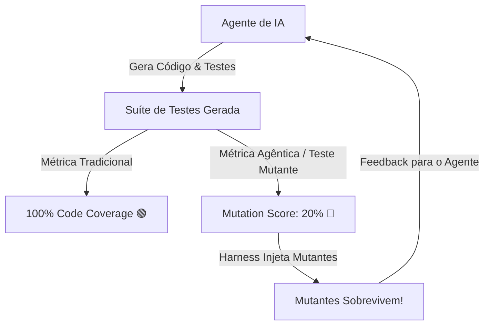

# 03 - Teste Mutante na Era dos Agentes de IA e LLMs

## 1. O Desafio da Geração de Código e Testes por IAs

Na era agêntica, ferramentas de IA conseguem gerar centenas de linhas de código e testes em segundos. No entanto, surge um problema perigoso: **A Falsa Sensação de Segurança por Cobertura Inflada**.

Agentes de IA frequentemente geram testes unitários que:
- Chamas as funções certas e cobrem 100% das linhas.
- Fazem *assertions* superficiais (ex: `assert result is not None` ou `assert isinstance(result, dict)`).
- Ignoram regras de negócio de borda (edge cases) e falhas sutis de cálculo.

---

## 2. Teste Mutante como Filtro de Qualidade no Evaluation Harness

No **Evaluation Harness** para Agentes de Código, o Teste Mutante é usado como a **prova de fogo definitiva**:

1. **Geração**: O agente gera a implementação e a suíte de testes.
2. **Validação de Linha**: O linter e o `pytest-cov` checam se a cobertura foi de 100%.
3. **Validação de Mutação**: O Harness (ex: `mutmut` ou motor AST) injeta 20 mutantes no código gerado.
4. **Resultado**:
   - Se 20 mutantes forem mortos, a suíte de testes do agente é **aprovada com alto Mutation Score**.
   - Se 5 mutantes sobreviverem, o Harness envia o diff do mutante sobrevivente de volta para o agente:
     > *"Atenção Agente: Alteraçāo do operador '>' para '>=' na linha 14 não fez nenhum teste falhar. Escreva um teste de borda específico para o valor limite."*

---

## 3. Benefícios Estratégicos do Mutation Testing em Pipelines CI/CD com Agentes

- **Evita Testes "Teatro"**: Elimina testes que existem apenas para passar na esteira de CI sem testar nada de verdade.
- **Auto-refinamento de Testes**: Agentes de IA conseguem interpretar os relatórios de mutantes sobreviventes e criar novos testes direcionados.
- **Confiança na Refatoração Autônoma**: Se uma suíte de testes tem 95%+ de Mutation Score, engenheiros humanos podem aprovar refatorações feitas por IAs com total tranquilidade.
