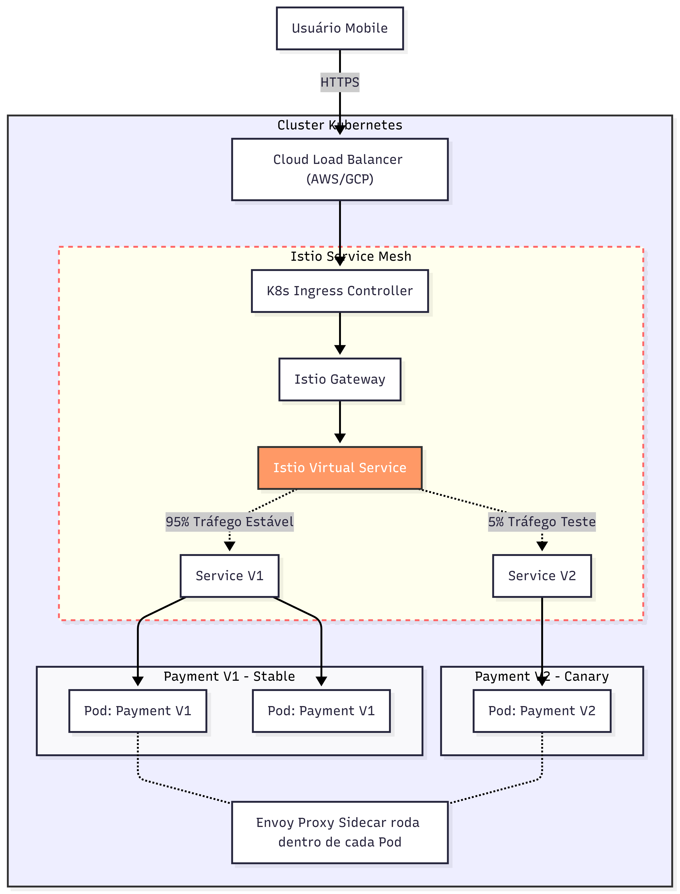

# Sistema de Pedidos: Otimização de Leitura e Escrita

Este design foca em como oferecer uma experiência fluida de navegação (leitura rápida) enquanto gerencia o ciclo de vida do pedido de forma assíncrona.

## Padrões e Técnicas Utilizadas

- **Cache-Aside Pattern:** O serviço de catálogo primeiro busca o menu no Redis; se não encontrar (cache miss), busca no Postgres e alimenta o cache para a próxima requisição.
- **Asynchronous Order Processing:** O pedido é aceito rapidamente e colocado em uma fila (RabbitMQ), desacoplando a frente de caixa da produção (cozinha).
- **CQRS (Conceitual):** Separação clara entre a lógica de "Leitura Otimizada" (Catálogo/Menu) e "Processamento do Pedido" (Escrita/Status).
- **Real-Time Updates:** Uso de WebSockets ou Push para atualizar o tablet do barista sem necessidade de refresh manual.

## Componentes e Suas Funções

### 1. Leitura Otimizada (Catálogo)
- **Serviço de Catálogo:** Focado apenas em exibir produtos.
- **Redis (Cache Menu):** Garante latência de milissegundos para os usuários que estão apenas navegando no menu.
- **Postgres (Produtos):** Fonte da verdade para os dados dos produtos.

### 2. Processamento do Pedido
- **Serviço de Pedidos:** Valida o pedido e o persiste com status `RECEBIDO` no **Postgres (Pedidos)**.
- **RabbitMQ (Fila de Preparo):** Garante que os pedidos cheguem à cozinha na ordem correta e que nenhum seja perdido se o serviço da cozinha oscilar.

### 3. Cozinha e Barista
- **Serviço da Cozinha:** Atua como o consumidor da fila. Quando um barista começa a preparar, ele atualiza o status para `EM PREPARO`.
- **Tablet Barista:** Recebe atualizações em tempo real via WebSocket para saber instantaneamente quando um novo pedido chega.

## Jornada do Pedido
1. O cliente entra no App e vê o menu instantaneamente via **Redis**.
2. O cliente faz o pedido (`POST /pedido`). O sistema grava no banco e joga na fila do **RabbitMQ**.
3. A cozinha recebe o pedido via fila.
4. O barista altera o status do pedido, o que reflete no banco de dados e notifica o cliente de que o café está sendo preparado.
