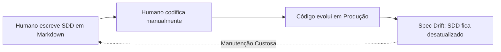
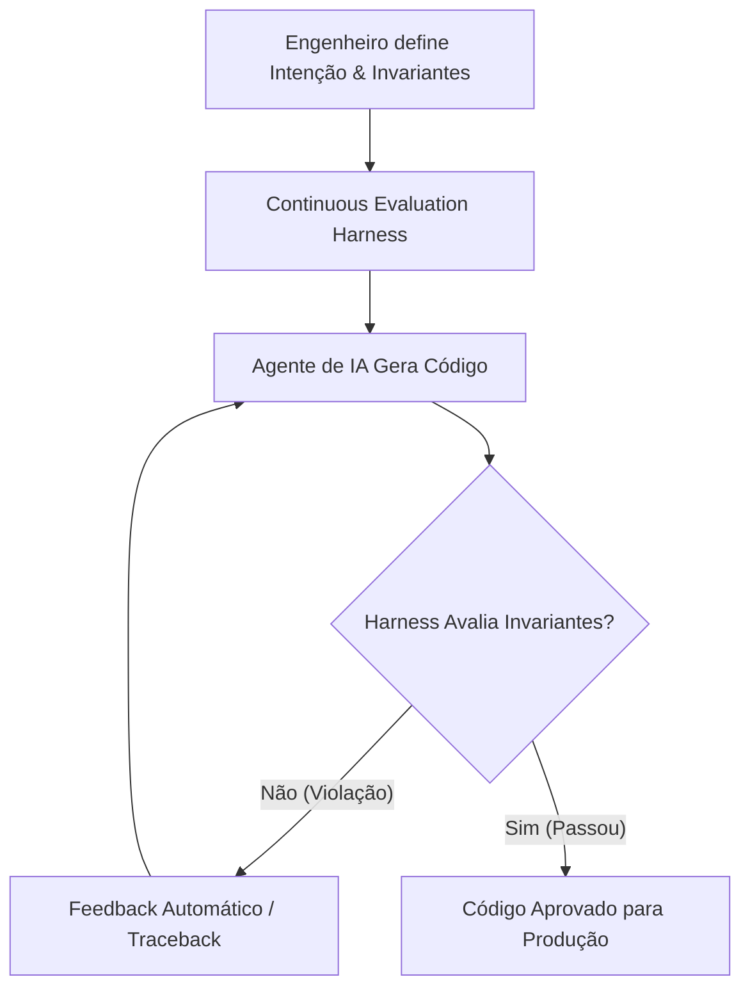

# Spec-Driven Development (SDD) na Era Agêntica

> *"O SDD, em sua forma excessivamente documental, estática e uniforme terá vida curta. Seu vencimento está próximo. Na era agêntica, o SDD evolui para: Intenção explícita + restrições verificáveis + execução autônoma + avaliação contínua."*

---

## 📌 Visão Geral

À medida que o código-fonte se torna abundante, barato, descartável e gerado por **Agentes de IA**, o gargalo do desenvolvimento de software deixa de ser a *escrita da sintaxe* e passa a ser a **preservação da intenção e a garantia de invariantes de negócio**.

Este repositório explora a transformação do **Software Design Document (SDD)** tradicional (documentos estáticos em Word/Markdown) para a **Especificação Executável e Harness Agêntico**, onde a especificação é uma estrutura viva, compilável e testável continuadamente por agentes autônomos.

---

## 🔀 A Mudança de Paradigma: Clássico vs. Agêntico

### 1. Workflow Clássico (Documental Estático)


### 2. Workflow Agêntico (Harness & Executable Spec)


---

## 🏗️ Estrutura do Repositório

```
spec-driven-development-agentic/
├── README.md                           # Este arquivo: Visão geral e guia rápido
├── docs/
│   ├── 01-o-fim-do-sdd-estatico.md     # O declínio do SDD passivo e a crise de manutenção
│   ├── 02-os-4-pilares-agentic-sdd.md  # Intenção + Restrições + Execução + Avaliação
│   └── 03-harness-como-especificacao.md # O Harness de Dev como a nova especificação viva
├── src/
│   ├── classic_sdd/                    # Abordagem 1: SDD Clássico (Texto livre + Código manual)
│   │   ├── spec_banking_transfer.md
│   │   └── transfer_service.py
│   ├── executable_sdd/                 # Abordagem 2: Especificação Executável em Código
│   │   ├── transfer_spec.py            # Contratos Pydantic
│   │   ├── invariants.py               # Conservação de dinheiro & saldos não-negativos
│   │   └── test_property_sdd.py        # Property-Based Testing com Hypothesis
│   └── agentic_sdd_harness/            # Abordagem 3: O SDD Vivo no Loop do Agente
│       ├── intent_contract.json        # Contrato de Intenção legível por máquina
│       ├── agent_generator.py          # Agente de IA com auto-correção via feedback
│       ├── continuous_evaluator.py     # Evaluation Harness que valida o código
│       └── main_agentic_loop.py        # Orquestrador do loop agêntico
├── tests/                              # Suíte de testes automatizados (pytest)
│   └── test_all.py
├── walkthrough_examples.py             # CLI Interativo para rodar todas as demonstrações
├── requirements.txt
└── pyproject.toml
```

---

## ⚡ Como Executar os Exemplos em Python

### 1. Configurar o Ambiente Virtual

```bash
cd spec-driven-development-agentic
python3 -m venv .venv
source .venv/bin/activate
pip install -r requirements.txt
```

### 2. Rodar o Walkthrough Interativo (CLI)

O script `walkthrough_examples.py` executa sequencialmente as 3 fases do SDD no terminal:

```bash
python walkthrough_examples.py
```

### 3. Rodar a Suíte de Testes e Property-Based Testing (Hypothesis)

```bash
pytest tests/
```

Você verá o `Hypothesis` testando centenas de combinações numéricas aleatórias para provar que a invariante de **Conservação de Valor** é inquebrável.

---

## 📖 Leituras Recomendadas (`/docs`)

1. [01 - O Fim do SDD Estático e a Crise da Documentação Manual](docs/01-o-fim-do-sdd-estatico.md)
2. [02 - Os 4 Pilares do SDD Agêntico](docs/02-os-4-pilares-agentic-sdd.md)
3. [03 - O Harness de Desenvolvimento Agêntico como o "Novo SDD"](docs/03-harness-como-especificacao.md)

---

## 💡 Principais Conclusões

- **O código-fonte tornou-se descartável**: IAs conseguem reescrever módulos inteiros em segundos.
- **Invariantes duram mais que código**: O que não muda é a regra matemática de negócio (ex: dinheiro não pode sumir).
- **O Harness é a especificação**: Prompts estruturados, schemas Pydantic, testes de propriedade e guardrails de tempo de execução são o verdadeiro SDD da Era Agêntica.
