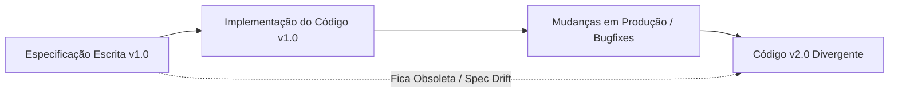

# 01 - O Fim do SDD Estático e a Crise da Documentação Manual

## 1. O Que Foi o SDD (Software Design Document / Spec-Driven Development)?

Historicamente, o **Software Design Document (SDD)** ou a especificação arquitetural (RFCs, TDDs - Technical Design Documents) servia como o modelo conceitual de um sistema de software antes da escrita de qualquer linha de código. 

A promessa do SDD era nobre:
- Alinhar múltiplos engenheiros e times antes da implementação.
- Mapear requisitos de negócio em esquemas de dados, endpoints de API e contratos de integração.
- Reduzir retrabalho durante a fase de codificação.

No entanto, em ambientes industriais modernos, a abordagem clássica baseada em documentos de texto estáticos (*Markdown*, *Confluence*, *Notion*) sofre de defeitos estruturais graves.

---

## 2. A Síndrome do "Spec Drift" (Decaimento da Especificação)

À medida que o código evolui, a especificação estática permanece inalterada no repositório ou wiki. Isso gera a famosa crise de **Spec Drift**:

### Principais Gargalos do SDD Estático:
1. **Verificação Manual e Passiva**: Documentos de texto não são compiláveis nem testáveis automaticamente. Dependem exclusivamente de code reviews humanos para garantir conformidade.
2. **Custo de Manutenção Mais Alto que o Código**: Atualizar uma especificação em linguagem natural consome tempo precioso do engenheiro, sem oferecer garantia de runtime.
3. **Falsa Sorte de Segurança**: Acreditar que a documentação reflete a realidade do sistema induz novos membros da equipe ao erro.

---

## 3. O Surgimento da Era Agêntica e a Inversão de Custos

Com o avanço das LLMs (*Large Language Models*) e Agentes de Codificação, o custo unitário de escrever sintaxe em código-fonte (Python, Java, TypeScript) despencou drasticamente:

- **Antes da Era Agêntica**: Escrever código era lento e custoso; a documentação tentava evitar erros na escrita.
- **Na Era Agêntica**: Gerar código tornou-se barato, descartável e instantâneo. 

> **A Nova Realidade:**
> Se o código tornou-se um subproduto barato e regenerável por IAs, o valor estratégico do desenvolvimento desloca-se da **sintaxe do código** para a **preservação da intenção, restrições e invariantes de negócio**.

---

## 4. O Vencimento do SDD Tradicional

O SDD tradicional em formato documental passivo está com os dias contados porque:
- Agentes de IA **não necessitam** de prosas prolixas e burocráticas para compreender um problema.
- Agentes necessitam de **Intenções Claramente Definidas** e **Mecanismos de Validação Determinísticos** para iterar de forma autônoma sem causar alucinações ou quebrar contratos de sistema.

Nos próximos capítulos, veremos como o SDD renasce não como um PDF/Markdown esquecido, mas como a espinha dorsal do **Harness Agêntico**.
