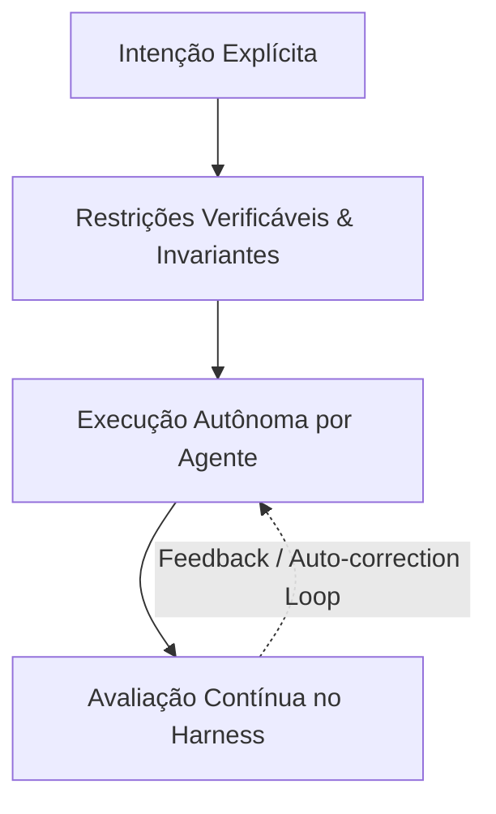

# 02 - Os 4 Pilares do SDD Agêntico

Na era agêntica, a especificação deixa de ser um documento passivo lido apenas por humanos e evolui para uma estrutura viva e computável formada por 4 pilares fundamentais:

---

## Pillar 1: Intenção Explícita (Explicit Intent)
A intenção expressa **o que** o sistema deve fazer em alto nível, focada nos objetivos de negócio e na semântica do problema, desatrelada de detalhes de implementação sintática.

- **Exemplo**: *"Processar a transferência financeira entre duas contas garantindo liquidação atômica e auditoria."*
- **Representação**: Prompts estruturados, especificações OpenAPI/JSON, arquivos de declaração de intenção agêntica (`intent_contract.json`).

---

## Pillar 2: Restrições Verificáveis & Invariantes (Verifiable Constraints)
Ao contrário das especificações em linguagem natural ("O saldo não deve ser negativo"), as restrições no SDD Agêntico são codificadas como **invariantes matematicamente verificáveis ou executáveis**.

### Tipos de Restrições Verificáveis:
1. **Tipagem e Esquemas de Dados**: Pydantic, JSON Schema, Protobuf.
2. **Invariantes de Conservação / Propriedades**: Checagens que *sempre* devem ser verdadeiras (ex: $Saldo_{origem\_antes} + Saldo_{destino\_antes} == Saldo_{origem\_depois} + Saldo_{destino\_depois}$).
3. **Testes Baseados em Propriedades (PBT)**: Utilização de ferramentas como `Hypothesis` para testar milhares de entradas aleatórias tentando quebrar o código do agente.

---

## Pillar 3: Execução Autônoma (Autonomous Execution)
Uma vez definidos a Intenção e os Critérios Verificáveis, a escrita do código-fonte (funções, classes, rotas de API, tratamento de exceções) é delegada a agentes autônomos de IA (LLMs/Agentes).

O agente recebe a intenção e os testes de restrição e trabalha no ciclo:
1. Analisar a especificação.
2. Gerar a primeira versão do código.
3. Submeter o código para validação.

---

## Pillar 4: Avaliação Contínua & Auto-Correction (Continuous Evaluation)
O **Harness de Desenvolvimento Agêntico** atua como o juiz e o guia do agente. Ele executa continuamente:
- Linter e checadores estáticos (`mypy`, `ruff`).
- Validação de esquemas e contratos (`Pydantic`).
- Suíte de testes unitários e de propriedades (`pytest`, `hypothesis`).

Quando o Harness detecta uma falha ou violação de invariante, ele não interrompe o desenvolvimento com uma mensagem de erro frustrante para o humano; ele **alimenta o erro de volta para a conversa com o Agente**, permitindo que ele se auto-corrija automaticamente (*Auto-healing/Auto-correction loop*).

---

## Comparativo: SDD Clássico vs SDD Agêntico

| Característica | SDD Clássico (Tradicional) | SDD Agêntico (Era da IA) |
| :--- | :--- | :--- |
| **Formato** | Prosa estática (Word/Markdown/Wiki) | Esquemas executáveis + Invariantes de código |
| **Executor** | Desenvolvedor Humano | Agente de IA Autônomo |
| **Garantia de Qualidade** | Code Review manual ocasional | Continuous Evaluation Harness automatizado |
| **Manutenibilidade** | Torna-se obsoleto com facilidade (*Spec Drift*) | É a fonte da verdade usada pelo agente para regenerar código |
| **Custo de Mudança** | Alto (reescrever código e documento) | Baixo (ajustar a intenção/invariante e mandar o agente regenerar) |
