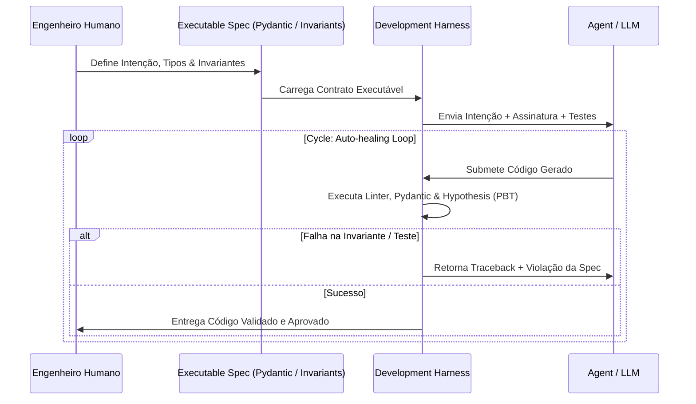

# 03 - O Harness de Desenvolvimento Agêntico como o "Novo SDD"

## 1. O Que É o Harness Agêntico?

No desenvolvimento agêntico moderno, o termo **Harness** (ou *Evaluation Harness*) refere-se ao ecossistema de ferramentas, restrições, promps de controle, suítes de testes, mocks e checadores em tempo de execução que envolvem a execução de um Agente de IA.

> **Tese Central:** O SDD não desaparece; seus conceitos são incorporados diretamente na arquitetura do Harness.

---

## 2. Componentes de um Harness Específico para SDD

Para que o Harness sirva como especificação viva, ele combina quatro camadas principais:

### A. Validação de Fronteira (Input/Output Contracts)
- Tipagem estática rigorosa usando `Pydantic` ou `dataclasses`.
- Validação automática de payloads de requisição/resposta antes de atingir a regra de negócio.

### B. Especificação Baseada em Propriedades (Property-Based Testing)
- Diferente de testes unitários tradicionais baseados em valores concretos (ex: `assert transfer(100) == success`), a especificação por propriedade testa **invariantes matemáticas universais**.
- Usando bibliotecas como `Hypothesis`, o Harness testa milhares de cenários extremos (edge cases, números negativos, estouro de precisão float, valores limite) que um humano dificilmente descreveria em um documento tradicional.

### C. Evaluation Evals (Benchmarks de Agente)
- Conjunto de critérios que medem o desempenho do agente em relação à intenção original (ex: consumo de memória, tempo de execução, complexidade ciclomática, ausência de falhas de segurança).

### D. Runtime Guardrails
- Mecanismos em tempo de execução que garantem que, mesmo se o código gerado pelo agente for executado em produção, ele não viole as restrições críticas do sistema (ex: limites de taxa, auditoria obrigatória, isolamento de escopo).

---

## 3. Por Que Escrever Especificações Maiores É um Antipadrão

Na era pré-IA, tentava-se resolver a ambiguidade da linguagem natural escrevendo documentos de especificação cada vez mais volumosos e detalhados.

Na era agêntica, especificações gigantescas em linguagem natural são ineficientes:
- Consomem a janela de contexto (*context window*) do agente desnecessariamente.
- Aumentam a probabilidade de contradições internas na especificação.

### A Regra de Ouro do SDD Agêntico:
> **Descreva Menos em Prosa, Codifique Mais Invariantes Testáveis.**
> A especificação ideal para um agente de IA é **concisa na intenção, estrita nos tipos e implacável nas validações automatizadas**.
