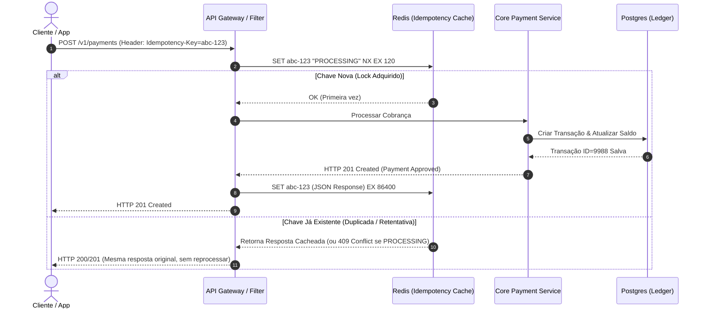

# 🔄 Idempotência vs. Deduplicação: Entendendo a Diferença

> **Guia de Estudo Técnico & Arquitetural em Engenharia de Software e Sistemas Distribuídos**  
> *Idioma:* Português (pt-BR)

---

## 🎯 A Pergunta Clássica de Entrevista

> *"Como desenvolvedor backend / engenheiro de software, você sabe a real diferença prática e arquitetural entre **Idempotência** e **Deduplicação**?"*

Muitos desenvolvedores usam esses termos como sinônimos, mas eles resolvem problemas em **camadas diferentes** e possuem **garantias distintas**:

- **Idempotência (Idempotency):** Repetir uma operação produz **o mesmo efeito no estado do sistema**.
- **Deduplicação (Deduplication):** Mecanismo ativo para **evitar e descartar processamento ou registros repetidos**.

---

## 🧮 Analogias Fundamentais

### 1. Pela Matemática 🔢

| Conceito | Operação Matemática | Explicação |
|:---|:---:|:---|
| **Idempotência** | $1 \times 1 = 1$<br>ou $f(f(x)) = f(x)$ | Multiplicar por 1 ou aplicar a função $N$ vezes resulta sempre no mesmo valor original. O estado não se multiplica. |
| **Duplicação** *(Não-idempotente)* | $1 + 1 = 2$<br>ou $f(x) + f(x) = 2x$ | Repetir a operação soma e acumula novos efeitos colaterais a cada chamada. |

---

### 2. Pelo Inglês & Linguagem Natural 🗣️

```
┌────────────────────────────────────────────────────────────────────────┐
│  Idempotency  = "Do it again, but don't multiply the effect."          │
│  Duplication  = "Do it again, and you get another one."                │
│  Deduplication= "Catch duplicates before they do any damage."          │
└────────────────────────────────────────────────────────────────────────┘
```

#### Analogias do Cotidiano:
- **Botão de Elevador (Idempotência):** Se você apertar o botão do 10º andar 1 vez ou 10 vezes, o elevador irá ao 10º andar exatamente da mesma forma. O efeito não se multiplica.
- **Botão de Comprar/Adicionar ao Carrinho sem proteção (Não-Idempotente):** Clicar 2 vezes adiciona 2 itens ou cobra duas vezes no cartão ($1 + 1 = 2$).
- **Filtro de E-mails / SPAM (Deduplicação):** Ao receber dois e-mails idênticos com o mesmo `Message-ID`, o provedor descarta a 2ª cópia antes de exibi-la na sua caixa de entrada.

---

## 🔍 Definições Técnicas Detalhadas

### 1. O que é Idempotência?
A idempotência é uma **propriedade de design** de uma operação ou sistema.

- Uma operação $f$ é idempotente se:
  $$\forall x, \quad f(f(x)) = f(x)$$
- Em sistemas de software: executar uma requisição 1 vez ou $N$ vezes consecutivas deixa o banco de dados e o ecossistema no **mesmo estado final** e retorna uma resposta consistente.
- **Foco:** No **resultado e estado final** do sistema.

### 2. O que é Deduplicação?
A deduplicação é uma **técnica ou mecanismo operacional** (filtro/detector).

- Consiste em interceptar uma mensagem, payload ou evento que já foi visto recentemente e descartá-lo ou ignorá-lo imediatamente.
- Frequentemente implementada com janelas de tempo (**TTL**) usando chaves em cache (Redis), índices únicos em tabelas (`UNIQUE INDEX`), ou message IDs de brokers (AWS SQS FIFO).
- **Foco:** No **evento de entrada** (evitar que a lógica seja executada mais de uma vez).

---

## ⚖️ Tabela Comparativa Lado a Lado

| Aspecto | 🔄 Idempotência (Idempotency) | 🛡️ Deduplicação (Deduplication) |
|:---|:---|:---|
| **O que é?** | Propriedade intrínseca do design/lógica. | Mecanismo de filtragem e descarte. |
| **Foco principal** | Garantir que o **estado final** não mude com repetições. | Garantir que a **ação** não ocorra mais de 1 vez. |
| **O que acontece na 2ª chamada?** | A requisição pode ser reprocessada com segurança ou retornar a mesma resposta original. | A mensagem/requisição é identificada como repetida e **descartada/ignorada**. |
| **Dependência Temporal (TTL)** | Geralmente **atemporal** (ex: `SET status = 'PAID'`). | Geralmente **temporal** (ex: janela de 5 min no SQS FIFO ou 24h no Redis). |
| **Onde reside?** | Na camada de domínio / banco de dados / contratos de API. | Na camada de infraestrutura, gateway, mensageria ou middleware. |
| **Exemplo HTTP** | `PUT /users/123`, `DELETE /orders/456`. | Middleware que rejeita requisição com `Idempotency-Key` já em processamento. |
| **Exemplo SQL** | `UPDATE accounts SET balance = 100 WHERE id = 1`. | `INSERT INTO table ... ON CONFLICT DO NOTHING`. |

---

## 🌐 Cenários do Mundo Real

### Cenário 1: Métodos HTTP REST
No protocolo HTTP (RFC 7231 / RFC 9110):

| Método HTTP | É Idempotente? | Explicação |
|:---:|:---:|:---|
| `GET` | ✅ **Sim** | Operação segura de leitura; chamar 10x não altera estado. |
| `PUT` | ✅ **Sim** | Substitui o recurso completamente. Enviar o mesmo recurso 10x resulta no mesmo estado. |
| `DELETE` | ✅ **Sim** | Deletar um recurso existente ou já deletado mantém o recurso fora do sistema. |
| `POST` | ❌ **Não** | Criação ou disparo de ação. Chamar 2x cria 2 recursos ou processa 2 pagamentos. |
| `PATCH` | ⚠️ **Depende** | Se for `{"name": "Alice"}` é idempotente; se for `{"increment": 1}` não é. |

---

### Cenário 2: APIs de Pagamento com `Idempotency-Key` (Padrão Stripe / PicPay)

Como transformar um `POST /v1/payments` (não-idempotente por natureza) em uma operação segura contra retentativas de rede (*network retries*)?



---

### Cenário 3: Mensageria & Filas (Kafka / RabbitMQ / AWS SQS)

Em sistemas distribuídos, a entrega de mensagens é quase sempre **At-Least-Once** (Pelo menos uma vez). Falhas de rede (*ack timeouts*) fazem com que mensagens sejam reenviadas.

#### 1. Abordagem por Deduplicação (Filtro por ID):
```java
// O consumer descarta se a mensagem já estiver no Redis/Cache
public void handleMessage(OrderCreatedEvent event) {
    boolean isNew = redisTemplate.opsForValue()
        .setIfAbsent("msg:" + event.getMessageId(), "SEEN", Duration.ofHours(24));
    
    if (!isNew) {
        log.warn("Mensagem duplicada detectada e descartada: {}", event.getMessageId());
        return; // DEDUPLICAÇÃO
    }

    processOrder(event);
}
```

> ⚠️ **Atenção ao Risco da Deduplicação isolada:**  
> Se o Redis expirar após 24h e uma mensagem antiga for reprocessada por reprocessamento manual ou Dead Letter Queue (DLQ), a deduplicação falhará! É aí que a **idempotência de domínio** entra como camada de defesa definitiva.

#### 2. Abordagem por Idempotência de Negócio / Banco de Dados:
```sql
-- Idempotente por design de estado:
UPDATE orders 
SET status = 'CONFIRMED', updated_at = NOW() 
WHERE id = :orderId AND status = 'PENDING';

-- Se a mensagem for executada 10 vezes, o registro só é alterado na primeira;
-- nas seguintes, rows_affected = 0, sem gerar efeito colateral duplicado.
```

---

## 🏛️ Comparação SQL: Operações Idempotentes vs. Não-Idempotentes

```sql
-- ❌ NÃO-IDEMPOTENTE (Duplica o efeito a cada execução)
UPDATE carteira 
SET saldo = saldo + 50 
WHERE usuario_id = 1;

-- ✅ IDEMPOTENTE (Mesmo efeito independente do número de execuções)
UPDATE carteira 
SET saldo = 250 
WHERE usuario_id = 1;

-- 🛡️ DEDUPLICAÇÃO VIA BANCO DE DADOS (Restrição de Unicidade)
CREATE UNIQUE INDEX idx_transacao_idempotency_key 
ON transacoes (idempotency_key);

INSERT INTO transacoes (id, idempotency_key, valor, status)
VALUES ('tx_1', 'key_abc_123', 100.00, 'COMPLETED')
ON CONFLICT (idempotency_key) DO NOTHING;
```

---

## 💡 Como Responder em Entrevistas de System Design

Se o entrevistador perguntar: *"Qual a diferença entre Idempotência e Deduplicação?"*

### 🎙️ Resposta Modelo (30 a 60 segundos):
> *"**Idempotência** é uma propriedade do sistema onde executar uma operação múltiplas vezes resulta no mesmo estado final, sem multiplicar os efeitos colaterais — matematicamente como $1 \times 1 = 1$.*
> 
> *Já **Deduplicação** é um mecanismo ativo de filtragem que identifica e descarta mensagens ou requisições repetidas antes que a lógica de negócio seja executada.*
> 
> *Em arquitetura distribuída, a melhor prática é a **defesa em profundidade**: usamos deduplicação na borda (com Idempotency Keys e Redis) para economizar recursos e responder rápido, mas modelamos nosso banco e regras de negócio de forma idempotente (com constraints únicas e máquinas de estado) para garantir consistência mesmo se a janela de deduplicação expirar."*

---

## 📌 Resumo Rápido (Cheat Sheet)

- **Idempotência = Estado garantido.** (Foco: *O que acontece no destino*).
- **Deduplicação = Descarte antecipado.** (Foco: *O que entra na origem*).
- **$1 \times 1 = 1$:** Idempotência.
- **$1 + 1 = 2$:** Duplicação / Falha de Idempotência.
- **`PUT /orders/1`:** Idempotente.
- **`POST /orders`:** Não-idempotente (requer `Idempotency-Key` para se tornar idempotente).
- **Deduplicação depende de janela (TTL); Idempotência estrutural é perene.**

---

## 🔗 Referências e Materiais Relacionados

- [Pagamentos Idempotentes & Transferências](./system-design/idempotent-payment-transfer.md)
- [CAP, ACID e Locks](./cap-acid-locks.md)
- [Padrão Saga e Orquestração](./system-design/saga-orchestrator-architecture.md)
- [IETF RFC 9110 — HTTP Semantics (Idempotent Methods)](https://www.rfc-editor.org/rfc/rfc9110.html#name-idempotent-methods)
- [IETF Draft — The Idempotency-Key HTTP Header Field](https://datatracker.ietf.org/doc/draft-ietf-httpapi-idempotency-key-header/)
