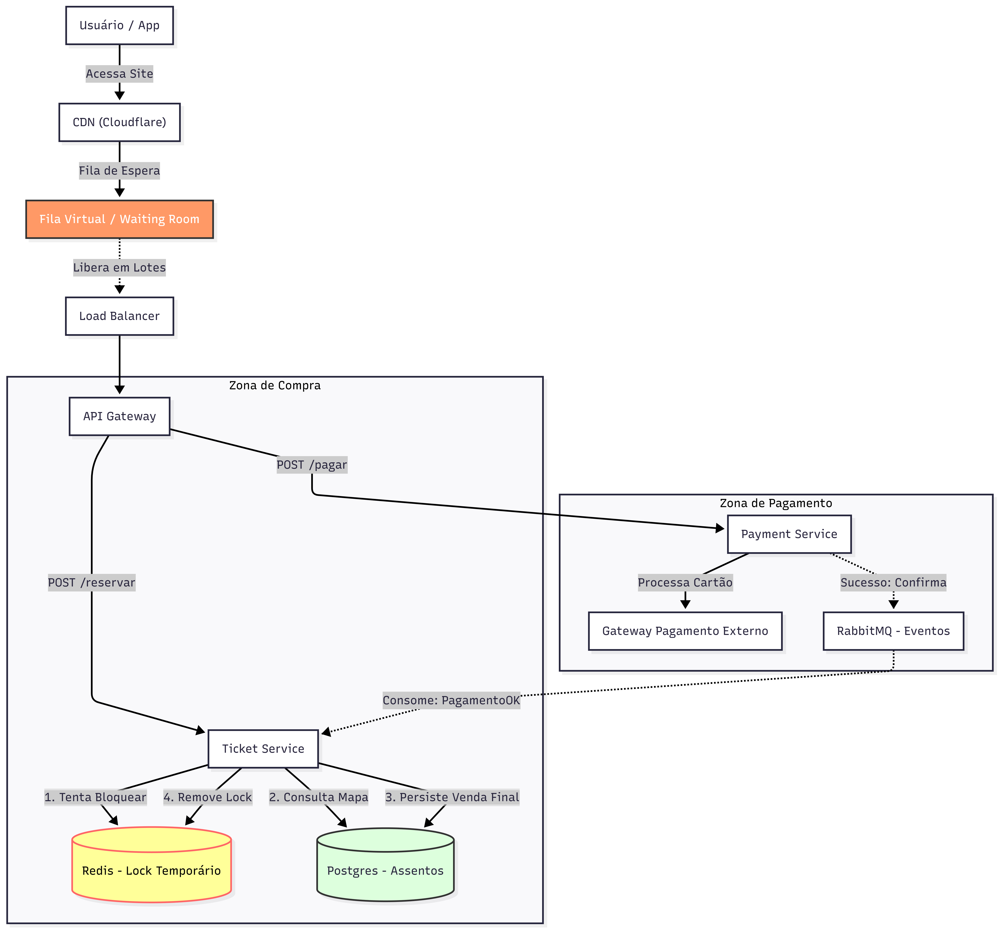

# Sistema de Ride-Sharing (Matching e Rastreamento em Tempo Real)

Este sistema lida com a complexidade de conectar passageiros a motoristas disponíveis e rastrear milhares de coordenadas GPS simultaneamente.

## Padrões e Técnicas Utilizadas

- **Geospatial Indexing:** Uso de Redis (Geo Commands) para buscas rápidas de proximidade (ex: "quem são os motoristas num raio de 5km?").
- **WebSocket:** Conexão persistente bidirecional para comunicação de baixa latência com o aplicativo do motorista.
- **Event Streaming:** Uso do Kafka para processar o fluxo contínuo de dados GPS.
- **NoSQL for Time-Series:** Cassandra utilizado para armazenar o histórico massivo de rotas (escrita rápida e escalabilidade horizontal).

## Componentes e Suas Funções

### 1. Gestão da Corrida (Matching)
- **Dispatch/Matching Service:** O cérebro do sistema. Decide qual motorista deve receber a oferta.
- **Redis (Driver Status):** Armazena o estado atual do motorista (Disponível, Em Corrida, Offline).
- **Postgres (Corridas):** Armazena os dados transacionais e definitivos da corrida.

### 2. Gestão de Localização (Real-Time)
- **Serviço de Conexão Real-Time:** Mantém os WebSockets ativos com os motoristas.
- **Kafka (Tópico GPS):** Buffer de mensagens que recebe todas as coordenadas GPS. Garante que o sistema suporte picos de carga sem perder dados.
- **Location Service:** Consome do Kafka e atualiza o **Redis Geospatial Index**.
- **Cassandra (Histórico Rotas):** Banco de dados especializado em gravar grandes volumes de dados sequenciais (logs de GPS) para auditoria e análise posterior.

## Fluxo Principal
1. O motorista envia sua posição via **WebSocket**.
2. A posição cai no **Kafka** e o **Location Service** atualiza o **Redis Geospatial**.
3. O passageiro solicita uma corrida via HTTP.
4. O **Dispatch Service** busca motoristas próximos no Redis (1).
5. O sistema bloqueia o motorista escolhido (2) e cria o registro da corrida no Postgres (3).
6. Uma oferta de push é enviada ao motorista (4) através do serviço de tempo real.
